*※2025/06/16 11:16:35 更新*

## 多層弱拍基軸リズム理論で得られるもの

**多層弱拍基軸リズム理論** は、日本人語学学習者、日本人音楽家に向けて、日本人が何故グルーヴしないのかを理論的に説明し、どうしらグルーヴする様になるのかについて具体的な指針を与えます。

ここでは次の内容を説明します。

* グルーヴとは何か
* 音楽のグルーヴと英語のリスニングの関係
* 弱拍強拍とは何か
* 母国語によって弱拍強拍の認識に違いが生じること
* 弱拍強拍には音楽・言語の両方に共通の**階層**があること
* 弱拍強拍の階層には **再帰性** があること
* 弱拍強拍階層の再帰性が音楽と詩吟の読み方に大きな影響を与えていること
* 弱拍強拍の多層階層の分析手法

### この本の読み方

まず言語によってリズム認識が異なるということを見ていきます。次にシラブル拍、ストレス拍、モーラ拍の違いを学びます。そしてこれが弱拍強拍という概念と関連していることを見ていきます。次にストレス拍でこの弱拍強拍という概念が多層構造になっていることを見ていきます。そして弱拍強拍とは何かを掘り下げ、弱拍と強拍の多層構造とはどういうものなのかを見ていきます。そしてこの多層構造がメロディを歌う時の配置の方向性に大きな影響を与えることを見ていきます。そして最後に、これが人間の時間認識の方向性に大きな影響を与えており、更にこれが人間の動きの認識自体に影響を与えていることを見ていきます。

### グルーヴとは英語そのもの

英語は、音韻学で **ストレス拍リズム** に分類されています。ストレス拍リズムの言語は『アクセントのあるシラブル（ストレス拍）を一定時間ごとに発音しなければならず、アクセントのないシラブル（非ストレス拍）は弱く発音したり省略したりしなければならない』という発音上のルールを持ちます。このルールが英語という言語を意味のある文章として聴き取る為に重要な役割を持っています。 

つまり、このストレス拍リズムがグルーヴの正体です。

ストレス拍リズムには、俳句と同じ様に重厚な詩吟文化があり、言語自体が持っているリズムを探求し発展してきた長い歴史を持っています。この詩吟文化の上に、R&Bやラップなどのアフリカ系アメリカ人の文化が発展しました。これが更にジャズに多大な影響を与えました。そしてこのジャズが、ブルースやロックンロール・ロック・ハードロック・ヘビメタが生まれ、世界中に飛び火して世界中の音楽に影響を与えています。

### 音楽と語学を繋げる

この多層弱拍基軸リズム理論は、音楽でグルーヴが起こる条件を理論的に説明した上で、何故人によって音楽のグルーヴの認識い違いが生まれるのかを考察します。そしてこのリズム認識の違いが生まれる理由に関して、この音韻学を使って説明します。この多層弱拍基軸リズム理論は、グルーヴを習得する為の理論・オフビートカウント理論が成立することを示す基礎理論となります。

### グルーヴを顕在意識化する

つまり多層弱拍基軸リズム理論は、日本人が何故グルーヴしないのかを理論的に説明し、どうやったら日本人が後天的にグルーヴを習得する事ができるのか、その練習方法に関して理論的な予想を与えます。

### 音楽のグルーヴで英語リスニング力は伸びる
もしも読者の貴方が英語学習者でしたら、恐らくリスニングに対して問題意識を持っているのではないでしょうか ─── 日本人は英語が聴き取れません。日本人は英語がわかる様になるために義務教育で１０年以上の月日を費していますが日本人はほとんどの場合英語が理解できません。努力の末に英語を読むことが出来るようになっても、映画を字幕無しで見て理解したり、実際に会話したりすることは出来ません。そんな頭でっかちな英語教育が批判され、実践英会話の重要性が叫ばれたのももう２０年以上前の話です。しかし２０年たった今も状況は全く変わっていません。

**多層弱拍基軸リズム理論** は、この残念な状況に一石を投じます。

### 英語リスニングで音楽のグルーヴ力が伸びる

もしも読者の貴方が音楽の演奏者でしたら、恐らくグルーヴに対して問題意識を持っているのではないでしょうか ─── 日本人ミュージシャンは全くグルーヴしません。 これが [縦乗り](/tatenori-theory/) です。縦乗りとは元々、日本のジャズ演奏者の間で使われていた俗語でした。ジャズ独特なスイング感のないグルーヴのない日本人のジャズの演奏は俗に『縦乗り』と呼ばれて常に悩みの種でした。グルーヴ感はジャズの醍醐味です。グルーヴ感のないジャズは正に画竜点睛を欠く価値のない音楽です。しかし日本人がグルーヴしない理由をはっきりと理解し明確に説明できた人は存在しませんでした。

日本人ジャズ演奏者の間で日本人のリズムの問題  [縦乗り](/tatenori-theory/) は、グルーヴしたいのにどうやってもグルーヴ出来ない日本人ジャズ演奏者の心にトラウマを生み出しました。ジャズ演奏者の間でリズムの問題を話題として出すだけで激昂する人が大勢存在するなかで、もはやタブーとしてみな腫れ物に触れるような扱いをしてきました。

日本には世界有数の巨大なジャズ演奏者コミュニティがあります ─── にもかかわらず世界中の誰も日本人ジャズを聞かない。日本には世界有数の巨大なジャズのリスナコミュニティがあり、ジャズ市場は世界最大規模と言われています。そんな巨大なジャズ市場の誰も日本人ジャズを聴いていません  ─── これはジャズ界最大悲劇の悲劇を通り越して、もはや喜劇です。

**多層弱拍基軸リズム理論** は、この状況に一石を投じます。

## 強拍弱拍の順序に対する認識の違い
音符が現れる順序の認識は、その人が母国語とする言語によって大きな違いが生まれます。

### 音楽のリズム解釈には言語によって違いがある

次のリズムを聴いてみてください。

<blockquote class="twitter-tweet" data-media-max-width="560">
バダムツー（英語での「ちゃんちゃん」のような効果音） Credit : <a href="https://t.co/1pMfDuY1S3">https://t.co/1pMfDuY1S3</a> <a href="https://t.co/qdcGm8P81M">pic.twitter.com/qdcGm8P81M</a>
&mdash; 岡敦/Ats🇯🇵 (@ats4u) <a href="https://twitter.com/ats4u/status/1928811162042507281?ref_src=twsrc%5Etfw">May 31, 2025</a></blockquote>

これは海外では、日本の「ちゃんちゃん」と同じ意味を持っているリズム効果音です。これを何か面白いことが起こった時の落ちの効果音として演奏します。この音のことを一般的にバダムツーというオノマトペで表現し ba dum tss と綴ります。このバダムツーに関しては [縦乗り理論#バダムツーとは](/tatenori-theory/#バダムツーとは) で詳しく説明しました。

このリズムを譜面で表すと、いくつか複数の書き方あることに気付くでしょう。これを読む貴方はどうお考えになりますか。

もしかしたら次の様に解釈したかも知れません。

果たしてバダムツーは、本当にこういうリズムの音楽からやってきたのでしょうか ─── 実際に試してみるとわかるかも知れません。このリズム解釈を使って音楽を作って見て、実際に聴いてみましょう。

<blockquote class="twitter-tweet" data-media-max-width="560">
バダムツーの縦乗りでの解釈 <a href="https://twitter.com/hashtag/%E3%82%AA%E3%83%95%E3%83%93%E3%83%BC%E3%83%88%E3%81%A7%E6%80%9D%E8%80%83%E3%81%99%E3%82%8B%E8%AA%9E%E5%AD%A6?src=hash&amp;ref_src=twsrc%5Etfw">#オフビートで思考する語学</a> <a href="https://t.co/KN5gMaKMdE">https://t.co/KN5gMaKMdE</a> <a href="https://t.co/TCvZoJEMqw">pic.twitter.com/TCvZoJEMqw</a>
&mdash; 岡敦/Ats🇯🇵 (@ats4u) <a href="https://twitter.com/ats4u/status/1928070176341164344?ref_src=twsrc%5Etfw">May 29, 2025</a></blockquote>

これは正しいでしょうか  ─── 少なくともリズムペディア筆者の私には、こうは感ぜられないのです。その音楽は恐らくこういう音楽だった筈です。

<blockquote class="twitter-tweet" data-media-max-width="560">
バダムツーの横乗りでの解釈 <a href="https://twitter.com/hashtag/%E3%82%AA%E3%83%95%E3%83%93%E3%83%BC%E3%83%88%E3%81%A7%E6%80%9D%E8%80%83%E3%81%99%E3%82%8B%E8%AA%9E%E5%AD%A6?src=hash&amp;ref_src=twsrc%5Etfw">#オフビートで思考する語学</a> <a href="https://t.co/KN5gMaKMdE">https://t.co/KN5gMaKMdE</a> <a href="https://t.co/C5x0FYgXLk">pic.twitter.com/C5x0FYgXLk</a>
&mdash; 岡敦/Ats🇯🇵 (@ats4u) <a href="https://twitter.com/ats4u/status/1928070026998755806?ref_src=twsrc%5Etfw">May 29, 2025</a></blockquote>

この上記リズム解釈を譜面として表現した場合、恐らく次のようになるでしょう。

ここに存在する違いは一体何でしょうか ───  これが**強拍弱拍の順序認識**です。

### 音楽の弱拍強拍の順序認識の違い

強拍弱拍の順序とはどういう意味でしょうか。次のビデオを見てください。

<blockquote class="twitter-tweet" data-media-max-width="560">
【モーラ拍リズムの言語（日本語）を母語として話す人が聴き取れないリズム】 16分音符1つが弱起として入っている基本リフパターン ─── マイケル・ジャクソンのヒューマン・ネイチャー Live at Wembley 1988 Credit : <a href="https://t.co/eQ1e6WjElH">https://t.co/eQ1e6WjElH</a> <a href="https://t.co/mBAaWxTeSj">pic.twitter.com/mBAaWxTeSj</a>
&mdash; 岡敦/Ats🇯🇵 (@ats4u) <a href="https://twitter.com/ats4u/status/1928820285270024211?ref_src=twsrc%5Etfw">May 31, 2025</a></blockquote>

この曲は、マイケル・ジャクソンのヒット曲『[ヒューマン・ネイチャー](https://www.youtube.com/watch?v=ElN_4vUvTPs)』です。この曲の冒頭でマイケル・ジャクソンが「チーチキ・チーチキ」と歌っていますが、この記事を読んで下さっている皆様は、このリズムをどの様に聴き取りましたでしょうか。

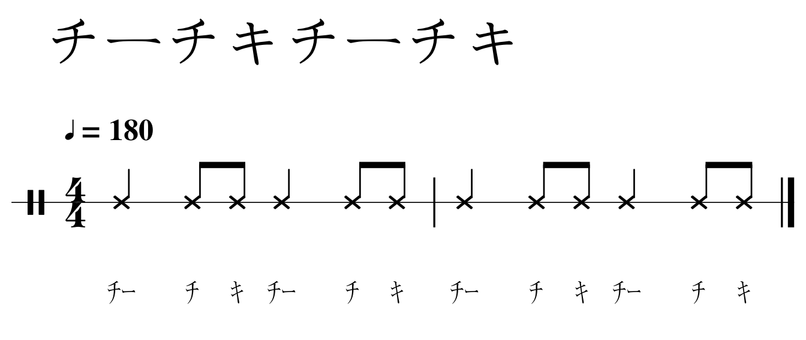

この様に解釈されたのではないでしょうか。しかし曲が始まると間もなくこの解釈が間違っていることが明らかになります ─── 実は次のようになっています。

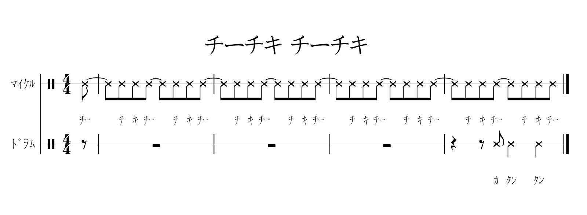

このように８分音符１つ分ずれた形でリズムが始まっています。  ─── **ここからわかることは、日本人はある音を聞いた瞬間、当然のようにそれを８分音符の強拍として認識しているところを、日本人以外の人々は当然の様にそれを８分音符の弱拍として認識している**ということです。

これが **弱拍強拍の順序認識の違い** です。

この『リズムの解釈の違い』 ─── リズムペディア筆者である私は、海外の僻地で語学武者修行し12年で4ヶ国語（英語・タイ語・ラオ語・中国語のそれぞれ方言）を学んびました。この『リズムの解釈の違い』は、私が日本語から離れていく過程で常に念頭にあった事柄でした。その人の母国語が音楽の聞こえ方にも大きな影響を与えている ─── これが数ある日本人が外国語が苦手になる原因でも最も大きな要因ではないかと私は考えています。  
  
アジア人はみな英語が苦手でしょうか ─── 必ずしも苦手ではない様です。私が放浪中に見てきたアジアの人々・・・例えばタイ人・ラオス人・ベトナム人・中国人はしばしばさほど勉強しなくてもある程度の英語が話せるようになります。日本人以外のアジア人は、どんなに奥地に住んでいる人々でも、見様見真似で多少の英語を話すことができます。そもそも英語はそんなに習得が難しい言語ではありません。しかし何故か **日本人だけが英語を見様見真似で習得することができません**。日本人はアジアのなかでも特に例外的に英語が極端に苦手のようでした。

何故日本人だけ英語が苦手なのでしょうか ─── **その原因がこの弱拍強拍の順序の認識**です。

### 言語の弱拍強拍の順序認識の違い

具体例として次のビデオを見てみます。

<blockquote class="twitter-tweet" data-media-max-width="560">
【リエゾン】前後の子音が全て繋がることをリエゾンといいます。  LMFAO エルエムエフエイオー ⇩⇩⇩⇩ エェレッメッフェィヨゥ！ Credit : <a href="https://t.co/FL5wMtgC4l">https://t.co/FL5wMtgC4l</a> <a href="https://t.co/v0mkyrsnW4">pic.twitter.com/v0mkyrsnW4</a>
&mdash; 岡敦/Ats🇯🇵 (@ats4u) <a href="https://twitter.com/ats4u/status/1596182037001830400?ref_src=twsrc%5Etfw">November 25, 2022</a></blockquote>

このビデオに登場するのは2011年前後に一世風靡したLMFAOというボーカルユニットです。彼らがストレス拍リズムで発音する「エルエムエフエイオー」が、モーラ拍リズムの認識では『エェレッメッフェイヨウ』と認識されます。

これはシラブル拍リズム・ストレス拍リズム言語での拍の順序＝弱強というリズム認識を、モーラ拍リズム言語での拍の順序＝強弱というリズム認識で間違って認識してしまうことから起こります。

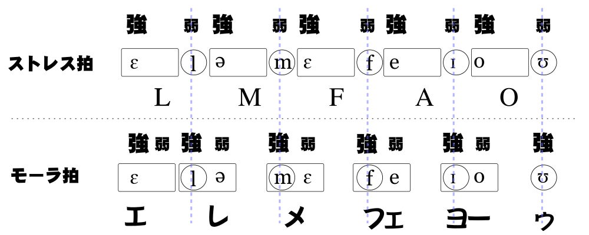

上記はストレス拍解釈の発音をモーラ拍リズム解釈で解釈し間違えた時の状態を図式化したものです。

英語では母音にアクセントを置いており、子音をその前に添える様に発音します。これを音楽の強拍弱拍に喩えるならば、それはあたかも音楽の弱起と同じ要素があることに気付くでしょう。弱起を先に添える様に演奏し、その後で強拍を演奏することで、弾むようにリズミカルな雰囲気を醸造するのです。

海外の音韻学では、この様に出来る限り弱拍を先に演奏する傾向のことを **頭子音最大化原則（とうしおんさいだいかげんそく/Maximize Onset Principle / MOP )** と呼びます。 この頭子音最大化原則については今後の節でより詳しく見ていきます。

日本語では、子音にアクセントを置いてアクセントの後で母音を発音します。なのでシラブル拍での弱く発音する子音を聴いた時に次に更に大きな強拍が来ることが予想できず、そのまま子音を強拍として錯覚してしまう現象が起こります。これを[最初に聴いた音が１拍目強拍に聴こえる症候群](https://oka-ats.blogspot.com/2021/01/oka01-ubjkgrbexmeuwzjj.html) と呼びます。

[最初に聴いた音が１拍目強拍に聴こえる症候群](https://oka-ats.blogspot.com/2021/01/oka01-ubjkgrbexmeuwzjj.html)  によって日本人が英語を聞くと、単語の区切り位置が完全に１つずれた状態で頭の中で結像する結果となって観察されます。

### 強拍先行の日本語のリズム 🇯🇵

日本語を母国語とする人は、**強弱を自然と感じ弱強を不自然に感じる**という認識の偏りを持っています。 また日本語で演奏される音楽の拍の順序には『強弱』のパターンしか現れません。日本に生まれて日本の音楽だけを聴いていると、このリズムの偏りに気付く機会は全くありません。よって日本語話者の大半は、このリズムの偏りに全く気付くことがなく日々を過ごしています。このリズム偏りは日本社会の大きな盲点です。 この盲点は人々から全く気付かれることなく、社会のなかで隠然と存在し続けています。

─── 日本人は何故グルーヴしないのか。…その理由が日本人の強弱リズムです。

 ─── 同時に、日本人が英語が聴き取れないのか。…その理由も日本人の強弱リズムです。

音韻学では、日本語は**モーラ拍リズム**の言語に分類されます。

このモーラ拍リズムがこの強弱リズム認識が起こるメカニズムの根底に存在します。このモーラ拍リズムについて以降の節で見ていきます。

### 弱拍先行のフランス語🇫🇷スペイン語🇪🇸や英語のリズム🇺🇸 

英語を母国語とする人は、**強弱を自然と感じ弱強を不自然に感じる**という認識の偏りを持っていません。 彼らは **弱強と強弱の両方とも自然**に感じており、音楽にも『弱強』『強弱』の両方のパターンが現れます。

音韻学ではフランス語・スペイン語・ポルトガル語などを**シラブル拍リズム**に分類します。 英語・ドイツ語・ロシア語は**ストレス拍リズム** に分類します。

このシラブル拍リズム、ストレス拍リズムについてを以降の節で見ていきます。

## 拍リズムと言語特有のリズム認識

日本人が演奏する音楽のリズムは、海外の人が演奏する音楽と比べて何かが違います。この違いは、海外の人々が弱拍が強拍の前に来ていると認識している事に対し、日本人は強拍が弱拍の前に来ていると認識している事が原因として起こります。この認識の違いは言語自体が持っているリズム認識の違いから生まれます。このリズム認識の事を音韻学(Phonetics)で**拍リズム**(timed-rhythm)と呼びます。

### 主だった三つの拍リズム

日本語のリズム認識を音韻学で**モーラ拍リズム**(mora-timed rhythm) と呼びます。そして英語が持っているリズム認識を音韻学では**ストレス拍リズム**(stress-timed rhythm)と呼びます。この他にスペイン語・フランス語などが持っているリズム認識を音韻学では**シラブル拍リズム(syllable-timed rhythm)** と呼びます。 

**シラブル拍リズム**（英語）と**シラブル拍リズム**（スペイン語）の多くの特徴は共通です。一方**モーラ拍リズム**（日本語）はストレス拍リズムともシラブル拍リズムとも全く異なる、世界的に見て独特な特徴を持っています。特に日本語は、純粋なモーラ拍リズムを持っている言語として知られています。

| ストレス拍  | シラブル拍 | モーラ拍   |
| ------ | ----- | ------ |
| 英語     | スペイン語 | 日本語    |
| ドイツ語   | イタリア語 | キリバス語  |
| ロシア語   | フランス語 | スロバキア語 |
| オランダ語  | 韓国語   | ルガンダ語  |
| ポーランド語 | 広東語   | タミル語   |
| アラビア語  | トルコ語  |        |
| タイ語    | 北京語   |        |
| ラオ語    | テルグ語  |        |
| ノルウェー語 |       |        |

### シラブル拍リズム🇫🇷🇪🇸の特徴
世界中の大半の言語はシラブル拍リズムだと言われています。シラブルと呼ばれる時間単位で発音が構成されていることがシラブル拍リズムの特徴です。各シラブルはほとんど同じ長さで発音されます。シラブルは前節で述べたモーラとほとんど同じ時間単位ですが、１つのシラブル内に多重子音・多重母音・末子音が現れることが特徴です。またリエゾンと言って、末子音が次のシラブルにつながることが特徴になっています。詳しくは後述します。

### ストレス拍リズム🇩🇪🇺🇸🇬🇧の特徴
主に英語とドイツ語で見られる拍リズムです。ほとんどの特徴はシラブル拍リズムと共通ですが、シラブルの長さが不定で伸縮するという大きな違いがあります。ストレス拍では、シラブルが **強拍**・**弱拍** (ストレス拍・非ストレス拍) に分かれており、一定の時間毎に強拍を配置し、強拍ではないすべての弱拍は強拍の 間に適切に分散されたり、省略されたり、完全に脱落したりします。この弱拍の省略がストレス拍リズムの大きな特徴です。詳しくは後述します。

### モーラ拍リズム🇯🇵の特徴
ほぼ日本語だけで見られる拍リズムで、完全なモーラ拍リズム言語は日本語しかないと言われています。モーラと呼ばれる時間単位で発音が構成されていることがモーラ拍リズムの特徴です。各モーラはほとんど同じ長さで発音されます。モーラは次で述べるシラブルとほとんど同じですが、末子音や多重子音がないことが特徴です。二重子音・末子音が必要なときは、それぞれの子音にモーラ割り当てるという特徴があります。 詳しくは後述します。

### 日本人が英語が苦手になる原理

日本人が英語が苦手な理由は、このリズム認識のギャップの大きさにあります。日本人がスペイン語やイタリア語などのシラブル拍リズムに基づいた言語を最初に学ぶならば、日本人はモーラとシラブルの違いを学ぶだけで目的を達することができた筈です。しかし日本人が英語を学ぶ際は、シラブル拍が身についていない状態で、ストレス拍のシラブルの脱落や省略まで同時に身につける必要に迫られます。これは理論的に見て、無理なことです。

ここで大切な事は、まずモーラ拍の独特な特徴があることに気付き、モーラ拍の違いを学び、その上でまずシラブル拍の基礎を学び、シラブル拍が充分に身についたところで初めて、ストレス拍のシラブル脱落と省略を学ぶ必要があるのです。

シラブル拍という段階を経ずに一足飛びにストレス拍を習得する ─── この難しさが英語の習得の難しさの根源にあります。

### リズム認識はリズム拍によって異なる
日本語のリズム認識のことを学術的に**モーラ拍リズム**と呼びます。世界的に見てモーラ拍リズムを持った言語は日本語しかありません。一方英語のリズム認識のことを学術的に**ストレス拍リズム**と呼びます。ストレス拍リズムの言語は英語だけではなく、ロシア語やドイツ語など世界的に見ると英語以外にもたくさん存在します。

### シラブル拍リズム🇫🇷🇪🇸の詳細

**シラブル拍リズム** （syllable-timed rhythm）とは、各シラブル（音節）がほぼ一定の長さで均等に発音される言語のリズムのことを指します。代表的なシラブル拍リズム言語としては、スペイン語、イタリア語、フランス語、タイ語などが挙げられます。  以下でこのシラブルの仕組みについて見ていきましょう。

#### 音節／シラブルとは

シラブル／音節とは音韻学の重要な概念のひとつです。全ての単語は、シラブルの組み合わせで構成されています。

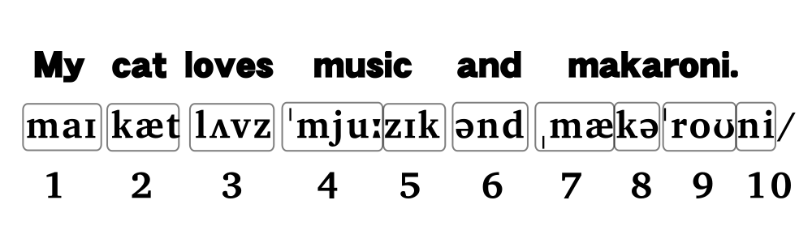

#### シラブルの構造
全てのシラブルは、**頭子音(Onset)** **音節核(Nucleus)** **末子音(Coda)** の３つの要素で構成されています。 

音節核と末子音は、シラブルの本体になっています。この本体を **音節基(Rime)** と呼びます。 

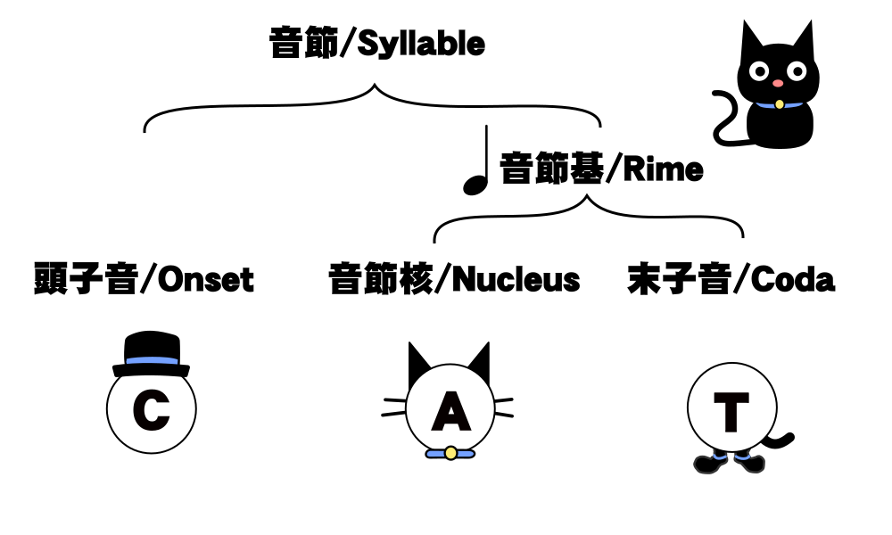

#### シラブルの頭子音はなくならない

単語 **Cat** の頭子音は **C** です。**C** がなくなると **At** という位置を表す前置詞になります。 この場合このシラブルには頭子音がありません。英語では、このように頭子音がそこにない時でもしばしばそこに **声門閉鎖音** という特殊な子音が挿入されます。 このことを**声門閉鎖音挿入(Glottal Stop Insertion)**  と呼びます。

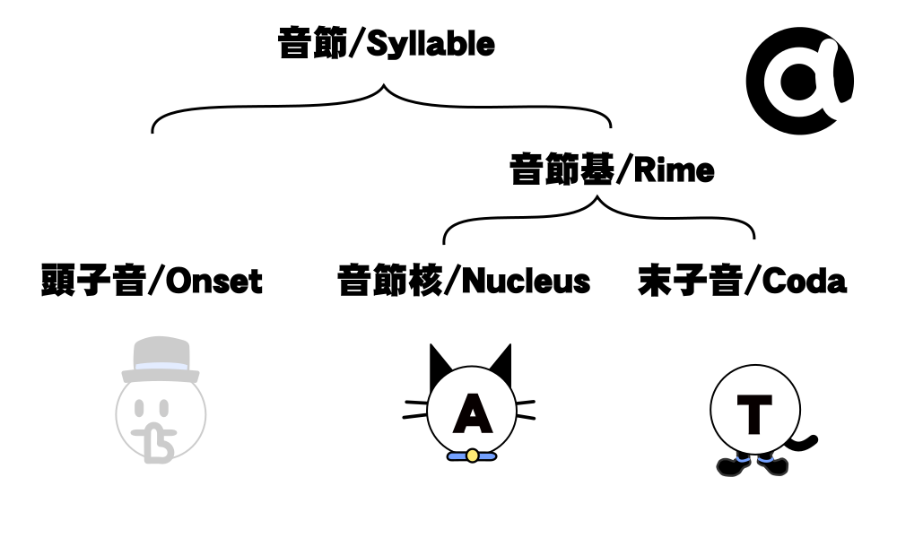

ネイティブ話者がほとんど声門閉鎖音挿入を意識していません。しかし日本人が、英語やスペイン語などのシラブル拍リズムやストレス拍リズムの言語を学ぶ場合、この**声門閉鎖音挿入をはっきり意識することはとても大切**です。これにはとても明快な理由があります。以下でその理由を見ていきましょう。

#### シラブルの音節基は等間隔で配置される
音節基は基本的に等間隔で発音されます。音節基の間に子音が何個あっても音節基は必ず等間隔に発音します。

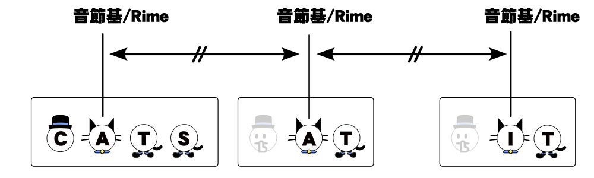

#### シラブルの頭子音と末子音は音節基の間に配置される
**頭子音** 及び **末子音** は、等間隔に並んでいる音節基と音節基の間に分散されます。頭子音と末子音の数が増えても音節基の間隔はかわりません。

#### シラブルの音節基に強拍が置かれる
読み上げの際は音節基に強拍が置かれます。

#### シラブルの頭子音と末子音に弱拍が置かれる。
音節基が強拍であることに対し **頭子音** 及び **末子音** は弱拍に対応します。

#### シラブルの末子音は頭子音に融合する＝リンキング

２つの音節が連続する場合、先に現れた音節の末子音は、可能な限り次の音節の頭子音としてまとめられて発音されます。このまとめる作業のことを**再音節化**・**再シラブル化** と呼びます。そしてこの末子音が頭子音にまとめられて発音される現象を**リンキング**と呼びます。**リンキングは英語の発音を学ぶうえで最も重要**と言っても過言ではない規則です。

#### シラブルには頭子音最大化原則＝MOP原則がある
リンキングは、可能であれば可能な限り起こるという規則があります。このことを**頭子音最大化原則（とうしおんさいだいかげんそく）**、または英語表記「Maximal Onset Principle」の頭文字をとって**MOP原則**と呼びます。

この図中で帽子が頭子音、猫が音節核、靴が末子音を表しています。

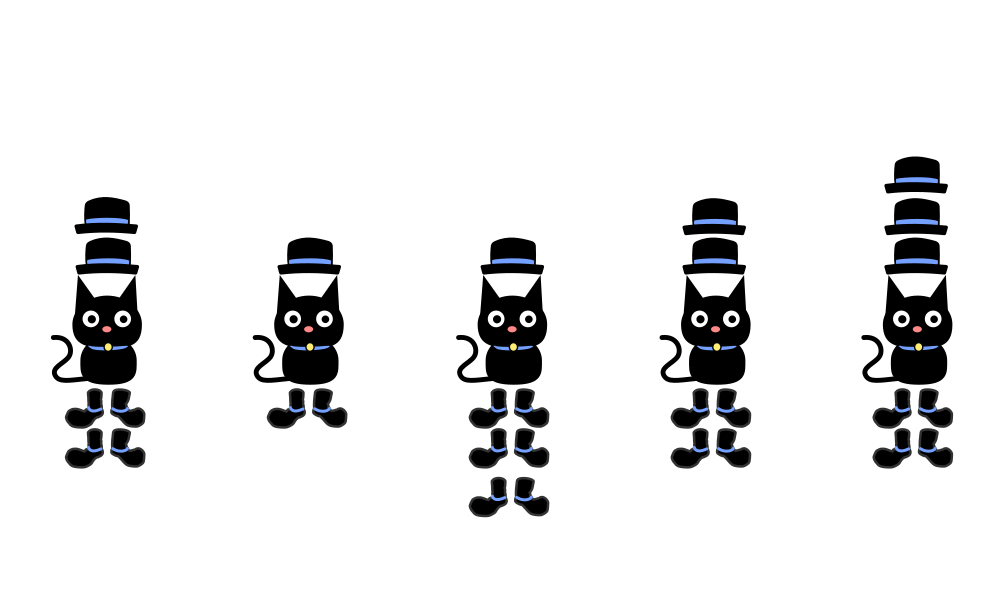

この図中の様に全ての末子音は出来るだけ次の頭子音に結びついてまとめて発音されます。これがリンキングです。

※ 実例を追加する。

### ストレス拍リズム🇩🇪🇺🇸🇬🇧の詳細
ストレス拍リズム（stress-timed rhythm）は、シラブル拍リズム（syllable-timed rhythm）から分岐して発展したと考えられているリズム認識の形式です。基本的な性質はストレス拍リズムと共通ですが、シラブル拍リズムにはないいくつかの大きな違いがあります。どちらのリズムも発音に一定のリズム感を作り出す為の拍を持っていますが、その拍の置き方に大きな違いがあります。

#### ストレス拍リズムとシラブル拍リズムの違い

前節で見た様に、シラブル拍には頭子音・音節基・末子音を持っています。ストレス拍はこれらのシラブル拍のルールをひとつの大きな例外を除いて全て踏襲します。その例外とはシラブルの等間隔性です。

シラブル拍リズムは**全てのシラブルが等間隔に置かれる**というルールがありますが、ストレス拍リズムではシラブルの中でも **ストレス拍** のある音節だけが一定の時間間隔で配置されるという追加のルールを持っています。  それ以外のシラブルは **無ストレス拍** と呼ばれ、ストレス拍とストレス拍の間に詰め込まれます。この際にストレス拍の等間隔を崩さない様、大幅に省略されて短縮されます。場合によっては完全に脱落します。  この ストレス拍リズムの無ストレス拍省略こそがシラブル拍リズムとの大きな違いで、ストレス拍リズムの最も大きな特徴になっています。

このストレス拍リズムは、前述のシラブル拍リズムからの発展形として、よりリズム／テンポの伸縮を可能にした時間的に柔軟な構造を持っていると考えられます。つまり、強調すべき箇所（＝ストレス拍）に拍という主軸を置くことによって、それ以外の非ストレス拍の複雑な配置が可能となり、これによって装飾音や弱起などの音楽的な効果を与えることができるのです。 このストレス拍リズムの構造が与える音楽的な奥行きが、ストレス拍独特な詩や歌の表現の多様性を生み出しています。そしてこの言語上のリズムが、更に音楽に対しても大きなフィードバックを与えています。

ストレス拍リズムの特徴には次のようなものがあります。

* 一定の時間毎に**ストレス拍** が置かれる。
* ストレス拍の隙間を埋めるように複数の**無ストレス拍** を分配する。

結果として次の法則が成り立ちます。

* ストレス拍は、必ず母音になる。
* 子音は必ず無ストレス拍に含まれる。
* 無ストレス拍には、子音と母音の両方がある。
* 母音は強拍と弱拍の両方がある。

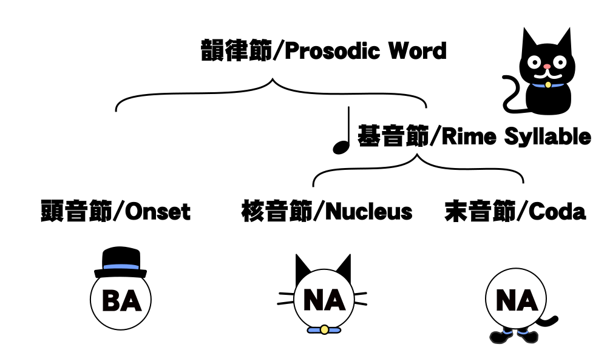

#### モーラ拍リズムとストレス拍リズムの違い

前節で見た様にシラブル拍リズムとストレス拍リズムの拍リズム構造は基本的に共通です。但しストレス拍リズムにはシラブル拍リズムにはない特徴＝**ストレス拍(アクセント)** があります。  つまり日本語のモーラ拍リズムから英語のストレス拍リズムを見ると、シラブル拍リズムの特徴とストレス拍リズムの特徴の両方の違いが、同時に混在している様に見えます。これが日本人が英語を理解することが難しくなる理由の１つです。

もし日本人が英語を最初に勉強するのではなく、スペイン語を最初に勉強していたならば、恐らく日本人は英語ほどの混乱はなくスペイン語を習得できた筈です。日本人が英語を学習するときは、モーラ拍リズムとシラブル拍の違いをしっかり学んで、シラブル拍リズムをきちんと身につけるだけでよかった筈です。

日本人が英語の勉強をする場合、シラブル拍リズムとモーラ拍リズムの違いをしっかり学んだ上で、シラブル拍リズムの発展系であるストレス拍リズムを学ぶ必要があります。 しかし現在の教育システムでは、日本人の英語学習者は、シラブル拍リズムをしっかり身につける間もなくストレス拍リズムを一気に同時に学習することになります。これは原理的に不可能なことです。

#### ストレス拍ではシラブルの長さは変化する

ストレス拍リズムではシラブルの長さは一定ではなくアクセントの有無によって長さが伸び縮みします。これはシラブル拍リズムにもモーラ拍リズムにもないストレス拍リズムだけがもっている独特な特徴です。

シラブル拍リズムの特徴を無視し、モーラ拍（日本語）とストレス拍（英語）のリズムの違いを見てみると、モーラ拍リズムのモーラの長さが伸び縮みしているように見えます。これは，アメリカ人が日本語を話した時によくなる英語訛り「ワターシワァ？ ニーホンｸﾞゴォウゥオォ？ ハナァシマスゥ！」という話し方に端的に現れています。アメリカ人は、ストレス拍を基準に非ストレス拍を短く揃える様に発音する習慣を持っている為、全ての拍を均等に揃えることが出来ません。

このことは、日本語の名称が英語でどのような発音に変化するかを観察するとよくわかります。以下は英語吹き替え版アキラの一幕です。

<blockquote class="twitter-tweet" data-media-max-width="560">
【縦乗りの起源】頭にアクセントが置かれる日本語の名前を英語ネイティブの人たちが読むと、しばしば2つ目の位置にアクセントが移動しますが、逆もまた然りです。  しばしば2番め以降にアクセントが置かれる英語のリズムを日本話ネイティブの人が読むと全アクセントが頭に移動します。  【英語版アキラ <a href="https://t.co/fJHnZgu5cb">pic.twitter.com/fJHnZgu5cb</a>
&mdash; 岡敦/Ats🇯🇵 (@ats4u) <a href="https://twitter.com/ats4u/status/1574375878184042496?ref_src=twsrc%5Etfw">September 26, 2022</a></blockquote>

ストレス拍リズムでは、アクセントが置かれたシラブル（モーラ）を他のシラブル（モーラ）よりも長く発音するというルールがあります。このため「タカシ」は「タカーシ」「アキラ」は「アキーラ」に変化します。一方タカシのタは弱拍にある為、軽く添える様に短く「ﾀｯカーーーｼ」とシラブル長が短くなる傾向があります。場合によってはこのシラブルは脱落し発音しないこともあります。シラブルの長さが伸び縮みする ─── これがストレス拍リズムの1つ目の特徴です。

つまり**逆もまた然り**です。日本人が英語を話すと「アーイー、スーピークー、イーンーグーリーッシュー」というような日本語訛りになってしまいます。これは日本人としてはとてもはっきりしていて聞き取りやすい様に感じますが、英語を話す人から見ると、ストレス拍リズムに必要なシラブルの省略がなく、不要なシラブルがたくさん混ざっていることにより、とても聞き取りづらい発音として感じられます。

英語では本来であればストレス拍と非ストレス拍の区分をはっきりさせて、ストレス拍の位置を定期的に配置しなければならないのです。ところが日本語では全ての拍を均等に同じ長さで発音する習慣を持っているために、ストレス拍及び非ストレス拍の区別をつけることが出来ず、英語として解釈できる発音が出来なくなってしまうのです。

#### ストレス拍ではアクセント付きシラブルを等間隔に発音する

ストレス拍ではシラブルの長さは一定ではなくアクセントの位置によって伸び縮みしますが、このアクセント付きのシラブルはできる限り等間隔に発音し、アクセントのついていないシラブルは、短くなったり場合によっては省略されたりしながら、アクセント付きシラブルの間に適当に分散します。 これはシラブル拍にもモーラ拍にもないストレス拍独特な特徴です。

| 例文                                              | シラブル数 |
| ----------------------------------------------- | ----- |
| **Boys** **play** **games**.                    | ３     |
| The **boys** **play** **games**.                | ４     |
| The **boys** will **play** **games**.           | ５     |
| The **boys** will be **playing** **games**.     | ６     |
| The **boys** will be **playing** the **games**. | ７     |

ここで太字で書かれた **Boys play games** はアクセント付き（ストレス拍）として発音されます。つまりこれらのシラブルは、等間隔に発音されます。そして、それ以外の機能のある語 (function word = 助動詞 auxiliaries と 代名詞 pronouns ) はアクセントなし（非ストレス拍）としてアクセント付きシラブルの間に分散されつつ発音されます。

次のビデオで実際の音声を確認してください。

<iframe width="560" height="315" src="https://www.youtube.com/embed/VXHxtpvRacc?si=nOJ9rsU44BqROp7R&amp;start=450" title="YouTube video player" frameborder="0" allow="accelerometer; autoplay; clipboard-write; encrypted-media; gyroscope; picture-in-picture; web-share" referrerpolicy="strict-origin-when-cross-origin" allowfullscreen></iframe>

#### ストレス拍ではアクセントなしシラブルが省略される

ストレス拍リズムでは、アクセントなし（無ストレス拍）のシラブルは、しばしば様々な形で省略されます。

##### 母音省略のよくあるケース
母音省略がよく起こるケースには次のようなものがあります。

| **理由**                                           | 例                              | 解説                                             |
| ------------------------------------------------ | ------------------------------ | ---------------------------------------------- |
| **機能語** (**Function words**)                  | _to, for, and, of, at_         | /tə/, /fər/, /ən/, /əv/, /ət/                  |
| **接頭辞** (**Prefixes**)                        | _com-, con-, de-, re-, in-_    | _compact_ /ˈkɒmpækt/ vs. _compact_ /kəmˈpækt/  |
| **Suffixes**                                     | _-tion, -ous, -al, -ity, -ive_ | Reduced in rhythm: _dangerous_ → /ˈdeɪndʒərəs/ |
| **Second/third syllable in multisyllabic words** | _America_ → /əˈmɛrɪkə/         | Very frequent in polysyllables                 |

##### 母音省略の例

| 単語          | 変化前                                                         | 変化後                         | 解説                                                                               |     |
| ----------- | ----------------------------------------------------------- | --------------------------- | -------------------------------------------------------------------------------- | --- |
| banana      | /baˈnaːna/ ([ウォロフ語](https://en.wiktionary.org/wiki/banana)) | /bəˈnænə/ (英語)              | 単一母音の** シュワ母音/ə/ 化**                                                             |     |
| happy       | /ˈhæpiː/                                                    | /ˈhæpi/                     | ** /iː/ が /ɪ/ 又は  /i/ ** ( [ハッピー母音](https://en.wiktionary.org/wiki/happy_vowel)) |     |
| _influence_ | /ˈɪnfluəns/                                                 | /ˈɪnflʊəns/                 | ** /uː/ が /ʊ/** へ                                                                |     |
| going       | /ˈɡoʊɪŋ/                                                    | /ˈɡəʊɪŋ/ → /ˈɡəɪŋ/ → /ˈɡɪŋ/ | **二重母音の単純化**（**Diphthong Simplification**）                                       |     |
| Canada      | /ˈkænədə/                                                   | /ˈkænədə/                   | **短母音/æ/  のシュワ母音/ə/化**                                                           |     |
| support     | /sʌˈpɔːrt/                                                  | /səˈpɔːt/                   | **短母音 /ʌ/ のシュワ母音/ə/化**                                                           |     |
| family      | /ˈfæməli/                                                   | /ˈfæmli/                    | **母音の脱落** (**Vowel Deletion**)                                                   |     |
| _probably_  | /ˈprɒbəbli/                                                 | /ˈprɒbli/                   | **母音の脱落** (**Vowel Deletion**)                                                   |     |
| _chocolate_ | /ˈtʃɒklət/                                                  | /ˈtʃɒklɪt/                  | **母音の脱落** (**Vowel Deletion**)                                                   |     |
| roses       | /ˈroʊzɪz/                                                   | /ˈrəʊzəz/                   | ** /ɪ/ のシュワ母音/ə/化**                                                              |     |

##### 母音省略３種類の形式
ストレス拍リズムでは、アクセントなし（無ストレス拍）のシラブルは、短縮、結合、脱落します。

- **弱化** （主に母音の短絡＝シュワと呼ばれる）
- **短縮** 
- **脱落** 

この規則により、アクセント付き（ストレス拍）が等間隔に発音できる用になります。

##### 1. **弱化(Vowel Reduction)**:
アクセントのない（非ストレス拍）シラブルにある母音は、/ə/ ─── しばしばシュワと呼ばれる英語で最も頻出する母音に変化します。 

| 単語      | 変化前   | 変化後         | 例                                 |
| ------- | ----- | ----------- | --------------------------------- |
| **to**  | /tuː/ | /tə/        | I want **to** go. → _"wanna go"_  |
| **of**  | /ʌv/  | /əv/ or /ə/ | A cup **of** tea. → _"cup’v tea"_ |
| **and** | /ænd/ | /ən/, /n/   | You and me. → _"you’n me"_        |

######  中舌化とは
母音がシュワ母音 /ə/ に近付くことを中舌化といいます。 具体的には、母音の発音時に舌の位置が口腔内の前方や後方から中央（＝中舌位置）に移動することを指します。これはストレス拍リズム言語で、無アクセント音節にある母音が弱まり曖昧な音に変化することを指します。

* 母音は、発音時の舌の**水平的位置（前舌／後舌）や垂直的位置（高舌／低舌）**によって分類されます。
* 中央化とは、これらの位置が中央付近（mid-central）に向かって収束することを意味します。
* その結果、母音はより「曖昧」な音、例えば シュワ母音 /ə/  のような音に近づきます。

##### 2. **短縮(Contractions)**:

文法として必要な単語は、ストレス拍が一定間隔で並ぶことができるように短縮されます。

| 短縮前               | 短縮後         | 例                       |
| ----------------- | ----------- | ----------------------- |
| I am              | I’m         | I’m fine.               |
| He will           | He’ll       | He’ll come soon.        |
| They are          | They’re     | They’re nice.           |
| I would have gone | I’d’ve gone | I’d’ve gone if I could. |

> 🗣️ “I’d’ve” は、３シラブル分が全て短縮し**１つのアクセント付きシラブルに短縮される**興味深い例と言えます。

---

##### 3. **脱落(Omission)**:

アクセントのない（非ストレス拍）シラブルは、カジュアルな場面や早口で話しているときに完全に脱落します。

| Careful Speech       | Casual Speech     | Note                         |
| -------------------- | ----------------- | ---------------------------- |
| Did you eat yet?     | Didja eat yet?    | “Did you” → _“Didja”_        |
| What are you doing?  | Whatcha doin’?    | “What are you” → _“Whatcha”_ |
| I’m going to go now. | I’m gonna go now. | “going to” → _“gonna”_       |
| I want to do it.     | I wanna do it.    | “want to” → _“wanna”_        |
| Don’t you know?      | Doncha know?      | “Don’t you” → _“Doncha”_     |

#### ストレス拍とシラブル拍の関係は再帰的＝再帰的韻律同一性原理RPEP

ストレス拍とシラブル拍は、再帰的な関係を持っています。

##### 再帰とは

**再帰**とは全体の構造がその一部の構造と一致することです。

この漫画には、自分自身の状況をそのまま漫画にするという再帰的な自己言及性が表現されています。

この様な再帰的な構造は世界のあらゆる場所に現れます。

 

再帰についての詳しい解説は[オンライン上の解説](https://www.google.com/search?gl=us&hl=en&gws_rd=cr&safe=off&q=%E5%86%8D%E5%B8%B0)などを参照してください。

ストレス拍には、これと同じ再帰的構造があります。

##### ストレス拍とシラブル拍の再帰的構造
シラブル拍は、頭子音・音節核・末子音という要素を持っていることを見てきました。

そして [MOP 原則](#シラブルには頭子音最大化原則＝MOPがある) によって、末子音が頭子音にまとめられて発音されることを見てきました。

これと同じ構造がストレス拍リズムにも存在します。

前述したシラブル拍の構造が、ストレス拍に関しても成立します。

ストレス拍のアクセント（すなわちストレスのある拍とストレスのない拍）を分析すると、中心に核となるストレスのあるシラブルが置かれ、その前後にストレスのないシラブルが前、及び後ろにある構造が浮かび上がります。 この構造は英語の音韻分析では従来、二分木構造などの階層モデルによって説明されてきました。 本稿が提唱する多層弱拍基軸理論は、**シラブル拍の分析手法は、そのままストレス拍にも再帰的に利用できる** という新しい視点を提案します。このことを本書では **再帰的韻律同一性原理**  **RPEP (Recursive Prosodic Equivalence Principle)** と呼びます。 そしてストレス拍に適用された MOP原則のことをここでは **MPOP (Maximal Prosodic Onset Principle)** と呼びます。

この理論では、シラブル拍リズムのシラブルのリズム構造は、ストレスあるなしの二分木構造に置き換わるのではなく、むしろシラブル拍と同じ構造が、階層の異なる次元で再帰的に表現されます。

そして、更にこの再帰的構造がストレス拍で演奏される音楽のリズムにそのまま再帰的に適用されることを説明します。

更に、これが音楽のリズム上では、16分音符・8分音符・4分音符・2分音符．．．と、そのまま無限に再帰的適用されることを見ていきます。

#### ストレス拍の韻律節の構造

**再帰的韻律同一性原理**  **RPEP (Recursive Prosodic Equivalence Principle)** では、単語のなかのシラブルをアクセントの位置によって分類します。

単語のなかのアクセントのあるシラブルのことを核音節(Nucleus Syllable) と呼びます。

単語のなかの核音節の前にある全ての音節を**頭音節(Onset Syllable)**と呼びます。

単語のなかの韻律節内の核音節の後ろにある全ての音節を**末音節(Coda Syllable)**と呼びます。

このいくつかの音節のまとまりを**韻律節 (Prosodic Word)** と呼びます。

韻律節は、大抵単語と等しくなります。しかしこのあとで紹介する**再韻律節化(Reprosodification)**という法則が適用されることで一致しなくなることがあります。

全ての韻律節は、**頭音節(Onset)** **核音節(Nucleus)** **末音節(Coda)** の３つの要素で構成されています。 

核音節と末音節は、ストレス拍の韻律節の本体になっています。この本体を **基音節(Rime Syllable)** と呼びます。 

#### ストレス拍では韻律節(単語)を基本単位として発音する

韻律節は、大抵単語と等しくなります。しかしこのあとで紹介する**再韻律節化**という法則が適用されることで一致しなくなることがあります。以下で見ていきます。

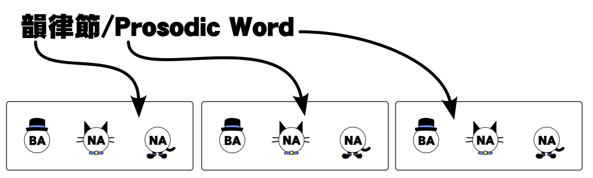

#### ストレス拍では基音節は等間隔で配置される
基音節に等間隔で発音されます。基音節の間にある音節の数に関わらず、基音節は必ず等間隔に配置します。

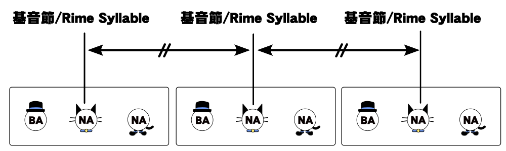

#### ストレス拍では頭音節と末音節は基音節の間に配置される
**頭子音** 及び **末子音** は、等間隔に並んでいる基音節と基音節の間に分散されます。頭音節と末音節の数が増えても基音節の間隔は変わりません。

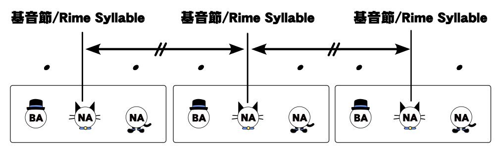

#### ストレス拍では基音節に強拍が置かれる
読み上げの際は基音節に強拍が置かれます。

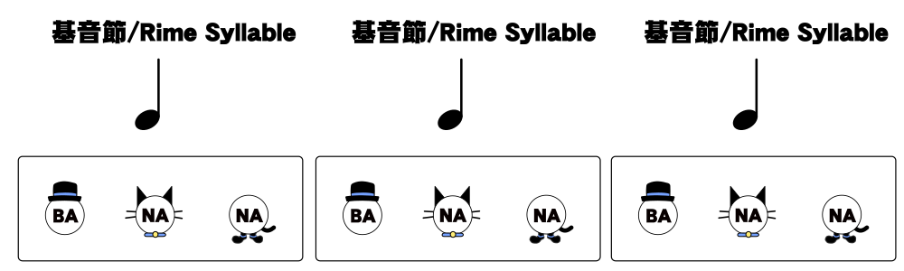

#### ストレス拍では頭音節と末音節に弱拍が置かれる
基音節が強拍であることに対し **頭子音** 及び **末子音** は弱拍に対応します。

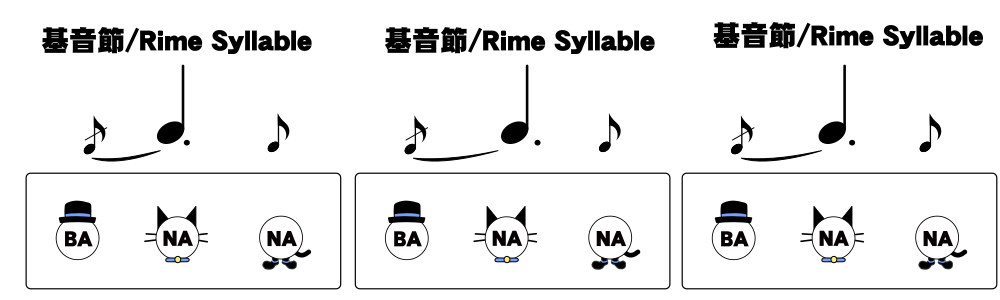

#### ストレス拍では末音節は頭音節に融合する再韻律節化が起こる

２つの音節が連続する場合、先に現れた音節の末子音は、可能な限り次の音節の頭子音としてまとめられて発音されます。このまとめる作業のことを**再韻律節化 (Reprosodification)** と呼びます。そしてこの末音節が頭音節にまとめられて発音される現象を **音節リンキング** と呼びます。

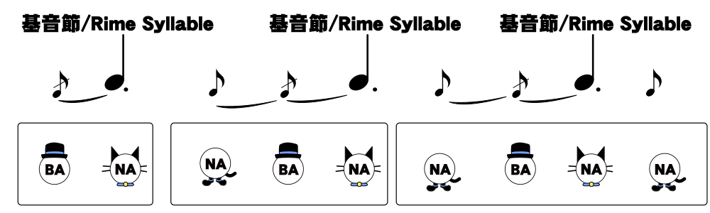

#### ストレス拍には頭音節最大化原則＝MPOP原則がある

シラブル拍では末子音が可能な限り頭子音としてまとめられて発音されることを学びました。またこの法則を頭子音最大化原則と呼ぶことを見てきました。

そしてシラブル拍リズムから派生したストレス拍リズムでも、シラブル拍と同様に、シラブル拍で起こる頭子音最大化原則が全て同様に起こります。

更にストレス拍リズムでは、シラブル拍で全ての**音素(Phonome)** に対して頭子音最大化原則(MOP)が適用されたことと全く同じ様に、全てのシラブルに対して**頭音節最大化原則(MPOP)** が適用されます。

つまり音節リンキングは、可能であれば可能な限り起こるという規則をもっています。このことを **頭音節最大化原則（とうおんせつさいだいかげんそく）**、または英語表記「Maximal Prosodic Onset Principle」の頭文字をとって**MPOP原則**と呼びます。

この図中で帽子が頭音節、猫が核音節、靴が末音節を表しています。

この図中の様に全ての末音節は出来るだけ次の頭音節に結びついてまとめて発音されます。これが音節リンキングです。

※ 実例を追加する。

### モーラ拍リズム🇯🇵の詳細

モーラ拍は、シラブル拍、及びストレス拍とは全く違った特徴を持っています。

#### モーラ拍の主な特徴

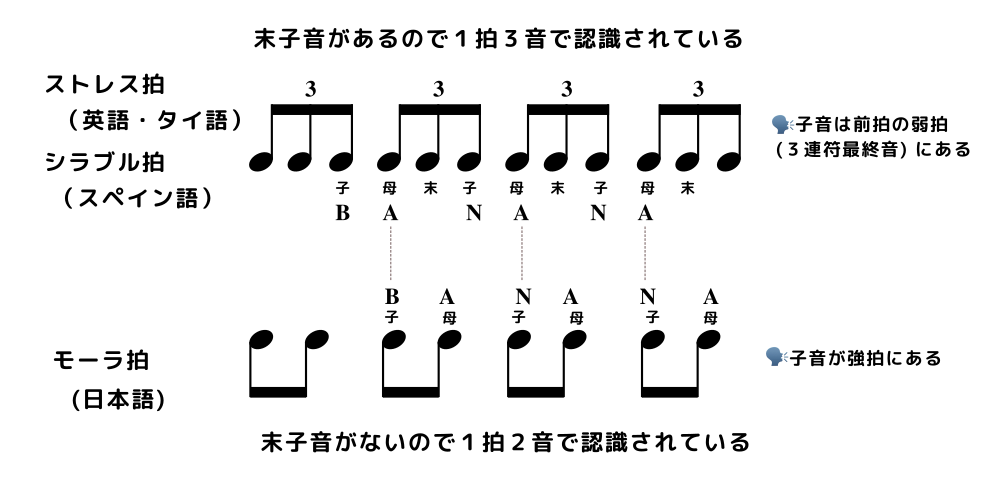

日本語のリズムは、学術的に **モーラ拍リズム** に分類されています。モーラ拍リズムは、**シラブル**音節ではなく**モーラ**音節という特殊な単位で発音すると定義されています。この**モーラ**音節の構造を**シラブル**音節と比較すると多くの根本的な違いがあります。 日本語のモーラ拍リズムには主に以下のような特徴があります。

* 発音が一定時間ごとに区切れておりこの1音をモーラと呼ぶ。
* モーラは主に母音と子音で構成され末子音を持たない。

モーラ拍（日本語）とシラブル拍（英語）の違いを短くまとめると次のようになります。

* モーラ拍は、子音が必ず **拍(音節基)** の後ろにある。
* シラブル拍は、子音が必ず**拍(音節基)** の前にある。

そして更に踏み込んで調べてみますと、次の様な認識の違いが存在することがわかります。

* モーラ拍は、子音と母音を区別しない。
    * シラブル拍（英語）には連続する複雑な子音クラスターがたくさん現れるため、いつも子音の位置を意識して発音しますが、モーラ拍（日本語）は子音が短く単純な為、ほとんどの場合その子音の位置を意識しません。
* モーラ拍は、末子音がない
    * シラブル拍は子音だけ単独で発音することが出来るため、当然音節（シラブル）の末尾に子音が来ることは稀ではありません。しかしモーラ拍（日本語）では、外来語で現れる末子音にも、その子音だけで独立した1モーラを割り当てます。つまりモーラ拍では末子音が存在することが出来ないのです。
* モーラ拍は、多重子音がない
    * 多重子音にはそれぞれの子音に母音をつけ1モーラが割り当てる。
* モーラ拍は、子音が短い
    * → 母音とモーラが主体で子音は重要ではない。
    * → 子音数が少ない。
* モーラ拍は、母音しか意識しておらず子音が意識できない
    * → 母音とモーラが主体で子音は重要ではない。
    * → 子音数が少ない。

|          | モーラ拍 | シラブル拍 |
| -------- | :--: | :---: |
| 子音と母音を区別 |  ない  |  ある   |
| 末子音      |  ない  |  ある   |
| 多重子音     |  ない  |  ある   |
| 子音       |  短い  |  長い   |
| 子音を意識    | しない  |  する   |

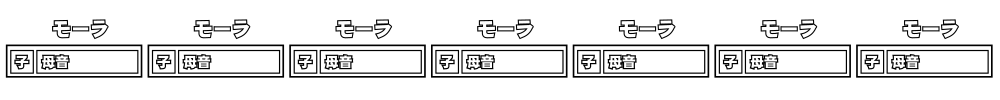

結果としてモーラ拍とシラブル拍には最初に挙げた図の様な違いが表れます。

以下でモーラ拍リズムとシラブル拍リズムの違いを詳細に見ていきましょう。

#### モーラには末子音がない
モーラ音節をシラブル音節と比較した時の最大の違いは、末子音がないことです。モーラ音節には末子音がない ─── これがモーラ拍リズムの最大の特徴です。モーラ音節に末子音がないことが発端となってモーラ音節にはシラブル音節とは全く違った性質が生み出されます。以下で見ていきます。

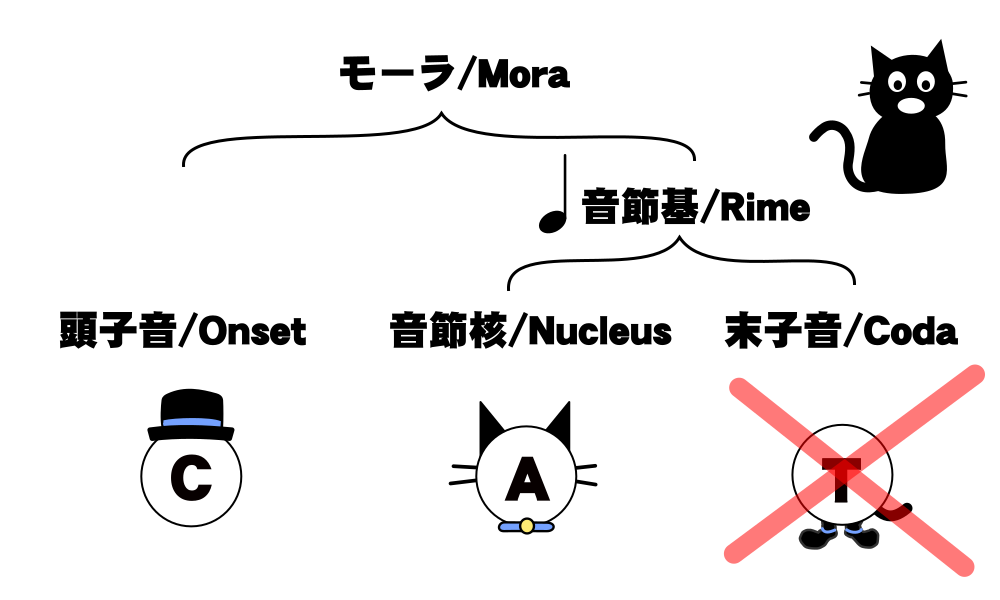

#### モーラの頭子音は音節基に含まれる
シラブル音節では音節基に頭子音は含まれません。しかしモーラ音節では音節基に頭子音が含まれます。これがモーラ音節の2つ目の大きな特徴です。

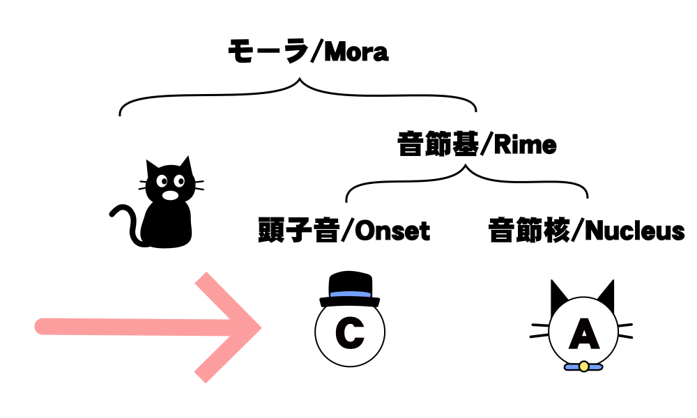

#### モーラと音節基は同じ長さで区別がない

シラブル音節では、頭子音と音節核はそれぞれ独立していますが、モーラ音節では、音節核に頭子音が含まれ、かつ末子音がない為、結果として音節核と音節が同じ長さになり区別がなくなります。

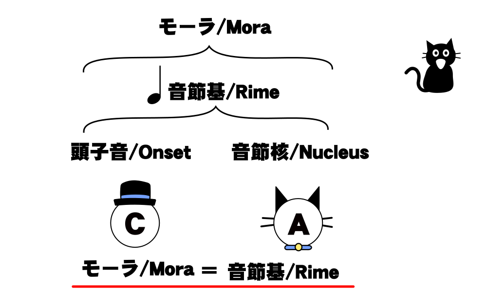

#### モーラの頭子音はとても短い

日本語（モーラ拍）の子音は、シラブル拍ストレス拍の言語の子音の長さと比較して非常に短いという特徴があります。

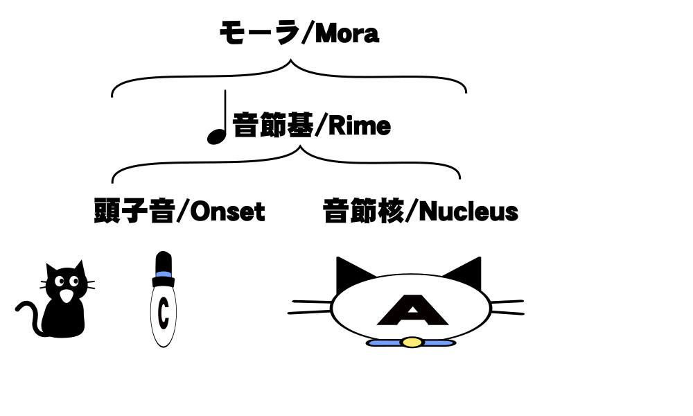

これは母音優位な言語である日本語だけを話しているとほとんど意識できないことですが、一般的に日本語以外の言語では子音は母音と同じくらい長いものです。

これは米国政治家トランプ氏の有名な写真です。彼が正に今 **頭子音 F** を長く発音することでFで始まる単語を言おうとしていることがわかる写真です。この様に英語やその他の言語では**子音は長く発音する**ことができます。 ─── これは日本語がフを長く言おうとすると「ふううーーー」となってしまい**母音「う」** しか残らないことと対照的です。

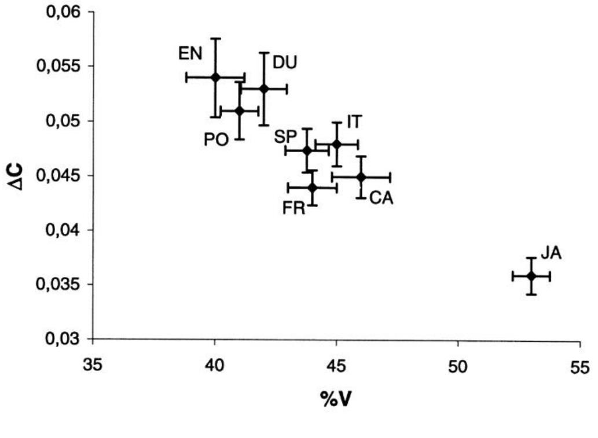

引用：[言語と音楽のリズム的共通性：ジャズおよびブルーグラス奏者を対象とした事例研究 — ウディ・ワールサガー修士論文](https://www.academia.edu/50961691/Rhythmic_Similarities_between_Language_and_Music_Jazz_and_Bluegrass_Musicians_as_a_Case_Study_Udi_Wahrsagers_Thesis?utm_source=chatgpt.com) この論文は『言語と音楽のリズム的類似性』というタイトルの修士論文で、ジャズとブルーグラスの演奏家を比較対象にしています。（著：ウディ・ワールサガー）

このグラフは、**縦軸=AC**が平均的な子音の長さ、**横軸=%V**が母音の長さの平均的パーセンテージを表しています。ここから日本語だけが突出して長い母音を持っており、突出して短い子音を持っていることがわかります。特に母音の長さが50%を超えている言語は、８カ国語中１カ国JA=日本語だけということがはっきり見て取れます。

#### モーラの頭子音はなくなる
シラブル音節では、頭子音が音節核と独立しており、かつ音節核に音節基が置かれている為、**頭子音がなくなっても音節核の位置は変わりません。**  しかしモーラ音節では、頭子音が音節基に含まれている為、**頭子音がなくなると音節基がその分拡張します。** これがモーラ拍リズムの3番目の特徴です。

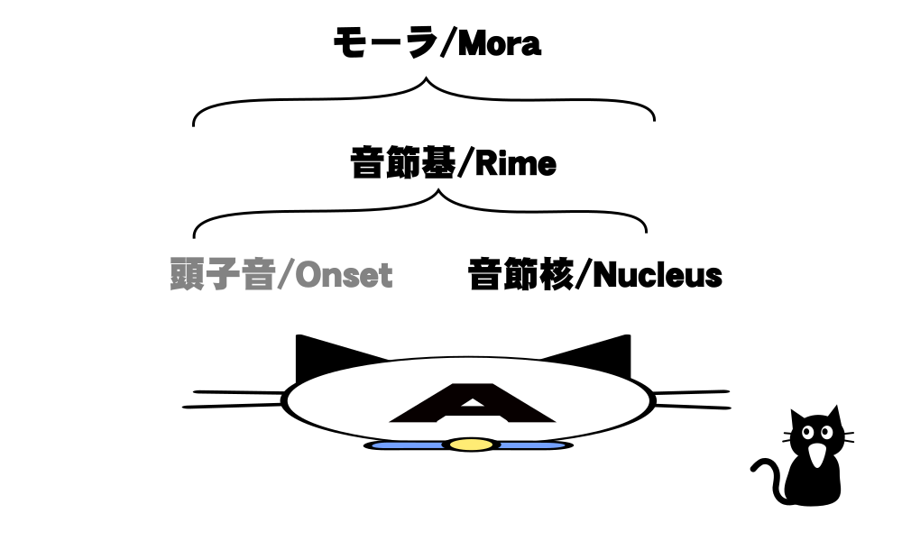

#### モーラには頭子音最小化原則 (MiOP = Minimum Onset Principle) がある

シラブル音節では、末子音はできる限り次の音節の頭子音と接続してまとめて発音されることを見てきました。シラブル拍と共通のルールを持つストレス拍リズムでも同様です。しかしモーラ拍ではここで全く違うルールが適用されます。

モーラ拍では、頭子音は可能な限りばらばらに分解されて発音されます。

モーラ拍リズムは末子音を持ちません。 末子音があった場合、末子音が次の頭子音と結合することを避ける為に、その末子音が新しい母音のない音節（モーラ）を作り、そこの頭子音として発音されます。またモーラ拍リズムは多重子音を持ちません。多重子音が表れた場合、それぞれの子音がそれぞれ独立した音節（モーラ）を作り、そこの頭子音として発音されます。

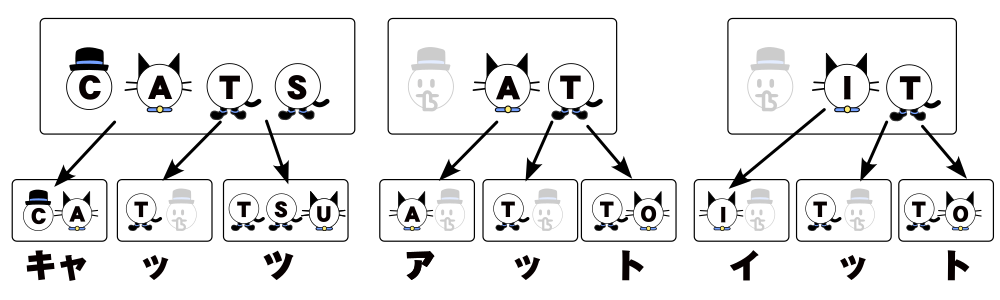

この様にモーラ拍リズムでは、頭子音末子音が可能な限り独立してバラバラになるように発音されます。これはシラブル拍言語・ストレス拍言語が持っている**頭子音最大化原則(MOP原則)** と真逆の性質です。 この性質を、ここでは **頭子音最小化原則 (MiOP = Minimum Onset Principle)** と呼びます。

#### モーラとシラブルの違いは強拍と弱拍の前後関係の違い

モーラ拍とシラブル拍の違いは、頭子音（弱拍）が音節基（強拍）よりも前にあるか、後ろにあるかに集約されます。

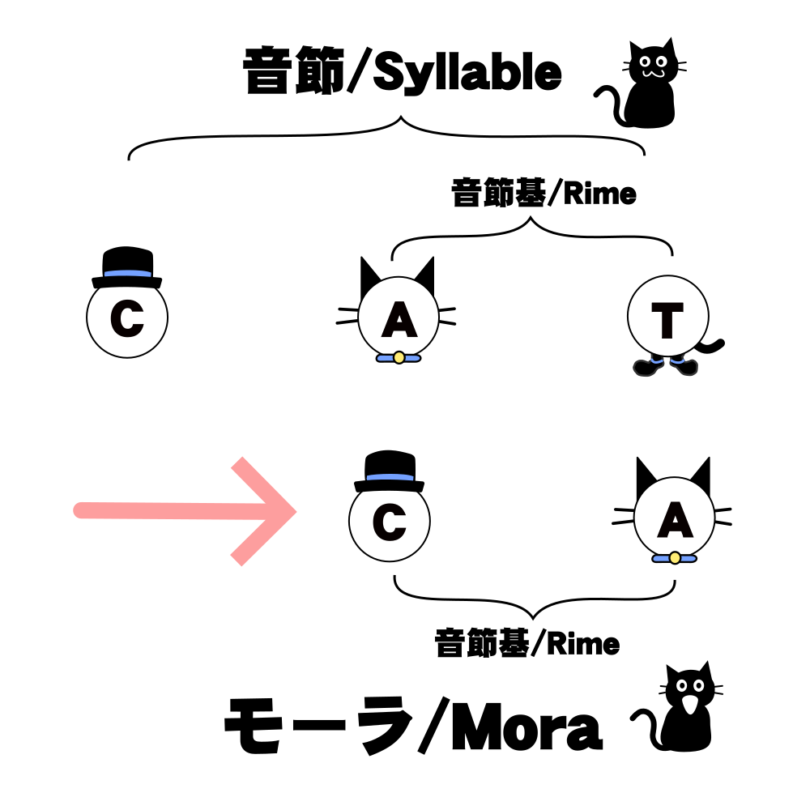

**シラブル拍リズム言語を話す人は、一定間隔でやってくる強拍（音節基）を聴く前に弱拍（頭子音）を認識**しています。

対して**モーラ拍リズム言語を話す人は、一定間隔でやってくる強拍（音節基）を聴いた後に弱拍（頭子音）を認識**しています。

このシラブル拍リズム言語が持っている強拍よりも前に弱拍があるという感覚は、強拍よりも後ろに弱拍があると認識しているモーラ拍リズムの言語を話している人にとって、大変に不可解でつかみにくい感覚です。

これをモーラ拍リズム言語を第一言語として話す人が、第二言語としてシラブル拍リズム言語のリズムを訓練によって習得しようとすると、しばしば１０年、場合によっては２０年近い年月が掛かることも稀ではありません。

オフビートカウント理論は、このモーラ拍リズムを母国語とする人が、シラブル拍リズムや次に紹介するストレス拍リズムを第二言語として習得する為にどのようにしたら最も効率よく習得することが出来るかに着目し考察した結果として生まれた練習方法です。

## 言語のリズムと音楽のリズムの交差点

### 頭子音構成軸 (OSA=Onset Structuring Axis)とは

これまでシラブル拍・ストレス拍・モーラ拍と順番に言語リズムの特徴について見てきました。弱拍強拍の順序には言語によって違いがあります。音節核と頭子音の位置関係が弱拍強拍の順序の向きがあります。このことをここでは、頭子音構成軸 (OSA=Onset Structuring Axis)と呼びます。

* シラブル拍リズム言語  (**拍の順番→ 弱強**)
    * 母音を等間隔に発音する。
    * 頭子音最大化原則(MOP=Maximize Onset Principle)
        * 末子音は出来るだけ頭子音としてまとめて発音する。
* ストレス拍リズム言語 (**拍の順番→ 弱強**)
    * シラブル拍リズム言語の全ルールを踏襲しルール追加する。
    * アクセントのある母音を等間隔に発音する。
    * アクセントのない母音と子音を縮小してアクセントのある母音の等間隔性を守る。
    * 頭音節最大化原則 （MPOP＝Maximal Prosodic Onset Principle)
        * 末音節は頭音節にできるだけまとめて発音する。
* モーラ拍言語 (**拍の順番→ 強弱) 注意！逆**
    * 母音ないしは子音が等間隔に並んでいる。
    * 頭子音最小化原則 (MiOP = Minimum Onset Principle)
        * 末子音、及び多重子音は、新たにシラブルを作って必ずばらして発音する。

この様に、言語によって、頭子音をまとめる位置を決める方向の違いがあります。これが頭子音構成軸 (OSA=Onset Structuring Axis)です。

### 言語リズム投影理論 ( LRPT Linguistic Rhythm Projection Theory )＝頭子音構成軸（OSA）が音楽の弱拍強拍の順序をも決める

 **再帰的韻律同一性原理**  **RPEP (Recursive Prosodic Equivalence Principle)** によって、頭子音構成軸(OSA) も再帰的に適用が出来るという仮説によって、言語を超えて音楽のリズムにもOSAを適用したものが <ruby><rb>律動</rb><rt>リズム</rt></ruby>的頭子音最大化原則(RMOP=Maximal Prosodic Onset Principle)  及び <ruby><rb>律動</rb><rt>リズム</rt></ruby>的頭子音最小化原則(RMiOP=Minimum Prosodic Onset Principle)  です。

そして言語と音楽だけでなく、更に歩き方やスポーツ格闘などその他の行動原理にも反映させたものをここでは **能動的事前分割主義 ( PD＝Proactive Divisionism )**  **受動的事後追随主義 ( Reactive Appendism )** と呼びます。

* シラブル拍/ストレス拍のMOP、及びストレス拍のMPOP
    * → **弱強リズム認識**が音楽にも適用される
        * → <ruby><rb>律動</rb><rt>リズム</rt></ruby>的頭子音最大化原則(RMOP) 
            * → 能動的事前分割主義 ( Proactive Divisionism )
* モーラ拍のMiOP
    * → **強弱リズム認識**が音楽にも適用される
        * → <ruby><rb>律動</rb><rt>リズム</rt></ruby>的頭子音最小化原則(RMiOP) 
            * → 受動的事後追随主義 ( Reactive Appendism )

### 能動的事前分割主義 (Proactive Divisionism )と受動的事後追随主義（Reactive Appndism )  

**核 Nucleus** と **頭子音 Onset** の位置関係 ── これこそが日本語と他言語との根本的な違いです。 言語における核 Nucleus は、音楽における**強拍**のような役割を果たします。 各言語が聴覚上で核(Nucleus)の**前**に頭子音(Onset)を配置しているか、あるいは**後**に配置しているかという認知上の傾向の違いが、音楽におけるリズム認識 ── すなわち、**強拍の前に弱拍を置くか、後に置くか** ── というリズム順序の違いへと反映されるのです。この強拍弱拍の順番認識が言語発音構造上の拍リズム認識と相関関係があるという仮説を、ここでは**<ruby><rb>律動</rb><rt>リズム</rt></ruby>的頭子音最大化原則（RMOP = Rhythmic Maximal Onset Principle ）** と呼びます。

**核（Nucleus）** は、音楽で言うところの強拍の様なものです。 

シラブル拍・ストレス拍では音節核と同時に母音を発音します。つまり母音が強拍の様なものです。そして子音は弱拍の様なものです。そして、子音は母音の前後にあります。しかし**頭子音最大化原則＝MOP** によって末子音は全て頭子音にまとめられます。つまり**子音は必ず母音の前に配置**されます。ここからシラブル拍・ストレス拍は、弱拍を先にくるものとして認識し、強拍を弱拍の後ろとして認識しているのです。

モーラ拍では、音節核と同時に子音を発音します。つまり子音自体が強拍の様なものになります。そしてその後に続く母音が弱拍のようなものです。そしてモーラ拍には末子音がなく頭子音最大化原則＝MOPももちません。つまり**モーラ拍では強拍が先に来るものとして認識しており、弱拍がその後に続いていると認識している**のです。

更に、モーラ拍では子音と母音の区別をせず別々の要素として扱いません。つまり弱拍という概念自体が希薄だといえます。頭子音がない場合は音節核で同時に母音を発音するという習慣があるのは、弱拍と強拍を区別しないからこそだといえます。いわばモーラ拍には強拍しかありません。これが弱拍を持つシラブル拍・ストレス拍との大きな違いです。

弱拍が前だと認識することの本質は強拍の位置の予想です。弱拍の後に続くまだない強拍の位置を予想する為には、現在のテンポがどの程度なのかを予想する必要があります。そしてそれだけでなく次の音符の音価が何なのか…八分音符なのか四分音符なのか二分音符なのか…全てを前もって予想している必要があります。予想であるからこそ、外れることがあります。外れた場合には修正も必要となります。こうして演奏中に強拍の位置を修正しながら弱拍を演奏し続けるという行為を恒常的に行い続ける必要があります。

弱拍が後ろだと認識すると**これらの全ての予想が不要になります**。  そして弱拍が後ろだと認識することの本質は、追従です。強拍が聞こえてから行動を起こす。強拍が聞こえてから一定時間待って手を動かす。強拍が聞こえてから一定時間待って、次の強拍を演奏する。 ─── 全ての行動が何らかのトリガを聞いてから追従して開始するという原理に基づいているのです。

これは日本人が時間を分割するという感覚を持っていないことを隠喩しています ─── このことは観察によって簡単に証明することができます。その方法は、 二人でペアになって、交互に手を叩くことです。しばらくやってみるとわかりますが、日本人は交互のタイミングを維持することが出来ず同時に収束してしまいます。これは日本人以外の人にはとても容易いことですが、日本人だけが交互手叩きを行うことが出来ないのです。

### <ruby><rb>日本的追従律動</rb><rt>タテノリ</rt></ruby>とは

このことをここでは<ruby><rb>日本的追従律動</rb><rt>タテノリ</rt></ruby>  <!--<ruby><rb>日本的</rb><rt>にほんてき</rt><rb>追従</rb><rt>ついじゅう</rt><rb>律動</rb><rt>リズム</rt></ruby>--> と呼びます。

この<ruby><rb>日本的追従律動</rb><rt>タテノリ</rt></ruby> は、日本人の全ての行動の原理に深く影響を与えています。例えば終わらない残業などがこれに当たります。始まる時間はとても正確なのに終わる時間は全く正確ではないことは日本人の悪しき習慣と言われて久しいですが直る気配も直す気配も全くありません。これこそが <ruby><rb>日本的追従律動</rb><rt>タテノリ</rt></ruby> の一例です。 コンビニで１人がレジに行くと全員レジに行ってレジが混みだす ─── これも<ruby><rb>日本的追従律動</rb><rt>タテノリ</rt></ruby> の一例です。１人トイレに行くとみんなで一緒にトイレにいかないと気がすまない。これも<ruby><rb>日本的追従律動</rb><rt>タテノリ</rt></ruby> です。 広い道端で、鉢合わせになった二人・・・右に避けると右に避ける、左に避けると左に避ける。何度避けてもぶつかりそうになる。日本にいると「お前が見ていないからだ！」と責任転嫁することも可能ですが、海外の人混みでこの挙動は極度に目立ちます。これも<ruby><rb>日本的追従律動</rb><rt>タテノリ</rt></ruby> の典型的な例です。他にもたくさんの例があります。 日本人の全ての挙動を<ruby><rb>日本的追従律動</rb><rt>タテノリ</rt></ruby> が支配しています。 ─── このことについては、稿を改めて [**日本語が人間の動作の認識に与える影響の仮説**](japanese-phonetic-hypothesys/index.md) にて詳細に議論します。

ここでは <ruby><rb>日本的追従律動</rb><rt>タテノリ</rt></ruby> が音楽のリズムに対して与えている大きな影響について次節以降で見ていきます。そしてこれが日本人の英語音痴の本質に横たわっていることを見ていきます。

## 多層弱拍先行について

拍には強拍と弱拍の2種類があることを見ていきます。そして強拍は必ずしも先に現れるわけではなく、しばしば弱拍が先に演奏されることを見ていきます。次に弱拍・強拍は、4分音符だけではなく全ての音価の音符に存在することを見てみます。各音価の弱拍強拍は、結果的に弱拍に多層構造を生み出します。この弱拍の多層構造に弱拍先行が加わると、リズムが頭合わせ構成から尻合わせ構成へと移行することを見てみます。

### １拍だけではリズムは生まれない

もしもそこに拍が一つしか存在しなければ、それはリズムとして成立しません。なぜなら、リズムという時間的な構造は、**対比の上に成立する感覚**だからです。次の例を見てみます。

<blockquote class="twitter-tweet" data-media-max-width="560">
リズムには最低二音が必要。一音しかなければそれはリズムとして成立しない。二音あればそこに弱拍と強拍が成立する。それを聴く人はどちらが弱拍かでどちらが強拍かを判定する必要に迫られる。この限られた時間内での判断の必要性がリズムの緊張感の源に存在する。<a href="https://twitter.com/hashtag/%E3%82%AA%E3%83%95%E3%83%93%E3%83%BC%E3%83%88%E3%81%A7%E6%80%9D%E8%80%83%E3%81%99%E3%82%8B%E8%AA%9E%E5%AD%A6?src=hash&amp;ref_src=twsrc%5Etfw">#オフビートで思考する語学</a> <a href="https://t.co/1QiPtCFGzg">pic.twitter.com/1QiPtCFGzg</a>
&mdash; 岡敦/Ats🇯🇵 (@ats4u) <a href="https://twitter.com/ats4u/status/1944485752970355051?ref_src=twsrc%5Etfw">July 13, 2025</a></blockquote>

波が打ち寄せては引いていく ─── この時に波は「打ち寄せる」「引いていく」の２つの対比的関係性があります。波は打ち寄せる一方では成立せず、引いていく一方でも成立しません。 日は静かに昇り沈んでいく ─── 日は昇る一方でも沈む一方でも成立しません。

<!-- ABOUT_RMOP -->

拍が一つしか存在しなければ、そこにリズムは成立しません。何故ならば、リズムという時間的構造は、**対比的な関係性の上に成立する感覚**だからです。 対比が成立する為に、少なくとも二つの拍が存在する必要があります。そして**その２つの間に相対的な機能差（強拍と弱拍）が生じたとき**、初めて私達はそこにリズムという時間的構造を認識します。すなわち、リズムとは単なる『**一音の繰り返し**』ではなく『**関係性の知覚**』によって生まれるものなのです。この現象をここでは「**リズムの二項対立性**」と呼びます。『**リズムの二項対立性**』は、リズムに意味的・構造的役割を持たせるための**最小構成単位** だと考えられます。

このリズムの二項対立性を概念化したものが**弱拍／強拍**と言えます。

### １拍だけでは弱拍／強拍は生まれない

よってそこに拍が一拍しかなければ、それは強拍か弱拍か判別出来ず、強拍/弱拍の関係が成立しません。 つまり強拍と弱拍は、そこに２つの音があって初めて成立する相対的な関係といえます。 ─── このことをここでは **弱強二拍単位説** と呼びます。この**弱強二拍単位説**は、ジャズやファンクなどの音楽で特徴的なバックビートを説明する時の重要なキーワードとなります。

<!-- ABOUT_RMOP -->

モーラ拍リズム言語（日本語）を母国語とする人は、言語の発音構造上１モーラに１拍しか持たないという制約を持っています。つまりモーラ拍リズムの言語にはリズムが存在しません。

<blockquote class="twitter-tweet" data-media-max-width="560">

日本のリズムには１拍しかない。弱拍強拍が成立する為には２拍必要だが日本語は１拍しか持たないので弱拍強拍という概念自体が存在しない ── 日本文化には動きのない美しさ…雅楽の笙（しょう）の様に無限に続く様な世界観がある。<a href="https://twitter.com/hashtag/%E3%82%AA%E3%83%95%E3%83%93%E3%83%BC%E3%83%88%E3%81%A7%E6%80%9D%E8%80%83%E3%81%99%E3%82%8B%E8%AA%9E%E5%AD%A6?src=hash&amp;ref_src=twsrc%5Etfw">#オフビートで思考する語学</a> <a href="https://t.co/4zBePkuQvv">pic.twitter.com/4zBePkuQvv</a>

— 岡敦/Ats🇯🇵 (@ats4u) <a href="https://twitter.com/ats4u/status/1946690247380897798?ref_src=twsrc%5Etfw">July 19, 2025</a>

</blockquote>

<!-- ABOUT_RMOP -->

ストレス拍リズム言語・シラブル拍リズム言語の音楽を演奏する人々は、そこに１拍しかないかのように演奏していても、心の中でその拍を無意識のうちに分割して２拍として演奏しています。つまり**１拍しかなくてもその拍を弱拍として認識したり、或いは１拍しかなくてもその前に弱拍の休符があると認識**していたりします。これが**弱強二拍単位説**です。

モーラ拍リズム言語を母国語とする人は、言語認識の制約上 **弱強二拍単位説** を認識出来ないという盲点を持っています。

### 弱拍／強拍はリズムの本質

このように、**リズムの二項対立性**は、時間の中で「対比」を成立させるための最小単位として機能します。その機能を象徴する表現が**強拍／弱拍**の関係です。つまり強拍と弱拍とは、単なる音量の強弱差を表すものではなく、**リズムという構造そのものを成り立たせる基盤的な関係性**そのものなのです。

リズムを私たちが知覚するということは、即ち「どこを主と捉え、どこを副と捉えるか」を**一定時間内で判断するプロセス**を経ています。この判断のプロセス ── つまり、**拍の間に構造的な意味差を見出す知覚作用**──こそが、リズムの本質に他なりません。

したがって、**強拍／弱拍の構造は、リズムの外側に付与される装飾的な性質ではなく、リズムがリズムとして成立するために不可欠な内在的構造**であると捉えるべきです。この視点に立てば、「強拍／弱拍」は単なる演奏上の指示や感覚的強弱ではなく、**時間構造を意味的に分節化するための認知的メカニズム**であり、結果として **リズムの意味**が生まれます。

故に ──   **強拍／弱拍とは、リズムそのものの本質的構造**といえます。

### 弱が起で強が結

日は昇り沈む ─── これを弱拍／強拍で表すとどちらが弱拍でどちらが強拍でしょうか。きっと**強拍で日が昇り、弱拍で日が沈む** …とお考えになったと思われます。この順序の認識は、その人が母国語として話す言語の認識に大きく影響を受けます。特に日本語のようなモーラ拍リズム言語を母国語として話す人は、それ以外の言語を話す人々の認識と大きな違いを持っています。この認識の違いを説明することがこの本の大きな目標の一つでもあります。

モーラ拍リズム以外の言語を母国語とする人々はしばしば逆の認識を持っています。つまり、しばしばシラブル拍言語・ストレス拍言語話者は「**弱拍で日が昇り、強拍で日が沈む**」と認識しています。 「波は打ち寄せては引いていく」もしばしば同様に「**弱拍で波が打ち寄せて、強拍で波が引いていく**」と認識しています。

<!-- コメント →→ -->
<!--
ストレス拍言語を話す人が必ずしもグルーヴする訳ではないので、英語で説明するときは別な説明が必要になる。

モーラ拍リズム言語話者
　　　↓↓↓
グルーヴする人
　　　↑↑↑
ストレス拍言語
　　　↑↑↑
シラブル拍言語
-->

弱拍は英語でしばしば「**アップビート**」と呼ばれることがあります。これは指揮者の指揮棒になぞらえた表現です。指揮者は壇上で指揮するにあたって弱拍で指揮棒を振り上げ、強拍で指揮棒を振り下ろすでしょう。この動きになぞらえて、弱拍は英語で「**アップビート**」と呼ばれるのです。モーラ拍リズム言語である日本語を母国語とするとしばしばこの認識は逆になります。

このモーラ拍リズム言語の順序認識が逆転するメカニズムを<ruby><rb>律動</rb><rt>リズム</rt></ruby>的頭子音最大化原則（RMOP = Rhythmic Maximal Onset Principle ）と呼びます。律動リズム的頭子音最大化原則については [音節核と頭子音との位置関係が強拍弱拍順序認識を決める](#音節核と頭子音との位置関係が強拍弱拍順序認識を決める) で説明しました。

### 弱拍と強拍の定義
**強拍** と **弱拍** の定義を振り返ってみます。音符が２つ以上あった時に小節上に現れる奇数番目の音符を**強拍**と、そして小節上に現れる偶数番目の音符を**弱拍**と呼びます。

各音価にそれぞれ強拍と弱拍があります。

例えば強拍弱拍を四分音符の上で見てみると次のようになります。

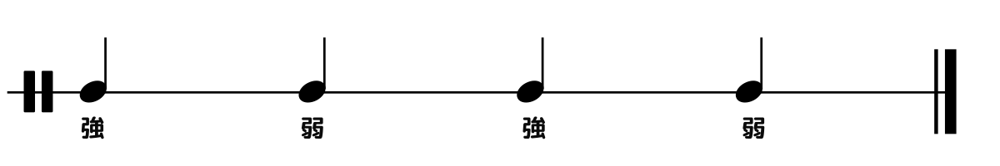

強拍弱拍を八分音符の上で見てみると次のようになります。

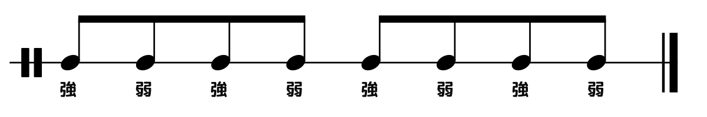

強拍弱拍を二分音符の上で見てみると次のようになります。

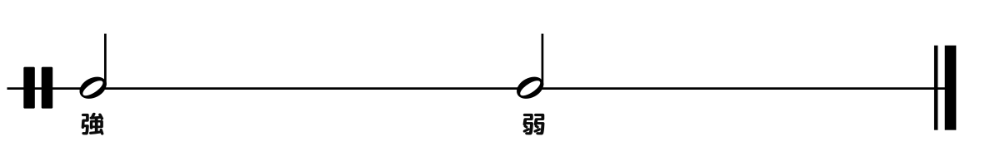

### 弱拍は強拍を分割する

２分音符と２つの４分音符を例にとって考えてみます。

この図では、橙色の星印が打音（アタック）を表しています。赤色の線が持続音（サスティン）を表しています。２分音符と４分音符の違いの本質は音符の長さですが、このことを改めて考えてみると、**音の長さ**と**打点と打点の距離**という２つの要素がそこにあることがわかります。

ここで打点だけに注目して考えて見ると、四分音符の強拍の打点位置は、２分音符の打点位置と同じことがわかります。

打音（アタック音）だけを考えると、４分音符の強拍を演奏することと２分音符を演奏することは全く同じことと言えます。逆に弱拍こそが２分音符との違いを際立たせている４分音符の特徴であり最も４分音符らしさを持った拍ということが言えます。

もしもこれをどら焼きに例えるならば、どら焼きが２分音符で弱拍が４分音符といえます。

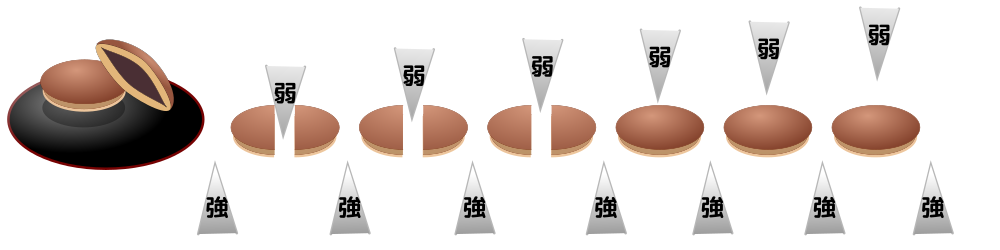

強拍は拍と拍の境目と言えます。そして弱拍は、その拍の中央にあります。つまり弱拍は、その音価の拍を分割します。

同じことが四分音符と８分音符にも言えます。

ここで打点だけに注目して考えて見ると、８分音符の強拍の打点位置は、四分音符の打点位置と同じことがわかります。

このことは、全ての音価の音符についていえます。

- ２分音符の強拍は、全音符
- ４分音符の強拍は、２分音符
- ８分音符の強拍は、４分音符だ。
- １６分音符の強拍は、８分音符だ。
- ３２分音符の強拍は、１６分音符だ。
- ．．．（続く）

このことを図で見てみます。

つまり **全ての音価の音符の強拍は必ず、その音価の倍の長さの音符と衝突する** ということがわかります。

### 弱拍強拍は分数で表すことが出来る

音符の位置は、小節を一定の比率で分割したものなので、分数で小節先頭からの距離として表せるでしょう。 楽典では小節先頭拍を１拍目として数える序数を使って説明されていますが、ここでは数学の数直線のように基数を使って先頭の拍を０拍目として並べてみましょう。

ここから興味深い法則を見つけることが出来ます。

### 強拍は約分できる

この各音符列上で左から数えて偶数番目（０個目・２個目・４個目・・・）の音符が強拍になります。そして奇数番目（１個目・３個目・５個目・・・）が弱拍になります。 すると全ての強拍は約分できることがわかります。

### 弱拍は約分できない

更に全ての弱拍は、約分できない分数＝既約分数になっていることがわかります。

分数は１つの数を表すに当たって複数通りの書き方がありますが、2/8 や 2/4などの分数は約分できます。つまり他の小さな数の組み合わせで表現することができます。

### 弱拍強拍の最適化
  
**つまり強拍とは約分できる分数で表される地点にある拍のことです。ある音価（ある分母）の強拍は、必ずその分母の最大公約数で約分された数字を分母として持つ音価の音符の弱拍が存在します。そしてその音価が音楽中で最小の音価でない限り、必ず他の音価（分母）を持った拍＝強拍が存在します。 つまりある音楽の中で、ある音価で強拍に置かれた音は、必ず他の音価で強拍または弱拍に置かれた音と重複します。**

ある強拍を最も大きな音価での弱拍として再解釈することをここでは**弱拍強拍の最適化**と呼びます。

### 先頭拍は必ず強拍だがより大きい音価で約分され弱拍になる
また小節の先頭の拍は全ての音価で必ず強拍となることがわかります。

しかし小節先頭の拍は強拍だからといって、弱拍が存在しない訳ではありません。この場合も前述の弱拍強拍の最適化を行うことで弱拍として解釈することが出来ます。 例えば、もしこの小節が２つあったら全音も２つあることになります。つまり２つ目の全音が弱拍となります。この様に繰り返しを前提に考えた場合、全ての強拍には対応すべき大きな音価の弱拍があることになります。

### 弱拍強拍最適化と尻合わせ

この考え方は結果として、音楽を聞く時に常に**前方にさかのぼってリズムを解釈しなおす習慣**を生み出します。 作曲する時に、最後に解決すべき強拍位置を最初に決め、そこから遡る様に弱拍の位置を設定していく様に考える様になります。 また音楽を聞いている時でも、最初に聴いた拍が弱拍であることを前提にして、その拍がどの音価の弱拍だったのかを推測しながら解釈する様になります。 ─── このことを **尻合わせ** と呼びます。 このことに関しては後に詳細を見ていきます。

### 強拍は存在せず全ての拍は弱拍である

以上の様に考え進めると、**ある音価の強拍は、必ずその音価より大きい音価の弱拍に相当**していることがわかります。つまり全ての音価で弱拍だけを演奏すると全ての拍がお互いに衝突を回避しあって入れ違いの位置に配置されることがわかります。このことをグラフを使って見てみましょう。 

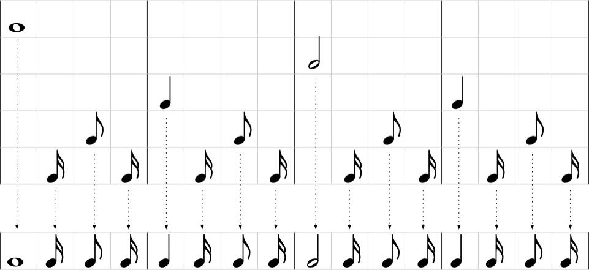

### 弱拍の多層性

この時、各音価（４分音符、８分音符、１６分音符…／ ２分音符・全音符・２全音符…）の弱拍の集合をここでは **拍の層** と呼びます。

ジャズでは、しばしば全ての拍は弱拍だという認識を持った演奏者同士で即興演奏を行います。 この時に、ある演奏者Ａが２分音符だけを演奏した場合は、もう一方の演奏者Ｂが４分音符だけを演奏したり、突然Ａが予告なく４分音符に入れ替えて演奏したらＢが咄嗟に２分音符に切り替えて演奏したりする、臨機応変な対応を楽しむ習慣があります。

異なる拍の層に切り替えることをここでは **拍の層の乗り換え** と呼びます。

### 弱拍だけを演奏する

ジャズなどの即興演奏中のひとつのテクニックとして、それぞれ各パートが弱拍しか演奏しないという制約と共に演奏する方法があります。例えばロックスタイルのバンド演奏で、ベースギターが４分音符弱拍を演奏し、ギターが８分音符弱拍を演奏し、ドラムスのハイハットが１６分音符弱拍を演奏し、キーボードが全音符弱拍を演奏する ─── というように、各音価の弱拍を異なる楽器で演奏します。すると強拍がひとつもないので各楽器が必ず重ならずに音が演奏され、音が際立った様に聴き取りやすくなります。このテクニックを使うとバンド全体の音量が上がった様にすら感じます。しかし実際には全体の音量は下がっており、耳の痛さが減るという効果があります。

次のグラフは、弱拍基軸演奏テクニックを**使わず**に、強拍と弱拍を全て演奏した場合のグラフです。

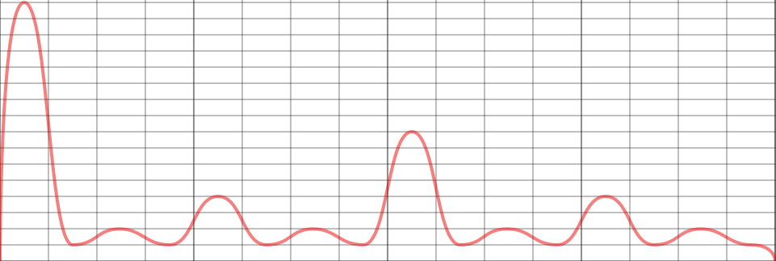

この様に強拍が重なりあってしまうことによってアンサンブルの瞬間音量が上がってしまうことがわかります。この音の重なりは音の濁りの原因となります。また加えて、各演奏者が演奏中に各自の自音がはっきり聞こえなくなる原因となり、無意識の内に更に音量を上げて演奏するようになり、聴者の耳が痛くなりやすくなる原因となります。

音楽のスピード感の多寡は拍の分割数（サブディヴィジョン）の細かさにあります。音が重なる部分は必ず、より大きな音価の強拍の位置にある為、拍が重なれば重なるほど、最小の分割拍（サブディヴィジョン）よりも大きな音価の強拍が強調される結果となります。これは音楽のスピード感を損なう最も大きな原因となります。

こうならないようにする為には、強拍を演奏せず弱拍だけを演奏するようにすることです。次の図は、弱拍のみを演奏した場合のグラフです。

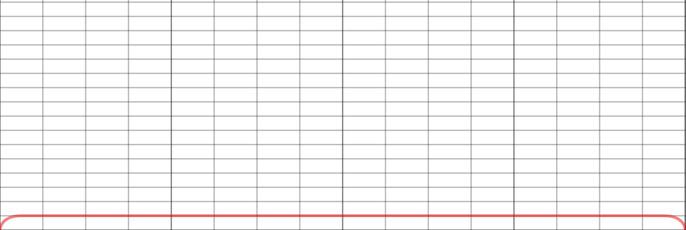

全ての音価で拍が重ならず単音で鳴っています。重なりがないので全ての拍で一定の音量で抑えられています。この様に各拍が重ならずに分離していると、各パートの楽器音が大きくてもそれぞれの音が分離して聞き取りやすくなります。自音が聞こえず無意識の内に音量が上がるということがなくなり、音の濁りを減らすことができます。

### 弱拍の有用性

強拍の演奏を控えることにより拍が重ならなくなることを見てきました。拍が重ならないことのメリットをまとめてみましょう。

-   音の重なりは分割数の細かさ（スピード感）を表現する妨げとなる。
-   バンド全体の音量が下がり楽器ごとの音量バランスがよくなる。
-   演奏中の平均音量が下がりバンド全体のダイナミクスレンジが大きくなる＝意図的に音を重ねた時の音量変化の落差が大きくなり、演奏にメリハリがつく。
-   タイミング変化による拍のニュアンスを表現しやすくなる。拍のタイミングをずらしても音が衝突しない。
-   バンド内での音の分離がよくなる。メロディーを弾いた時の一音一音がはっきり聞こえるようになりトーンの微妙な変化がリスナに聞こえやすくなる。

### 弱拍と強拍には交互という概念が含まれている

<!-- ABOUT_RMOP -->

強拍と弱拍は『交互』という概念を含んでいます。Aさんが強拍を叩いていたらBさんは弱拍を叩く。そしてBさんが強拍を叩いていたらAさんは弱拍を叩く。この様に協力し合って交互に拍を叩くことで二倍の音価を演奏する事が出来ます。この様に複数人数で交互に手を叩くことで細かな音価を演奏することを本書では**協力グルーヴ**と呼びます。

**協力グルーヴ**は、ストレス拍リズム言語、シラブル拍リズム言語を母国語とする人々にとって日常的な習慣であり、ほとんどの人はその存在すら意識していません。協力グルーヴは言語自体が持っているリズム概念に**交互に叩く**という基本的感覚が含まれているからです。

しかしモーラ拍リズム(日本語)を母国語とする人々にとって協力グルーヴは馴染のない習慣です。何故ならばモーラ拍リズムには末子音がないことから <ruby><rb>律動</rb><rt>リズム</rt></ruby>的頭子音最大化原則（RMOP) [参照](#RMOP) を持たないからです。そのかわりにモーラ拍言語には**同時に叩く**という基本的感覚が含まれています。

言語リズム感覚上の**同時**と**交互**という対立概念が、モーラ拍リズム（日本語）とそれ以外のストレス拍リズム（英語）とシラブル拍リズム（フランス語）の間に、横たわっているのです。

この同時と交互というリズム感覚の切り替えは、非常に難しい事がわかっています。原理的に全く違う数学的性質がそこに存在します。既に切り替えが出来る人でも、何かの拍子に切り替え間違ったり混乱して切り替えられなくなったりすることがあります ─── むしろ日常茶飯事です。ネイティブ言語として英語と日本語の両方を習得した人であっても、どちらかの言語に強い訛りを残しすことは決して稀ではありません。ネイティブではなく後天的に学習して身につけた場合であれば、なおさら高い困難を経過する必要があります。

日本語と英語のバイリンガルになるためには、この言語リズム感覚の切り替えが重要なキーワードとなります。

### 弱拍強拍の順序とは

もし音が次のように2回鳴ったとすると、その音符をどのように譜面に配置するでしょうか。

<blockquote class="twitter-tweet" data-media-max-width="560">
この様に２つの音が連続して並んでいるリズムをスコッチスナップと呼びます。一説では英語の元となったゲール語に起源があり、ゲール語由来の英語の主要単語にしばしば見られるリズムです。body billy money nitty gritty bitter dinner uncle Philip 等々 <a href="https://twitter.com/hashtag/%E3%82%AA%E3%83%95%E3%83%93%E3%83%BC%E3%83%88%E3%81%A7%E6%80%9D%E8%80%83%E3%81%99%E3%82%8B%E8%AA%9E%E5%AD%A6?src=hash&amp;ref_src=twsrc%5Etfw">#オフビートで思考する語学</a> v2 <a href="https://t.co/LXyKij07J6">pic.twitter.com/LXyKij07J6</a>
&mdash; 岡敦/Ats🇯🇵 (@ats4u) <a href="https://twitter.com/ats4u/status/1938149704401043799?ref_src=twsrc%5Etfw">June 26, 2025</a></blockquote>

この時、二通りの配置のしかたがあります。

<blockquote class="twitter-tweet" data-media-max-width="560">
【音が２つ鳴った時のリズムの前後関係の認識の違い】 モーラ拍リズム（日本語）リズム認識では強拍の後ろに弱拍が追随していると認識する。（第二版） <a href="https://twitter.com/hashtag/%E3%82%AA%E3%83%95%E3%83%93%E3%83%BC%E3%83%88%E3%81%A7%E6%80%9D%E8%80%83%E3%81%99%E3%82%8B%E8%AA%9E%E5%AD%A6?src=hash&amp;ref_src=twsrc%5Etfw">#オフビートで思考する語学</a> <a href="https://t.co/beMyPDhY7L">pic.twitter.com/beMyPDhY7L</a>
&mdash; 岡敦/Ats🇯🇵 (@ats4u) <a href="https://twitter.com/ats4u/status/1931607875006427196?ref_src=twsrc%5Etfw">June 8, 2025</a></blockquote>

もしかするとこの配置が最も自然だと感じたかも知れません ───  しかし次の様に解釈することも可能です。

<blockquote class="twitter-tweet" data-media-max-width="560">
【音が２つ鳴った時のリズムの前後関係の認識の違い】 ストレス拍リズム（英語）のリズム認識では弱拍が強拍に先駆けているという順序認識になる。（第二版） <a href="https://twitter.com/hashtag/%E3%82%AA%E3%83%95%E3%83%93%E3%83%BC%E3%83%88%E3%81%A7%E6%80%9D%E8%80%83%E3%81%99%E3%82%8B%E8%AA%9E%E5%AD%A6?src=hash&amp;ref_src=twsrc%5Etfw">#オフビートで思考する語学</a> <a href="https://t.co/rPiPqopgN4">pic.twitter.com/rPiPqopgN4</a>
&mdash; 岡敦/Ats🇯🇵 (@ats4u) <a href="https://twitter.com/ats4u/status/1931608649400467488?ref_src=twsrc%5Etfw">June 8, 2025</a></blockquote>

この様に解釈しても決して間違いではありません。

これは2つの音が鳴った時に、どちらが**強拍**で、どちらが**弱拍**と認識するかという問題にまとめられます。

### 強拍先行＝強弱

<blockquote class="twitter-tweet" data-media-max-width="560">
【音が２つ鳴った時のリズムの前後関係の認識の違い】 モーラ拍リズム（日本語）リズム認識では強拍の後ろに弱拍が追随していると認識する。（第二版） <a href="https://twitter.com/hashtag/%E3%82%AA%E3%83%95%E3%83%93%E3%83%BC%E3%83%88%E3%81%A7%E6%80%9D%E8%80%83%E3%81%99%E3%82%8B%E8%AA%9E%E5%AD%A6?src=hash&amp;ref_src=twsrc%5Etfw">#オフビートで思考する語学</a> <a href="https://t.co/beMyPDhY7L">pic.twitter.com/beMyPDhY7L</a>
&mdash; 岡敦/Ats🇯🇵 (@ats4u) <a href="https://twitter.com/ats4u/status/1931607875006427196?ref_src=twsrc%5Etfw">June 8, 2025</a></blockquote>

この様に解釈した時、これは弱拍が強拍の後ろに配置されていると見ることが出来ます。この場合の順序は『**強弱**』です。

### 弱拍先行＝弱強

逆に

<blockquote class="twitter-tweet" data-media-max-width="560">
【音が２つ鳴った時のリズムの前後関係の認識の違い】 ストレス拍リズム（英語）のリズム認識では弱拍が強拍に先駆けているという順序認識になる。（第二版） <a href="https://twitter.com/hashtag/%E3%82%AA%E3%83%95%E3%83%93%E3%83%BC%E3%83%88%E3%81%A7%E6%80%9D%E8%80%83%E3%81%99%E3%82%8B%E8%AA%9E%E5%AD%A6?src=hash&amp;ref_src=twsrc%5Etfw">#オフビートで思考する語学</a> <a href="https://t.co/rPiPqopgN4">pic.twitter.com/rPiPqopgN4</a>
&mdash; 岡敦/Ats🇯🇵 (@ats4u) <a href="https://twitter.com/ats4u/status/1931608649400467488?ref_src=twsrc%5Etfw">June 8, 2025</a></blockquote>

この様に解釈した場合、これは弱拍が強拍よりも前に配置されている見ることが出来ます。この場合の順序は『**弱強**』です。

### 弱起とは
ここまでに見てきた様に、拍には強拍と弱拍の２種類があります。強拍と弱拍は、小節のなかで必ず強弱、強弱という順序で並んでいます。しかし実際の音楽のなかでは強拍は必ずしも先に配置されている訳ではなく、弱拍が先に配置される形で音楽が構成されていることがあります。弱拍が先に配置されたリズムのことを弱起と呼びます。

### 弱起の重要性

この弱起の認識は、その人が母国語として話す言語に大きな影響を受けます。音楽を世界全体で見回してみると弱起が起こる頻度は非常に高いことに気付きます。音楽の種類によっては弱起の頻度は非常に高く、ほぼ毎回必弱起を演奏する場合もあります。弱起の頻度を更に踏み込んで調べてみると、実は逆に、日本だけが作曲や即興演奏で弱起をほとんど使わないということに気がつくでしょう。日本は音楽に弱起を使わないという非常に珍しい習慣を持っていることがわかります。 この習慣には理由があります ─── これは日本語が持っているモーラ拍リズムというリズム認識が引き起こす現象だからです。

### 多層弱拍先行と尻合わせ

多層の拍の上で弱拍先行が起こると**尻合わせ**という非常に特徴的なリズム上の現象が起こります。この節ではこの尻合わせが起こるメカニズムを説明します。

#### 尻合わせと頭合わせ
モーラ拍リズムのリズム認識をここでは**頭合わせ**と、そしてストレス拍リズムのリズム認識を**尻合わせ** と呼びます。

#### 尻合わせ
海外の音楽・・・ジャズやR&B、ロックではしばしばメロディーの開始点がはっきり決まっておらず、メロディーは任意の地点から漠然と開始されます。開始点ははっきり決まっていませんが、終了地点は必ず決まっており、その地点で大きな音でアクセントを入れる手法がしばしば用いられます。このリズム構成の構造をここでは **尻合わせ** と呼びます。

[尻合わせ](https://x.com/ats4u/status/1612304475347390466)

尻合わせリズム構成では４分音符の演奏順序がしばしば１２３４ではなく２３４１という順序で演奏されます。この様に必ず最後が１になるようにメロディーが配置されます。１６ビートの曲では８分音符で数えることが一般的ですが、この場合では２３４５６７８１と同様に必ず１が最後になるようにメロディーが配置されます。

#### 頭合わせ

中国の伝統音楽や、日本・イランなどモーラ拍言語を母国語とする国々の音楽では、しばしば繰り返しのなかでメロディーの開始地点がはっきりと決まっており、そこで大きな音でアクセントを入れる手法がしばしば用いられます。ほとんどの場合、終了地点ははっきり決まっておらず、メロディーは漠然と終わります。このリズム構成の構造をここでは **頭合わせ** と呼びます。

[頭合わせ](https://twitter.com/ats4u/status/1612304530502451201)

頭合わせリズム構成では、４分音符の演奏順序がしばしば１２３休という順序で演奏されます。この時４はしばしば演奏されずに休符が演奏されます。１６ビートの曲では「１２３休４５６休」（１２３休を２回繰り返し）や「１２３４５６休休」（１２３休を２倍に延長）という様に１２３休を変形した形を保ちます。

#### 多層拍構造での強拍先行
頭合わせ・尻合わせリズム構成が生まれることには、はっきりした理由があります。メロディーのリズム構成が頭合わせになるか尻合わせになるかは、リズムが弱拍先行であるか強拍先行であるかによって決まります。

以下で頭合わせ・尻合わせが起こるメカニズムを見ていきます。

次のように4分音符が1小節に4つあったとします。ここで音符を２個ずつのグループに分け、先に現れる方を強拍、後に現れる方を弱拍と定義します。

<table class="offbeat-onbeat-table">
  <tbody>
    <tr>
      <th>位置</th>
      <td>１拍目</td>
      <td>２拍目</td>
      <td>３拍目</td>
      <td>４拍目</td>
    </tr>
    <tr>
      <th>4分音符</th>
      <td>◯</td>
      <td>◯</td>
      <td>◯</td>
      <td>◯</td>
    </tr>
  </tbody>
</table>

これに先頭から強拍弱拍を順番に割り当てていくと次のようになります。

<table class="offbeat-onbeat-table">
  <tbody>
    <tr class="header">
      <th>位置</th>
      <td>１拍目</td>
      <td class="offbeat-td">２拍目</td>
      <td>３拍目</td>
      <td class="offbeat-td">４拍目</td>
    </tr>
    <tr>
      <th>4分音符</th>
      <td>◯</td>
      <td class="offbeat-td">◯</td>
      <td>◯</td>
      <td class="offbeat-td">◯</td>
    </tr>
    <tr>
      <th>強弱</th>
      <td>強</td>
      <td class="offbeat-td">弱</td>
      <td>強</td>
      <td class="offbeat-td">弱</td>
    </tr>
  </tbody>
</table>

同じ様に全ての音価に対して強拍弱拍を割り当てていくことが出来ます。 ここでは２分音符・４分音符８分音符・１６分音符を対象に、割り当てて行きます。結果は次のようになります。

<table class="offbeat-onbeat-table">
  <tbody>
    <tr>
      <th>位置</th>
      <td>１拍目</td>
      <td class="offbeat-td">２拍目</td>
    </tr>
    <tr>
      <th>2分音符</th>
      <td>◯</td>
      <td class="offbeat-td">◯</td>
    </tr>
    <tr>
      <th>強弱</th>
      <td>強</td>
      <td class="offbeat-td">弱</td>
    </tr>
  </tbody>
</table>

<table class="offbeat-onbeat-table">
  <tbody>
    <tr>
      <th>位置</th>
      <td>１拍目</td>
      <td class="offbeat-td">２拍目</td>
      <td>３拍目</td>
      <td class="offbeat-td">４拍目</td>
    </tr>
    <tr>
      <th>4分音符</th>
      <td>◯</td>
      <td class="offbeat-td">◯</td>
      <td>◯</td>
      <td class="offbeat-td">◯</td>
    </tr>
    <tr>
      <th>強弱</th>
      <td>強</td>
      <td class="offbeat-td">弱</td>
      <td>強</td>
      <td class="offbeat-td">弱</td>
    </tr>
  </tbody>
</table>

<table class="offbeat-onbeat-table">
  <tbody>
    <tr>
      <th>位置</th>
      <td>１</td>
      <td class="offbeat-td">２</td>
      <td>３</td>
      <td class="offbeat-td">４</td>
      <td>５</td>
      <td class="offbeat-td">６</td>
      <td>７</td>
      <td class="offbeat-td">８</td>
    </tr>
    <tr>
      <th>8分音符</th>
      <td>◯</td>
      <td class="offbeat-td">◯</td>
      <td>◯</td>
      <td class="offbeat-td">◯</td>
      <td>◯</td>
      <td class="offbeat-td">◯</td>
      <td>◯</td>
      <td class="offbeat-td">◯</td>
    </tr>
    <tr>
      <th>強弱</th>
      <td>強</td>
      <td class="offbeat-td">弱</td>
      <td>強</td>
      <td class="offbeat-td">弱</td>
      <td>強</td>
      <td class="offbeat-td">弱</td>
      <td>強</td>
      <td class="offbeat-td">弱</td>
    </tr>
  </tbody>
</table>

<table class="offbeat-onbeat-table">
  <tbody>
    <tr>
      <th>位置</th>
      <td>1</td>
      <td class="offbeat-td">2</td>
      <td>3</td>
      <td class="offbeat-td">4</td>
      <td>5</td>
      <td class="offbeat-td">6</td>
      <td>7</td>
      <td class="offbeat-td">8</td>
      <td>9</td>
      <td class="offbeat-td">10</td>
      <td>11</td>
      <td class="offbeat-td">12</td>
      <td>13</td>
      <td class="offbeat-td">14</td>
      <td>15</td>
      <td class="offbeat-td">16</td>
    </tr>
    <tr>
      <th>16分音符</th>
      <td>◯</td>
      <td class="offbeat-td">◯</td>
      <td>◯</td>
      <td class="offbeat-td">◯</td>
      <td>◯</td>
      <td class="offbeat-td">◯</td>
      <td>◯</td>
      <td class="offbeat-td">◯</td>
      <td>◯</td>
      <td class="offbeat-td">◯</td>
      <td>◯</td>
      <td class="offbeat-td">◯</td>
      <td>◯</td>
      <td class="offbeat-td">◯</td>
      <td>◯</td>
      <td class="offbeat-td">◯</td>
    </tr>
    <tr>
      <th>強弱</th>
      <td>強</td>
      <td class="offbeat-td">弱</td>
      <td>強</td>
      <td class="offbeat-td">弱</td>
      <td>強</td>
      <td class="offbeat-td">弱</td>
      <td>強</td>
      <td class="offbeat-td">弱</td>
      <td>強</td>
      <td class="offbeat-td">弱</td>
      <td>強</td>
      <td class="offbeat-td">弱</td>
      <td>強</td>
      <td class="offbeat-td">弱</td>
      <td>強</td>
      <td class="offbeat-td">弱</td>
    </tr>
  </tbody>
</table>

#### RMOP原則を適用し弱拍を前にする
<!-- ABOUT_RMOP -->

前節では、**頭子音最大化原則(MOP)** を紹介しました。またMOPが音楽上のリズムにも適用されるという<ruby><rb>律動</rb><rt>リズム</rt></ruby>的頭子音最大化原則（RMOP = Rhythmic Maximal Onset Principle ）という原理についても紹介致しました。

このRMOPを多層の拍層に適用するとどうなるかを見ていきます。

次のように４分音符があったとします。

<table class="offbeat-onbeat-table">
  <tbody>
    <tr>
      <th>位置</th>
      <td>１拍目</td>
      <td class="offbeat-td">２拍目</td>
      <td>３拍目</td>
      <td class="offbeat-td">４拍目</td>
    </tr>
    <tr>
      <th>4分音符</th>
      <td>◯</td>
      <td class="offbeat-td">◯</td>
      <td>◯</td>
      <td class="offbeat-td">◯</td>
    </tr>
    <tr>
      <th>強弱</th>
      <td>強</td>
      <td class="offbeat-td">弱</td>
      <td>強</td>
      <td class="offbeat-td">弱</td>
    </tr>
  </tbody>
</table>

これをRMOPを適用し、弱拍が前に来るという法則を使って再音節化(Resyllabification)すると次の様になります。

<table class="offbeat-onbeat-table">
  <tbody>
    <tr>
      <th>位置</th>
      <td class="offbeat-td">４拍目</td>
      <td>１拍目</td>
      <td class="offbeat-td">２拍目</td>
      <td>３拍目</td>
    </tr>
    <tr>
      <th>4分音符</th>
      <td class="offbeat-td">◯</td>
      <td>◯</td>
      <td class="offbeat-td">◯</td>
      <td>◯</td>
    </tr>
    <tr>
      <th>強弱</th>
      <td class="offbeat-td">弱</td>
      <td>強</td>
      <td class="offbeat-td">弱</td>
      <td>強</td>
    </tr>
  </tbody>
</table>

このように４拍目が先に演奏されるようになり１２３４から**４１２３**という順序に変わりました。

このことを**弱拍の先行**と呼びます。 

#### 弱拍先行には複数の階層がある

前章では弱拍先行するリズムの例として４分音符に於いて弱拍が強拍よりも先に演奏される場合をグラフ化して俯瞰しました。**この弱拍の先行は4分音符以外の全ての音価の拍で同時に起こり** ます。例えば2分音符で見てみましょう。

##### 2分音符の場合

次のように2分音符があったとします。

<table class="offbeat-onbeat-table">
  <tbody>
    <tr>
      <th>位置</th>
      <td>１拍目</td>
      <td class="offbeat-td">２拍目</td>
    </tr>
    <tr>
      <th>２分音符</th>
      <td>◯</td>
      <td class="offbeat-td">◯</td>
    </tr>
    <tr>
      <th>強弱</th>
      <td>強</td>
      <td class="offbeat-td">弱</td>
    </tr>
  </tbody>
</table>

先に述べた様に、2分音符も4分音符と同様に弱拍の先行が起こります。2分音符で弱拍先行が起こると次のようになります。

<table class="offbeat-onbeat-table">
  <tbody>
    <tr>
      <th>位置</th>
      <td class="offbeat-td">２拍目</td>
      <td>１拍目</td>
    </tr>
    <tr>
      <th>２分音符</th>
      <td class="offbeat-td">◯</td>
      <td>◯</td>
    </tr>
    <tr>
      <th>強弱</th>
      <td class="offbeat-td">弱</td>
      <td>強</td>
    </tr>
  </tbody>
</table>

この様に2分音符でも弱拍が先に演奏され、強拍がその後ろに演奏されるようになりました。弱拍の先行は8分音符16分音符などの他の全ての音価で同様に起こります。

そして弱拍の先行は**常に同時に起こる**のです。

##### 4分音符の場合

前節で4分音符で弱拍先行が起こった時のグラフを見てきました。その4分音符弱拍先行のグラフの上にそれぞれの4分音符に対応する2分音符のグラフを重ねてみると興味深いことがわかるのです。

まず次のように4分音符があったとします。

<table class="offbeat-onbeat-table">
  <tbody>
    <tr>
      <th>位置</th>
      <td>１拍目</td>
      <td class="offbeat-td">２拍目</td>
      <td>３拍目</td>
      <td class="offbeat-td">４拍目</td>
    </tr>
    <tr>
      <th>4分音符</th>
      <td>◯</td>
      <td class="offbeat-td">◯</td>
      <td>◯</td>
      <td class="offbeat-td">◯</td>
    </tr>
    <tr>
      <th>強弱</th>
      <td>強</td>
      <td class="offbeat-td">弱</td>
      <td>強</td>
      <td class="offbeat-td">弱</td>
    </tr>
  </tbody>
</table>

この4分音符が弱拍先行になると次の様になります。

<table class="offbeat-onbeat-table">
  <tbody>
    <tr>
      <th>位置</th>
      <td class="offbeat-td">４拍目</td>
      <td>１拍目</td>
      <td class="offbeat-td">２拍目</td>
      <td>３拍目</td>
    </tr>
    <tr>
      <th>4分音符</th>
      <td class="offbeat-td">◯</td>
      <td>◯</td>
      <td class="offbeat-td">◯</td>
      <td>◯</td>
    </tr>
    <tr>
      <th>強弱</th>
      <td class="offbeat-td">弱</td>
      <td>強</td>
      <td class="offbeat-td">弱</td>
      <td>強</td>
    </tr>
  </tbody>
</table>

これで４分音符の弱拍が先行しました。 しかしこの弱拍先行は完全ではありません。上に対応する2分音符のグラフを重ねてみると、２分音符で見たときには依然として強拍が先行していることがわかります。次のグラフを御覧下さい。

<table class="offbeat-onbeat-table">
  <tbody>
    <tr>
      <th>位置</th>
      <td>１拍目</td>
      <td class="offbeat-td">２拍目</td>
    </tr>
    <tr>
      <th>2分音符</th>
      <td>◯</td>
      <td class="offbeat-td">◯</td>
    </tr>
    <tr>
      <th>強弱</th>
      <td>強</td>
      <td class="offbeat-td">弱</td>
    </tr>
  </tbody>
</table>

<table class="offbeat-onbeat-table">
  <tbody>
    <tr>
      <th>位置</th>
      <td class="offbeat-td">４拍目</td>
      <td>１拍目</td>
      <td class="offbeat-td">２拍目</td>
      <td>３拍目</td>
    </tr>
    <tr>
      <th>4分音符</th>
      <td class="offbeat-td">◯</td>
      <td>◯</td>
      <td class="offbeat-td">◯</td>
      <td>◯</td>
    </tr>
    <tr>
      <th>強弱</th>
      <td class="offbeat-td">弱</td>
      <td>強</td>
      <td class="offbeat-td">弱</td>
      <td>強</td>
    </tr>
  </tbody>
</table>

４分音符で弱拍を倒置しても、２分音符で見ると依然として強拍が先になっていることがわかります ここで２分音符に関しても弱拍の倒置を起こしたらどうなるでしょうか。

<table class="offbeat-onbeat-table">
  <tbody>
    <tr>
      <th>位置</th>
      <td class="offbeat-td">２拍目</td>
      <td>１拍目</td>
    </tr>
    <tr>
      <th>2分音符</th>
      <td class="offbeat-td">◯</td>
      <td>◯</td>
    </tr>
    <tr>
      <th>強弱</th>
      <td class="offbeat-td">弱</td>
      <td>強</td>
    </tr>
  </tbody>
</table>

<table class="offbeat-onbeat-table">
  <tbody>
    <tr>
      <th>位置</th>
      <td class="offbeat-td">２拍目</td>
      <td>３拍目</td>
      <td class="offbeat-td">４拍目</td>
      <td>１拍目</td>
    </tr>
    <tr>
      <th>4分音符</th>
      <td class="offbeat-td">◯</td>
      <td>◯</td>
      <td class="offbeat-td">◯</td>
      <td>◯</td>
    </tr>
    <tr>
      <th>強弱</th>
      <td class="offbeat-td">弱</td>
      <td>強</td>
      <td class="offbeat-td">弱</td>
      <td>強</td>
    </tr>
  </tbody>
</table>

4分音符の順番がまる一周回転した状態になりました。このリズムを２３４１リズムと呼びます。これがいわゆる**横乗りリズム**の世界の数の数え方です。この世界では4分音符の順番が小節中を回転し完全に一周回って１が終了地点に来る状態になっています。

この様に、**全ての音価で弱拍が先行すると結果として、全ての音価の音符の序数の列は、必ず１が最後に来る様に回転します。これが弱拍先行で尻合わせが構成されるメカニズムです。** これが２３４１リズムが出来上がるメカニズムです。

１から始まるリズムは、弱拍が先行することにより、１で終わるリズムへと形を変えるのです。  この１で終わるリズムのことを**尻合わせリズム**と呼びます。これに対して１で始まるリズムのことを**頭合わせリズム**と呼びます。

この様にすると2分音符4分音符だけでなく、全音符／2全音符を含む考えうる全ての音符でこの現象が起こります。次に8分音符で見てみましょう。

##### ８分音符の場合

<table class="offbeat-onbeat-table">
  <tbody>
    <tr>
      <th>位置</th>
      <td>1拍目</td>
      <td class="offbeat-td">2拍目</td>
      <td>3拍目</td>
      <td class="offbeat-td">4拍目</td>
      <td>5拍目</td>
      <td class="offbeat-td">6拍目</td>
      <td>7拍目</td>
      <td class="offbeat-td">8拍目</td>
    </tr>
    <tr>
      <th>8分音符</th>
      <td>◯</td>
      <td class="offbeat-td">◯</td>
      <td>◯</td>
      <td class="offbeat-td">◯</td>
      <td>◯</td>
      <td class="offbeat-td">◯</td>
      <td>◯</td>
      <td class="offbeat-td">◯</td>
    </tr>
    <tr>
      <th>強弱</th>
      <td>強</td>
      <td class="offbeat-td">弱</td>
      <td>強</td>
      <td class="offbeat-td">弱</td>
      <td>強</td>
      <td class="offbeat-td">弱</td>
      <td>強</td>
      <td class="offbeat-td">弱</td>
    </tr>
  </tbody>
</table>

この様に、８分音符が並んでいるものを、弱拍先行として並べ替えてみます。すると以下の様になります。

<table class="offbeat-onbeat-table">
  <tbody>
    <tr>
      <th>位置</th>
      <td class="offbeat-td">8拍目</td>
      <td>1拍目</td>
      <td class="offbeat-td">2拍目</td>
      <td>3拍目</td>
      <td class="offbeat-td">4拍目</td>
      <td>5拍目</td>
      <td class="offbeat-td">6拍目</td>
      <td>7拍目</td>
    </tr>
    <tr>
      <th>8分音符</th>
      <td class="offbeat-td">◯</td>
      <td>◯</td>
      <td class="offbeat-td">◯</td>
      <td>◯</td>
      <td class="offbeat-td">◯</td>
      <td>◯</td>
      <td class="offbeat-td">◯</td>
      <td>◯</td>
    </tr>
    <tr>
      <th>強弱</th>
      <td class="offbeat-td">弱</td>
      <td>強</td>
      <td class="offbeat-td">弱</td>
      <td>強</td>
      <td class="offbeat-td">弱</td>
      <td>強</td>
      <td class="offbeat-td">弱</td>
      <td>強</td>
    </tr>
  </tbody>
</table>

これで弱拍が先行した形になりました。 しかし４分音符を重ねてみると違った様相が見えてきます。

<table class="offbeat-onbeat-table">
  <tbody>
    <tr>
      <th>位置</th>
      <td>１拍目</td>
      <td class="offbeat-td">２拍目</td>
      <td>３拍目</td>
      <td class="offbeat-td">４拍目</td>
    </tr>
    <tr>
      <th>4分音符</th>
      <td>◯</td>
      <td class="offbeat-td">◯</td>
      <td>◯</td>
      <td class="offbeat-td">◯</td>
    </tr>
    <tr>
      <th>強弱</th>
      <td>強</td>
      <td class="offbeat-td">弱</td>
      <td>強</td>
      <td class="offbeat-td">弱</td>
    </tr>
  </tbody>
</table>

<table class="offbeat-onbeat-table">
  <tbody>
    <tr>
      <th>位置</th>
      <td class="offbeat-td">8拍目</td>
      <td>1拍目</td>
      <td class="offbeat-td">2拍目</td>
      <td>3拍目</td>
      <td class="offbeat-td">4拍目</td>
      <td>5拍目</td>
      <td class="offbeat-td">6拍目</td>
      <td>7拍目</td>
    </tr>
    <tr>
      <th>8分音符</th>
      <td class="offbeat-td">◯</td>
      <td>◯</td>
      <td class="offbeat-td">◯</td>
      <td>◯</td>
      <td class="offbeat-td">◯</td>
      <td>◯</td>
      <td class="offbeat-td">◯</td>
      <td>◯</td>
    </tr>
    <tr>
      <th>強弱</th>
      <td class="offbeat-td">弱</td>
      <td>強</td>
      <td class="offbeat-td">弱</td>
      <td>強</td>
      <td class="offbeat-td">弱</td>
      <td>強</td>
      <td class="offbeat-td">弱</td>
      <td>強</td>
    </tr>
  </tbody>
</table>

こうしてみてみると、4分音符は依然として強拍先行になっていることがわかります。 つまり4分音符として見たときでも弱拍先行にしなければ、全ての音価で弱拍先行になっていないと言えます。 次に4分音符に関しても弱拍が先行する様に変えたものを見てみましょう。

<table class="offbeat-onbeat-table">
  <tbody>
    <tr>
      <th>位置</th>
      <td class="offbeat-td">４拍目</td>
      <td>１拍目</td>
      <td class="offbeat-td">２拍目</td>
      <td>３拍目</td>
    </tr>
    <tr>
      <th>4分音符</th>
      <td class="offbeat-td">◯</td>
      <td>◯</td>
      <td class="offbeat-td">◯</td>
      <td>◯</td>
    </tr>
    <tr>
      <th>強弱</th>
      <td class="offbeat-td">弱</td>
      <td>強</td>
      <td class="offbeat-td">弱</td>
      <td>強</td>
    </tr>
  </tbody>
</table>

<table class="offbeat-onbeat-table">
  <tbody>
    <tr>
      <th>位置</th>
      <td class="offbeat-td">6拍目</td>
      <td>7拍目</td>
      <td class="offbeat-td">8拍目</td>
      <td>1拍目</td>
      <td class="offbeat-td">2拍目</td>
      <td>3拍目</td>
      <td class="offbeat-td">4拍目</td>
      <td>5拍目</td>
    </tr>
    <tr>
      <th>8分音符</th>
      <td class="offbeat-td">◯</td>
      <td>◯</td>
      <td class="offbeat-td">◯</td>
      <td>◯</td>
      <td class="offbeat-td">◯</td>
      <td>◯</td>
      <td class="offbeat-td">◯</td>
      <td>◯</td>
    </tr>
    <tr>
      <th>強弱</th>
      <td class="offbeat-td">弱</td>
      <td>強</td>
      <td class="offbeat-td">弱</td>
      <td>強</td>
      <td class="offbeat-td">弱</td>
      <td>強</td>
      <td class="offbeat-td">弱</td>
      <td>強</td>
    </tr>
  </tbody>
</table>

これで4分音符も弱拍先行になりました。しかしこれも再度2分音符を重ねると、実はこれもまだ強拍先行になっていることがわかります。

<table class="offbeat-onbeat-table">
  <tbody>
    <tr>
      <th>位置</th>
      <td>１拍目</td>
      <td class="offbeat-td">２拍目</td>
    </tr>
    <tr>
      <th>2分音符</th>
      <td>◯</td>
      <td class="offbeat-td">◯</td>
    </tr>
    <tr>
      <th>強弱</th>
      <td>強</td>
      <td class="offbeat-td">弱</td>
    </tr>
  </tbody>
</table>

<table class="offbeat-onbeat-table">
  <tbody>
    <tr>
      <th>位置</th>
      <td class="offbeat-td">４拍目</td>
      <td>１拍目</td>
      <td class="offbeat-td">２拍目</td>
      <td>３拍目</td>
    </tr>
    <tr>
      <th>4分音符</th>
      <td class="offbeat-td">◯</td>
      <td>◯</td>
      <td class="offbeat-td">◯</td>
      <td>◯</td>
    </tr>
    <tr>
      <th>強弱</th>
      <td class="offbeat-td">弱</td>
      <td>強</td>
      <td class="offbeat-td">弱</td>
      <td>強</td>
    </tr>
  </tbody>
</table>

<table class="offbeat-onbeat-table">
  <tbody>
    <tr>
      <th>位置</th>
      <td class="offbeat-td">6拍目</td>
      <td>7拍目</td>
      <td class="offbeat-td">8拍目</td>
      <td>1拍目</td>
      <td class="offbeat-td">2拍目</td>
      <td>3拍目</td>
      <td class="offbeat-td">4拍目</td>
      <td>5拍目</td>
    </tr>
    <tr>
      <th>8分音符</th>
      <td class="offbeat-td">◯</td>
      <td>◯</td>
      <td class="offbeat-td">◯</td>
      <td>◯</td>
      <td class="offbeat-td">◯</td>
      <td>◯</td>
      <td class="offbeat-td">◯</td>
      <td>◯</td>
    </tr>
    <tr>
      <th>強弱</th>
      <td class="offbeat-td">弱</td>
      <td>強</td>
      <td class="offbeat-td">弱</td>
      <td>強</td>
      <td class="offbeat-td">弱</td>
      <td>強</td>
      <td class="offbeat-td">弱</td>
      <td>強</td>
    </tr>
  </tbody>
</table>

ここで2分音符も先行するように並べ替えてみます。

<table class="offbeat-onbeat-table">
  <tbody>
    <tr>
      <th>位置</th>
      <td class="offbeat-td">２拍目</td>
      <td>１拍目</td>
    </tr>
    <tr>
      <th>2分音符</th>
      <td class="offbeat-td">◯</td>
      <td>◯</td>
    </tr>
    <tr>
      <th>強弱</th>
      <td class="offbeat-td">弱</td>
      <td>強</td>
    </tr>
  </tbody>
</table>

<table class="offbeat-onbeat-table">
  <tbody>
    <tr>
      <th>位置</th>
      <td class="offbeat-td">２拍目</td>
      <td>３拍目</td>
      <td class="offbeat-td">４拍目</td>
      <td>１拍目</td>
    </tr>
    <tr>
      <th>4分音符</th>
      <td class="offbeat-td">◯</td>
      <td>◯</td>
      <td class="offbeat-td">◯</td>
      <td>◯</td>
    </tr>
    <tr>
      <th>強弱</th>
      <td class="offbeat-td">弱</td>
      <td>強</td>
      <td class="offbeat-td">弱</td>
      <td>強</td>
    </tr>
  </tbody>
</table>

<table class="offbeat-onbeat-table">
  <tbody>
    <tr>
      <th>位置</th>
      <td class="offbeat-td">2拍目</td>
      <td>3拍目</td>
      <td class="offbeat-td">4拍目</td>
      <td>5拍目</td>
      <td class="offbeat-td">6拍目</td>
      <td>7拍目</td>
      <td class="offbeat-td">8拍目</td>
      <td>1拍目</td>
    </tr>
    <tr>
      <th>8分音符</th>
      <td class="offbeat-td">◯</td>
      <td>◯</td>
      <td class="offbeat-td">◯</td>
      <td>◯</td>
      <td class="offbeat-td">◯</td>
      <td>◯</td>
      <td class="offbeat-td">◯</td>
      <td>◯</td>
    </tr>
    <tr>
      <th>強弱</th>
      <td class="offbeat-td">弱</td>
      <td>強</td>
      <td class="offbeat-td">弱</td>
      <td>強</td>
      <td class="offbeat-td">弱</td>
      <td>強</td>
      <td class="offbeat-td">弱</td>
      <td>強</td>
    </tr>
  </tbody>
</table>

これで小節内の全ての音価が弱拍先行になりました。すると最初12345678と並んでいた8分音符が23456781という様に１が最後に来るように並び替わったことがわかります。 これが**23456781リズム**です。 これがいわゆる**横乗りリズム**の世界での8分音符の数え方です。この世界でも、8分音符の順番が小節中を回転し完全に一周回って１が終了地点に来る状態になったのです。

##### 16分音符の場合

16分音符でも全く同じ事が言えます。 次の様に16分音符が並んでいた時を考えます。

<table class="offbeat-onbeat-table">
  <tbody>
    <tr>
      <th>位置</th>
      <td>1</td>
      <td class="offbeat-td">2</td>
      <td>3</td>
      <td class="offbeat-td">4</td>
      <td>5</td>
      <td class="offbeat-td">6</td>
      <td>7</td>
      <td class="offbeat-td">8</td>
      <td>9</td>
      <td class="offbeat-td">10</td>
      <td>11</td>
      <td class="offbeat-td">12</td>
      <td>13</td>
      <td class="offbeat-td">14</td>
      <td>15</td>
      <td class="offbeat-td">16</td>
    </tr>
    <tr>
      <th>16分音符</th>
      <td>◯</td>
      <td class="offbeat-td">◯</td>
      <td>◯</td>
      <td class="offbeat-td">◯</td>
      <td>◯</td>
      <td class="offbeat-td">◯</td>
      <td>◯</td>
      <td class="offbeat-td">◯</td>
      <td>◯</td>
      <td class="offbeat-td">◯</td>
      <td>◯</td>
      <td class="offbeat-td">◯</td>
      <td>◯</td>
      <td class="offbeat-td">◯</td>
      <td>◯</td>
      <td class="offbeat-td">◯</td>
    </tr>
    <tr>
      <th>強弱</th>
      <td>強</td>
      <td class="offbeat-td">弱</td>
      <td>強</td>
      <td class="offbeat-td">弱</td>
      <td>強</td>
      <td class="offbeat-td">弱</td>
      <td>強</td>
      <td class="offbeat-td">弱</td>
      <td>強</td>
      <td class="offbeat-td">弱</td>
      <td>強</td>
      <td class="offbeat-td">弱</td>
      <td>強</td>
      <td class="offbeat-td">弱</td>
      <td>強</td>
      <td class="offbeat-td">弱</td>
    </tr>
  </tbody>
</table>

これを弱拍先行に並べ替えてみます。

<table class="offbeat-onbeat-table">
  <tbody>
    <tr>
      <th>位置</th>
      <td class="offbeat-td">16</td>
      <td>1</td>
      <td class="offbeat-td">2</td>
      <td>3</td>
      <td class="offbeat-td">4</td>
      <td>5</td>
      <td class="offbeat-td">6</td>
      <td>7</td>
      <td class="offbeat-td">8</td>
      <td>9</td>
      <td class="offbeat-td">10</td>
      <td>11</td>
      <td class="offbeat-td">12</td>
      <td>13</td>
      <td class="offbeat-td">14</td>
      <td>15</td>
    </tr>
    <tr>
      <th>16分音符</th>
      <td class="offbeat-td">◯</td>
      <td>◯</td>
      <td class="offbeat-td">◯</td>
      <td>◯</td>
      <td class="offbeat-td">◯</td>
      <td>◯</td>
      <td class="offbeat-td">◯</td>
      <td>◯</td>
      <td class="offbeat-td">◯</td>
      <td>◯</td>
      <td class="offbeat-td">◯</td>
      <td>◯</td>
      <td class="offbeat-td">◯</td>
      <td>◯</td>
      <td class="offbeat-td">◯</td>
      <td>◯</td>
    </tr>
    <tr>
      <th>強弱</th>
      <td class="offbeat-td">弱</td>
      <td>強</td>
      <td class="offbeat-td">弱</td>
      <td>強</td>
      <td class="offbeat-td">弱</td>
      <td>強</td>
      <td class="offbeat-td">弱</td>
      <td>強</td>
      <td class="offbeat-td">弱</td>
      <td>強</td>
      <td class="offbeat-td">弱</td>
      <td>強</td>
      <td class="offbeat-td">弱</td>
      <td>強</td>
      <td class="offbeat-td">弱</td>
      <td>強</td>
    </tr>
  </tbody>
</table>

しかしこれも8分音符から見てみると実はまだ強拍先行になっています。

<table class="offbeat-onbeat-table">
  <tbody>
    <tr>
      <th>位置</th>
      <td>1拍目</td>
      <td class="offbeat-td">2拍目</td>
      <td>3拍目</td>
      <td class="offbeat-td">4拍目</td>
      <td>5拍目</td>
      <td class="offbeat-td">6拍目</td>
      <td>7拍目</td>
      <td class="offbeat-td">8拍目</td>
    </tr>
    <tr>
      <th>8分音符</th>
      <td>◯</td>
      <td class="offbeat-td">◯</td>
      <td>◯</td>
      <td class="offbeat-td">◯</td>
      <td>◯</td>
      <td class="offbeat-td">◯</td>
      <td>◯</td>
      <td class="offbeat-td">◯</td>
    </tr>
    <tr>
      <th>強弱</th>
      <td>強</td>
      <td class="offbeat-td">弱</td>
      <td>強</td>
      <td class="offbeat-td">弱</td>
      <td>強</td>
      <td class="offbeat-td">弱</td>
      <td>強</td>
      <td class="offbeat-td">弱</td>
    </tr>
  </tbody>
</table>

<table class="offbeat-onbeat-table">
  <tbody>
    <tr>
      <th>位置</th>
      <td class="offbeat-td">16</td>
      <td>1</td>
      <td class="offbeat-td">2</td>
      <td>3</td>
      <td class="offbeat-td">4</td>
      <td>5</td>
      <td class="offbeat-td">6</td>
      <td>7</td>
      <td class="offbeat-td">8</td>
      <td>9</td>
      <td class="offbeat-td">10</td>
      <td>11</td>
      <td class="offbeat-td">12</td>
      <td>13</td>
      <td class="offbeat-td">14</td>
      <td>15</td>
    </tr>
    <tr>
      <th>16分音符</th>
      <td class="offbeat-td">◯</td>
      <td>◯</td>
      <td class="offbeat-td">◯</td>
      <td>◯</td>
      <td class="offbeat-td">◯</td>
      <td>◯</td>
      <td class="offbeat-td">◯</td>
      <td>◯</td>
      <td class="offbeat-td">◯</td>
      <td>◯</td>
      <td class="offbeat-td">◯</td>
      <td>◯</td>
      <td class="offbeat-td">◯</td>
      <td>◯</td>
      <td class="offbeat-td">◯</td>
      <td>◯</td>
    </tr>
    <tr>
      <th>強弱</th>
      <td class="offbeat-td">弱</td>
      <td>強</td>
      <td class="offbeat-td">弱</td>
      <td>強</td>
      <td class="offbeat-td">弱</td>
      <td>強</td>
      <td class="offbeat-td">弱</td>
      <td>強</td>
      <td class="offbeat-td">弱</td>
      <td>強</td>
      <td class="offbeat-td">弱</td>
      <td>強</td>
      <td class="offbeat-td">弱</td>
      <td>強</td>
      <td class="offbeat-td">弱</td>
      <td>強</td>
    </tr>
  </tbody>
</table>

これも4分音符でやった時と同じ様に、8分音符弱拍先行で並べ替えてみます。

<table class="offbeat-onbeat-table">
  <tbody>
    <tr>
      <th>位置</th>
      <td class="offbeat-td">8拍目</td>
      <td>1拍目</td>
      <td class="offbeat-td">2拍目</td>
      <td>3拍目</td>
      <td class="offbeat-td">4拍目</td>
      <td>5拍目</td>
      <td class="offbeat-td">6拍目</td>
      <td>7拍目</td>
    </tr>
    <tr>
      <th>8分音符</th>
      <td class="offbeat-td">◯</td>
      <td>◯</td>
      <td class="offbeat-td">◯</td>
      <td>◯</td>
      <td class="offbeat-td">◯</td>
      <td>◯</td>
      <td class="offbeat-td">◯</td>
      <td>◯</td>
    </tr>
    <tr>
      <th>強弱</th>
      <td class="offbeat-td">弱</td>
      <td>強</td>
      <td class="offbeat-td">弱</td>
      <td>強</td>
      <td class="offbeat-td">弱</td>
      <td>強</td>
      <td class="offbeat-td">弱</td>
      <td>強</td>
    </tr>
  </tbody>
</table>

<table class="offbeat-onbeat-table">
  <tbody>
    <tr>
      <th>位置</th>
      <td class="offbeat-td">14</td>
      <td>15</td>
      <td class="offbeat-td">16</td>
      <td>1</td>
      <td class="offbeat-td">2</td>
      <td>3</td>
      <td class="offbeat-td">4</td>
      <td>5</td>
      <td class="offbeat-td">6</td>
      <td>7</td>
      <td class="offbeat-td">8</td>
      <td>9</td>
      <td class="offbeat-td">10</td>
      <td>11</td>
      <td class="offbeat-td">12</td>
      <td>13</td>
    </tr>
    <tr>
      <th>16分音符</th>
      <td class="offbeat-td">◯</td>
      <td>◯</td>
      <td class="offbeat-td">◯</td>
      <td>◯</td>
      <td class="offbeat-td">◯</td>
      <td>◯</td>
      <td class="offbeat-td">◯</td>
      <td>◯</td>
      <td class="offbeat-td">◯</td>
      <td>◯</td>
      <td class="offbeat-td">◯</td>
      <td>◯</td>
      <td class="offbeat-td">◯</td>
      <td>◯</td>
      <td class="offbeat-td">◯</td>
      <td>◯</td>
    </tr>
    <tr>
      <th>強弱</th>
      <td class="offbeat-td">弱</td>
      <td>強</td>
      <td class="offbeat-td">弱</td>
      <td>強</td>
      <td class="offbeat-td">弱</td>
      <td>強</td>
      <td class="offbeat-td">弱</td>
      <td>強</td>
      <td class="offbeat-td">弱</td>
      <td>強</td>
      <td class="offbeat-td">弱</td>
      <td>強</td>
      <td class="offbeat-td">弱</td>
      <td>強</td>
      <td class="offbeat-td">弱</td>
      <td>強</td>
    </tr>
  </tbody>
</table>

これで8分音符・16分音符共に弱拍先行になりました。

しかしこれも4分音符の世界から見ると強拍先行になっていることがわかります。

<table class="offbeat-onbeat-table">
  <tbody>
    <tr>
      <th>位置</th>
      <td>１拍目</td>
      <td class="offbeat-td">２拍目</td>
      <td>３拍目</td>
      <td class="offbeat-td">４拍目</td>
    </tr>
    <tr>
      <th>4分音符</th>
      <td>◯</td>
      <td class="offbeat-td">◯</td>
      <td>◯</td>
      <td class="offbeat-td">◯</td>
    </tr>
    <tr>
      <th>強弱</th>
      <td>強</td>
      <td class="offbeat-td">弱</td>
      <td>強</td>
      <td class="offbeat-td">弱</td>
    </tr>
  </tbody>
</table>

<table class="offbeat-onbeat-table">
  <tbody>
    <tr>
      <th>位置</th>
      <td class="offbeat-td">8拍目</td>
      <td>1拍目</td>
      <td class="offbeat-td">2拍目</td>
      <td>3拍目</td>
      <td class="offbeat-td">4拍目</td>
      <td>5拍目</td>
      <td class="offbeat-td">6拍目</td>
      <td>7拍目</td>
    </tr>
    <tr>
      <th>8分音符</th>
      <td class="offbeat-td">◯</td>
      <td>◯</td>
      <td class="offbeat-td">◯</td>
      <td>◯</td>
      <td class="offbeat-td">◯</td>
      <td>◯</td>
      <td class="offbeat-td">◯</td>
      <td>◯</td>
    </tr>
    <tr>
      <th>強弱</th>
      <td class="offbeat-td">弱</td>
      <td>強</td>
      <td class="offbeat-td">弱</td>
      <td>強</td>
      <td class="offbeat-td">弱</td>
      <td>強</td>
      <td class="offbeat-td">弱</td>
      <td>強</td>
    </tr>
  </tbody>
</table>

<table class="offbeat-onbeat-table">
  <tbody>
    <tr>
      <th>位置</th>
      <td class="offbeat-td">14</td>
      <td>15</td>
      <td class="offbeat-td">16</td>
      <td>1</td>
      <td class="offbeat-td">2</td>
      <td>3</td>
      <td class="offbeat-td">4</td>
      <td>5</td>
      <td class="offbeat-td">6</td>
      <td>7</td>
      <td class="offbeat-td">8</td>
      <td>9</td>
      <td class="offbeat-td">10</td>
      <td>11</td>
      <td class="offbeat-td">12</td>
      <td>13</td>
    </tr>
    <tr>
      <th>16分音符</th>
      <td class="offbeat-td">◯</td>
      <td>◯</td>
      <td class="offbeat-td">◯</td>
      <td>◯</td>
      <td class="offbeat-td">◯</td>
      <td>◯</td>
      <td class="offbeat-td">◯</td>
      <td>◯</td>
      <td class="offbeat-td">◯</td>
      <td>◯</td>
      <td class="offbeat-td">◯</td>
      <td>◯</td>
      <td class="offbeat-td">◯</td>
      <td>◯</td>
      <td class="offbeat-td">◯</td>
      <td>◯</td>
    </tr>
    <tr>
      <th>強弱</th>
      <td class="offbeat-td">弱</td>
      <td>強</td>
      <td class="offbeat-td">弱</td>
      <td>強</td>
      <td class="offbeat-td">弱</td>
      <td>強</td>
      <td class="offbeat-td">弱</td>
      <td>強</td>
      <td class="offbeat-td">弱</td>
      <td>強</td>
      <td class="offbeat-td">弱</td>
      <td>強</td>
      <td class="offbeat-td">弱</td>
      <td>強</td>
      <td class="offbeat-td">弱</td>
      <td>強</td>
    </tr>
  </tbody>
</table>

 8分音符16分音符で見た時に弱拍先行になっていても、4分音符では強拍先行になっていることがわかります。 そこで4分音符も弱拍先行として並べ替えてみます。

 <table class="offbeat-onbeat-table">
  <tbody>
    <tr>
      <th>位置</th>
      <td class="offbeat-td">４拍目</td>
      <td>１拍目</td>
      <td class="offbeat-td">２拍目</td>
      <td>３拍目</td>
    </tr>
    <tr>
      <th>4分音符</th>
      <td class="offbeat-td">◯</td>
      <td>◯</td>
      <td class="offbeat-td">◯</td>
      <td>◯</td>
    </tr>
    <tr>
      <th>強弱</th>
      <td class="offbeat-td">弱</td>
      <td>強</td>
      <td class="offbeat-td">弱</td>
      <td>強</td>
    </tr>
  </tbody>
</table>

<table class="offbeat-onbeat-table">
  <tbody>
    <tr>
      <th>位置</th>
      <td class="offbeat-td">6拍目</td>
      <td>7拍目</td>
      <td class="offbeat-td">8拍目</td>
      <td>1拍目</td>
      <td class="offbeat-td">2拍目</td>
      <td>3拍目</td>
      <td class="offbeat-td">4拍目</td>
      <td>5拍目</td>
    </tr>
    <tr>
      <th>8分音符</th>
      <td class="offbeat-td">◯</td>
      <td>◯</td>
      <td class="offbeat-td">◯</td>
      <td>◯</td>
      <td class="offbeat-td">◯</td>
      <td>◯</td>
      <td class="offbeat-td">◯</td>
      <td>◯</td>
    </tr>
    <tr>
      <th>強弱</th>
      <td class="offbeat-td">弱</td>
      <td>強</td>
      <td class="offbeat-td">弱</td>
      <td>強</td>
      <td class="offbeat-td">弱</td>
      <td>強</td>
      <td class="offbeat-td">弱</td>
      <td>強</td>
    </tr>
  </tbody>
</table>

<table class="offbeat-onbeat-table">
  <tbody>
    <tr>
      <th>位置</th>
      <td class="offbeat-td">10</td>
      <td>11</td>
      <td class="offbeat-td">12</td>
      <td>13</td>
      <td class="offbeat-td">14</td>
      <td>15</td>
      <td class="offbeat-td">16</td>
      <td>1</td>
      <td class="offbeat-td">2</td>
      <td>3</td>
      <td class="offbeat-td">4</td>
      <td>5</td>
      <td class="offbeat-td">6</td>
      <td>7</td>
      <td class="offbeat-td">8</td>
      <td>9</td>
    </tr>
    <tr>
      <th>16分音符</th>
      <td class="offbeat-td">◯</td>
      <td>◯</td>
      <td class="offbeat-td">◯</td>
      <td>◯</td>
      <td class="offbeat-td">◯</td>
      <td>◯</td>
      <td class="offbeat-td">◯</td>
      <td>◯</td>
      <td class="offbeat-td">◯</td>
      <td>◯</td>
      <td class="offbeat-td">◯</td>
      <td>◯</td>
      <td class="offbeat-td">◯</td>
      <td>◯</td>
      <td class="offbeat-td">◯</td>
      <td>◯</td>
    </tr>
    <tr>
      <th>強弱</th>
      <td class="offbeat-td">弱</td>
      <td>強</td>
      <td class="offbeat-td">弱</td>
      <td>強</td>
      <td class="offbeat-td">弱</td>
      <td>強</td>
      <td class="offbeat-td">弱</td>
      <td>強</td>
      <td class="offbeat-td">弱</td>
      <td>強</td>
      <td class="offbeat-td">弱</td>
      <td>強</td>
      <td class="offbeat-td">弱</td>
      <td>強</td>
      <td class="offbeat-td">弱</td>
      <td>強</td>
    </tr>
  </tbody>
</table>

これで4分音符も弱拍先行になりました。

しかしこれも今までと同様に2分音符で見ると依然として強拍先行になっていることがわかります。  次の表を見て下さい。

<table class="offbeat-onbeat-table">
  <tbody>
    <tr>
      <th>位置</th>
      <td>１拍目</td>
      <td class="offbeat-td">２拍目</td>
    </tr>
    <tr>
      <th>2分音符</th>
      <td>◯</td>
      <td class="offbeat-td">◯</td>
    </tr>
    <tr>
      <th>強弱</th>
      <td>強</td>
      <td class="offbeat-td">弱</td>
    </tr>
  </tbody>
</table>
<table class="offbeat-onbeat-table">
  <tbody>
    <tr>
      <th>位置</th>
      <td class="offbeat-td">４拍目</td>
      <td>１拍目</td>
      <td class="offbeat-td">２拍目</td>
      <td>３拍目</td>
    </tr>
    <tr>
      <th>4分音符</th>
      <td class="offbeat-td">◯</td>
      <td>◯</td>
      <td class="offbeat-td">◯</td>
      <td>◯</td>
    </tr>
    <tr>
      <th>強弱</th>
      <td class="offbeat-td">弱</td>
      <td>強</td>
      <td class="offbeat-td">弱</td>
      <td>強</td>
    </tr>
  </tbody>
</table>

<table class="offbeat-onbeat-table">
  <tbody>
    <tr>
      <th>位置</th>
      <td class="offbeat-td">6拍目</td>
      <td>7拍目</td>
      <td class="offbeat-td">8拍目</td>
      <td>1拍目</td>
      <td class="offbeat-td">2拍目</td>
      <td>3拍目</td>
      <td class="offbeat-td">4拍目</td>
      <td>5拍目</td>
    </tr>
    <tr>
      <th>8分音符</th>
      <td class="offbeat-td">◯</td>
      <td>◯</td>
      <td class="offbeat-td">◯</td>
      <td>◯</td>
      <td class="offbeat-td">◯</td>
      <td>◯</td>
      <td class="offbeat-td">◯</td>
      <td>◯</td>
    </tr>
    <tr>
      <th>強弱</th>
      <td class="offbeat-td">弱</td>
      <td>強</td>
      <td class="offbeat-td">弱</td>
      <td>強</td>
      <td class="offbeat-td">弱</td>
      <td>強</td>
      <td class="offbeat-td">弱</td>
      <td>強</td>
    </tr>
  </tbody>
</table>

<table class="offbeat-onbeat-table">
  <tbody>
    <tr>
      <th>位置</th>
      <td class="offbeat-td">10</td>
      <td>11</td>
      <td class="offbeat-td">12</td>
      <td>13</td>
      <td class="offbeat-td">14</td>
      <td>15</td>
      <td class="offbeat-td">16</td>
      <td>1</td>
      <td class="offbeat-td">2</td>
      <td>3</td>
      <td class="offbeat-td">4</td>
      <td>5</td>
      <td class="offbeat-td">6</td>
      <td>7</td>
      <td class="offbeat-td">8</td>
      <td>9</td>
    </tr>
    <tr>
      <th>16分音符</th>
      <td class="offbeat-td">◯</td>
      <td>◯</td>
      <td class="offbeat-td">◯</td>
      <td>◯</td>
      <td class="offbeat-td">◯</td>
      <td>◯</td>
      <td class="offbeat-td">◯</td>
      <td>◯</td>
      <td class="offbeat-td">◯</td>
      <td>◯</td>
      <td class="offbeat-td">◯</td>
      <td>◯</td>
      <td class="offbeat-td">◯</td>
      <td>◯</td>
      <td class="offbeat-td">◯</td>
      <td>◯</td>
    </tr>
    <tr>
      <th>強弱</th>
      <td class="offbeat-td">弱</td>
      <td>強</td>
      <td class="offbeat-td">弱</td>
      <td>強</td>
      <td class="offbeat-td">弱</td>
      <td>強</td>
      <td class="offbeat-td">弱</td>
      <td>強</td>
      <td class="offbeat-td">弱</td>
      <td>強</td>
      <td class="offbeat-td">弱</td>
      <td>強</td>
      <td class="offbeat-td">弱</td>
      <td>強</td>
      <td class="offbeat-td">弱</td>
      <td>強</td>
    </tr>
  </tbody>
</table>

2分音符も弱拍先行として並べ替えると以下の様になります。

<table class="offbeat-onbeat-table">
  <tbody>
    <tr>
      <th>位置</th>
      <td class="offbeat-td">２拍目</td>
      <td>１拍目</td>
    </tr>
    <tr>
      <th>2分音符</th>
      <td class="offbeat-td">◯</td>
      <td>◯</td>
    </tr>
    <tr>
      <th>強弱</th>
      <td class="offbeat-td">弱</td>
      <td>強</td>
    </tr>
  </tbody>
</table>
<table class="offbeat-onbeat-table">
  <tbody>
    <tr>
      <th>位置</th>
      <td class="offbeat-td">２拍目</td>
      <td>３拍目</td>
      <td class="offbeat-td">４拍目</td>
      <td>１拍目</td>
    </tr>
    <tr>
      <th>4分音符</th>
      <td class="offbeat-td">◯</td>
      <td>◯</td>
      <td class="offbeat-td">◯</td>
      <td>◯</td>
    </tr>
    <tr>
      <th>強弱</th>
      <td class="offbeat-td">弱</td>
      <td>強</td>
      <td class="offbeat-td">弱</td>
      <td>強</td>
    </tr>
  </tbody>
</table>

<table class="offbeat-onbeat-table">
  <tbody>
    <tr>
      <th>位置</th>
      <td class="offbeat-td">2拍目</td>
      <td>3拍目</td>
      <td class="offbeat-td">4拍目</td>
      <td>5拍目</td>
      <td class="offbeat-td">6拍目</td>
      <td>7拍目</td>
      <td class="offbeat-td">8拍目</td>
      <td>1拍目</td>
    </tr>
    <tr>
      <th>8分音符</th>
      <td class="offbeat-td">◯</td>
      <td>◯</td>
      <td class="offbeat-td">◯</td>
      <td>◯</td>
      <td class="offbeat-td">◯</td>
      <td>◯</td>
      <td class="offbeat-td">◯</td>
      <td>◯</td>
    </tr>
    <tr>
      <th>強弱</th>
      <td class="offbeat-td">弱</td>
      <td>強</td>
      <td class="offbeat-td">弱</td>
      <td>強</td>
      <td class="offbeat-td">弱</td>
      <td>強</td>
      <td class="offbeat-td">弱</td>
      <td>強</td>
    </tr>
  </tbody>
</table>

<table class="offbeat-onbeat-table">
  <tbody>
    <tr>
      <th>位置</th>
      <td class="offbeat-td">2</td>
      <td>3</td>
      <td class="offbeat-td">4</td>
      <td>5</td>
      <td class="offbeat-td">6</td>
      <td>7</td>
      <td class="offbeat-td">8</td>
      <td>9</td>
      <td class="offbeat-td">10</td>
      <td>11</td>
      <td class="offbeat-td">12</td>
      <td>13</td>
      <td class="offbeat-td">14</td>
      <td>15</td>
      <td class="offbeat-td">16</td>
      <td>1</td>
    </tr>
    <tr>
      <th>16分音符</th>
      <td class="offbeat-td">◯</td>
      <td>◯</td>
      <td class="offbeat-td">◯</td>
      <td>◯</td>
      <td class="offbeat-td">◯</td>
      <td>◯</td>
      <td class="offbeat-td">◯</td>
      <td>◯</td>
      <td class="offbeat-td">◯</td>
      <td>◯</td>
      <td class="offbeat-td">◯</td>
      <td>◯</td>
      <td class="offbeat-td">◯</td>
      <td>◯</td>
      <td class="offbeat-td">◯</td>
      <td>◯</td>
    </tr>
    <tr>
      <th>強弱</th>
      <td class="offbeat-td">弱</td>
      <td>強</td>
      <td class="offbeat-td">弱</td>
      <td>強</td>
      <td class="offbeat-td">弱</td>
      <td>強</td>
      <td class="offbeat-td">弱</td>
      <td>強</td>
      <td class="offbeat-td">弱</td>
      <td>強</td>
      <td class="offbeat-td">弱</td>
      <td>強</td>
      <td class="offbeat-td">弱</td>
      <td>強</td>
      <td class="offbeat-td">弱</td>
      <td>強</td>
    </tr>
  </tbody>
</table>

これで小節内の全ての音価が弱拍先行になりました。すると最初に `[ 1,2,3,4,5,6,7,8,9,10,11,12,13,14,15,16 ]` のように並んでいた8分音符が `[ 2,3,4,5,6,7,8,9,10,11,12,13,14,15,16,1 ]` という様に１が最後に来るように並び替わったことがわかります。 これが23456781リズムです。 これがいわゆる横乗りリズムの世界での8分音符の数え方です。この世界でも、8分音符の順番が小節中を回転し完全に一周回って１が終了地点に来る状態になったのです。

##### まとめ

強拍先行で1から始まっていたリズムが、弱拍先行に移行することで１で終わるリズムに変化することを見てきました。  この１で終わるリズムが**尻合わせリズム**です。これに対して１で始まるリズムが **頭合わせリズム**です。

### リズム解釈の本質

前章で4分音符に対して弱拍と強拍が現れることを見ました。

次の図の様に１小節のなかに4つの4分音符があったとします。

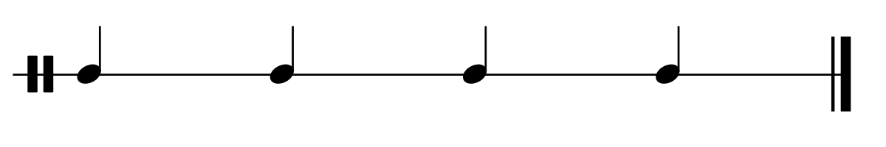

この時、4分音符は、次の図の様に強拍と弱拍に分かれることを説明しました。

しかし現実の音楽の音符は、この様に譜面上に行儀よく並んでいる訳ではありません。小節から逸脱して不規則に並んでいます。 この複雑なリズムを人間が聴いた時に、人間がどう解釈しているかを考えます。

* １．テンポのある曲では拍が１拍しかないということはありえない。
    * 何故なら、拍が一拍しかなかった場合、それはリズムとして成立せずテンポも存在しないからである。
        * → もしもテンポがある曲なら拍は、必ず二拍以上ある。
            * → その二拍について、音価（長さ）は幾らで何番目の拍にあるのかを考える必要がある。
                * → これが**拍がニ拍ある場合の難しさの本質**にある。
* ２． 音がニ拍あった時の難しさについて考える
    * → 拍がニ拍あった場合、片方は必ず弱拍になる。
        * → 最初の音が強拍だった場合、及び弱拍だった場合をそれぞれ考える。
            * → 最初の音が強拍だったと仮定すると、それは１拍目強拍でしかありえない。何故か。
                * → もしもそれが２拍目と４拍目だったら弱拍ということになる。
                * → もしもそれが４分音符３拍目強拍だったとしたら、それは２分音符の弱拍ということになる。
            * → 最初の音が弱拍だったと仮定すると、それは全音符２分音符４分音符８分音符１６分音符、つまり全ての音価の弱拍である可能性がある。
* ３．結論
    * → 拍が二拍ある時、そのリズムを理解する為には、その二拍の音価を判定する必要がある。その為にはその二拍が、あらゆる音価（四分音符・八分音符・一六分音符…ｎ分音符、及び 四分音符、二分音符、全音符、二全音符…ｎ全音符）の弱拍である可能性と、強拍である可能性を全て検証する必要がある。
    * → この検証作業を一定時間内に行う必要性があることが、リズムの緊迫感を生み出す源にある。

#### 音は必ず２つある

このことを考える時、問題を単純化する為に、音符が２つある場合を考えます。何故なら音符が１つしかない場合、それはリズムとして成立しないからです。

前章でも見たビデオをもう一度おさらいします。

<blockquote class="twitter-tweet" data-media-max-width="560">
リズムには最低二音が必要。一音しかなければそれはリズムとして成立しない。二音あればそこに弱拍と強拍が成立する。それを聴く人はどちらが弱拍かでどちらが強拍かを判定する必要に迫られる。この限られた時間内での判断の必要性がリズムの緊張感の源に存在する。<a href="https://twitter.com/hashtag/%E3%82%AA%E3%83%95%E3%83%93%E3%83%BC%E3%83%88%E3%81%A7%E6%80%9D%E8%80%83%E3%81%99%E3%82%8B%E8%AA%9E%E5%AD%A6?src=hash&amp;ref_src=twsrc%5Etfw">#オフビートで思考する語学</a> <a href="https://t.co/1QiPtCFGzg">pic.twitter.com/1QiPtCFGzg</a>
&mdash; 岡敦/Ats🇯🇵 (@ats4u) <a href="https://twitter.com/ats4u/status/1944485752970355051?ref_src=twsrc%5Etfw">July 13, 2025</a></blockquote>

この様に音が１つしかない場合、それはリズムとして成立しない為、除外して考えます。音符がリズムとして成立する最低の個数である２音の場合を考えます。

#### 音が２つあれば必ず強拍と弱拍ができる
音が２つあった場合、そのどちらかは必ず弱拍でそのどちらかは必ず強拍になります。先行拍が**弱拍**なら後行拍は**強拍**です。先行拍が**強拍**なら後行拍は**弱拍**です。

#### 先行拍が強拍だったなら、それは必ず１拍目強拍になる
* 例としてその音符が４分音符だった時のことを考えます。
* もし、その拍が２拍目か４拍目だったらそれは弱拍なのでここでは除外されます。
* もし、それが４分音符３拍目強拍だったとしたら、それは２分音符の弱拍ということになります。
* つまりもし、その拍が強拍だったとすると、それは必ず１拍目強拍ということになります。
* これは４分音符だけでなく、全ての音価の音符に対して成立します。

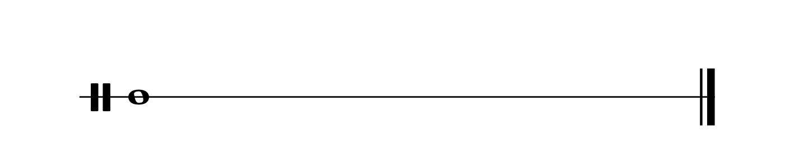

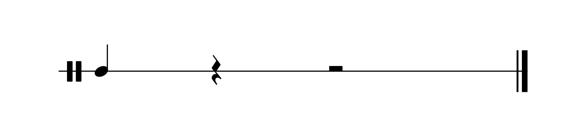

> 💡 もしも強拍が１拍目ではなかった場合、それは必ず弱拍として約分が出来ます。つまり必ず弱拍なのです。 [参照：弱拍強拍は分数で表すことが出来る]( #弱拍強拍は分数で表すことが出来る )

#### 先行拍が弱拍だった場合あらゆる音価の弱拍である可能性を検証しなければならない

もしも先行拍が強拍ではなかった場合、それは必ず弱拍です。弱拍は強拍とは異なり、無限に存在します。

もしその拍が弱拍だったとすると、その音符は４分音符の弱拍かも知れませんし、８分音符の弱拍かも知れません。１６分音符などのより細かな音価の弱拍かも知れません。或いはより長い２分音符・全音符・２全音符などの音符での弱拍かも知れません。可能性として考えられる音符は無限に存在します。無限に存在する可能性のなかでどの音符の弱拍なのかを判別するためには、予想と修正が必要になります。 まず予想を立てた上で、音楽をしばらく聴き前後の文脈から判別しながら、予想を修正しながら、実際の音価を特定する必要が発生します。

#### 先行する弱拍は緊迫感を生み出す
この様に先行する弱拍をを聴く人は、限られた時間内で、どちらが弱拍かでどちらが強拍かを判定する必要に迫られます。この作業の難しさがリズムの緊張感の源に存在します。

#### 先行する強拍は安定感を生み出す
逆に先行する強拍は、その可能性が必ず１拍目強拍に限定される為、考えるべき可能性の数が大幅に減少する結果となります。これにより先行する強拍は、それを聴く人に安定感をもたらします。

強拍が先に来るように音符を認識すると、これが強拍先行になることを説明しました。

これを4分音符上で行うと次のようになります。

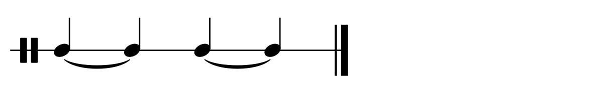

これを弱拍が先に来るように認識すると次の様になります。

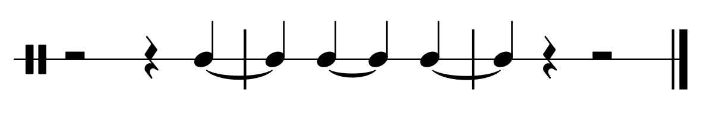

<blockquote class="twitter-tweet" data-media-max-width="560">
8分音符の弱拍先行（シラブル拍リズム／ストレス拍リズム）<a href="https://t.co/GQwo8b3NOs">pic.twitter.com/GQwo8b3NOs</a>
&mdash; 岡敦/Ats🇯🇵 (@ats4u) <a href="https://twitter.com/ats4u/status/1944024049505673559?ref_src=twsrc%5Etfw">July 12, 2025</a></blockquote>

<blockquote class="twitter-tweet" data-media-max-width="560">
8分音符の強拍先行（モーラ拍リズム）<a href="https://t.co/sxZbhBf0oP">pic.twitter.com/sxZbhBf0oP</a>
&mdash; 岡敦/Ats🇯🇵 (@ats4u) <a href="https://twitter.com/ats4u/status/1944024220717265090?ref_src=twsrc%5Etfw">July 12, 2025</a></blockquote>

<blockquote class="twitter-tweet" data-media-max-width="560">
4分音符の弱拍先行（ストレス拍リズム）<a href="https://t.co/YOsxEiurjc">pic.twitter.com/YOsxEiurjc</a>
&mdash; 岡敦/Ats🇯🇵 (@ats4u) <a href="https://twitter.com/ats4u/status/1944024378947383703?ref_src=twsrc%5Etfw">July 12, 2025</a></blockquote>

<blockquote class="twitter-tweet" data-media-max-width="560">
4分音符の強拍先行（モーラ拍リズム・シラブル拍リズム）<a href="https://t.co/nm7sOtEMLs">pic.twitter.com/nm7sOtEMLs</a>
&mdash; 岡敦/Ats🇯🇵 (@ats4u) <a href="https://twitter.com/ats4u/status/1944024526159065266?ref_src=twsrc%5Etfw">July 12, 2025</a></blockquote>

<blockquote class="twitter-tweet" data-media-max-width="560">
4分音符及び8分音符の弱拍先行（ストレス拍リズム）<a href="https://t.co/bao2f19Tbb">pic.twitter.com/bao2f19Tbb</a>
&mdash; 岡敦/Ats🇯🇵 (@ats4u) <a href="https://twitter.com/ats4u/status/1944024709320126788?ref_src=twsrc%5Etfw">July 12, 2025</a></blockquote>

<blockquote class="twitter-tweet" data-media-max-width="560">
4分音符及び8分音符の強拍先行（モーラ拍リズム）<a href="https://t.co/emtb3pwkcD">pic.twitter.com/emtb3pwkcD</a>
&mdash; 岡敦/Ats🇯🇵 (@ats4u) <a href="https://twitter.com/ats4u/status/1944024971963244620?ref_src=twsrc%5Etfw">July 12, 2025</a></blockquote>

<blockquote class="twitter-tweet" data-media-max-width="560">
2分音符、4分音符及び8分音符の弱拍先行（英語などのストレス拍リズム）<a href="https://t.co/xYQj8CQPJX">pic.twitter.com/xYQj8CQPJX</a>
&mdash; 岡敦/Ats🇯🇵 (@ats4u) <a href="https://twitter.com/ats4u/status/1944025277438509100?ref_src=twsrc%5Etfw">July 12, 2025</a></blockquote>

<blockquote class="twitter-tweet" data-media-max-width="560">
2分音符、4分音符及び8分音符の強拍先行（日本語などのモーラ拍リズム）<a href="https://t.co/tnw3Sn6aE8">pic.twitter.com/tnw3Sn6aE8</a>
&mdash; 岡敦/Ats🇯🇵 (@ats4u) <a href="https://twitter.com/ats4u/status/1944025500139286791?ref_src=twsrc%5Etfw">July 12, 2025</a></blockquote>

<blockquote class="twitter-tweet" data-media-max-width="560">
4分音符、8分音符及び16分音符の弱拍先行（英語などのストレス拍リズム） ( Can&#39;t Hide Love / Earth, Wind &amp; Fire ) <a href="https://t.co/z93F8mmjU7">pic.twitter.com/z93F8mmjU7</a>
&mdash; 岡敦/Ats🇯🇵 (@ats4u) <a href="https://twitter.com/ats4u/status/1944026314014630346?ref_src=twsrc%5Etfw">July 12, 2025</a></blockquote>

<blockquote class="twitter-tweet" data-media-max-width="560">
4分音符、8分音符及び16分音符の強拍先行（日本語などのモーラ拍リズム）( モーラ拍リズムの頭合わせリズム認識を適用した Can&#39;t Hide Love / Earth, Wind &amp; Fire ) <a href="https://t.co/Nx5G8rBc4f">pic.twitter.com/Nx5G8rBc4f</a>
&mdash; 岡敦/Ats🇯🇵 (@ats4u) <a href="https://twitter.com/ats4u/status/1944026780706521146?ref_src=twsrc%5Etfw">July 12, 2025</a></blockquote> 

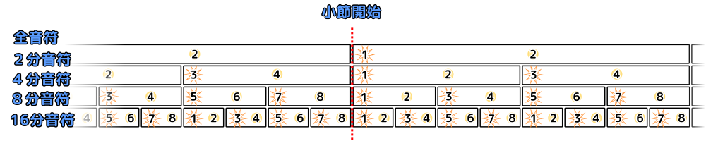

### ８分音符の弱拍先行

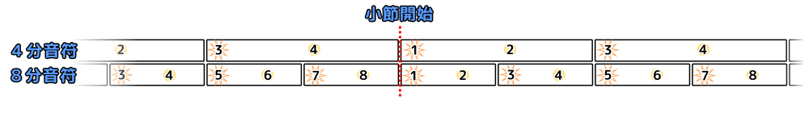

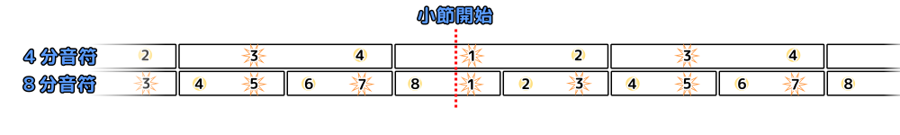

### ４分音符の弱拍先行

### 2分音符の弱拍先行

### ４分音符と８分音符で同時に弱拍先行

モーラ拍リズムを母語として話す人は、ストレス拍リズムを母語として話す人が演奏するリズムを強弱リズム解釈として１つずれた形で認識します。

<blockquote class="twitter-tweet" data-media-max-width="560">
バダムツー（英語での「ちゃんちゃん」のような効果音） Credit : <a href="https://t.co/1pMfDuY1S3">https://t.co/1pMfDuY1S3</a> <a href="https://t.co/qdcGm8P81M">pic.twitter.com/qdcGm8P81M</a>
&mdash; 岡敦/Ats🇯🇵 (@ats4u) <a href="https://twitter.com/ats4u/status/1928811162042507281?ref_src=twsrc%5Etfw">May 31, 2025</a></blockquote> 

#### 弱強リズム解釈

ストレス拍リズム（英語）の話者は、バダムツーを聴いた時、4分音符で弱強で、8分音符で弱強で解釈します。

この解釈を音楽で表すと次のようになるでしょう。

<blockquote class="twitter-tweet" data-media-max-width="560">
バダムツーの横乗りでの解釈 <a href="https://twitter.com/hashtag/%E3%82%AA%E3%83%95%E3%83%93%E3%83%BC%E3%83%88%E3%81%A7%E6%80%9D%E8%80%83%E3%81%99%E3%82%8B%E8%AA%9E%E5%AD%A6?src=hash&amp;ref_src=twsrc%5Etfw">#オフビートで思考する語学</a> <a href="https://t.co/KN5gMaKMdE">https://t.co/KN5gMaKMdE</a> <a href="https://t.co/C5x0FYgXLk">pic.twitter.com/C5x0FYgXLk</a>
&mdash; 岡敦/Ats🇯🇵 (@ats4u) <a href="https://twitter.com/ats4u/status/1928070026998755806?ref_src=twsrc%5Etfw">May 29, 2025</a></blockquote>

#### 強弱のリズム解釈

ところがモーラ拍リズム（日本語）の話者は、バダムツーを4分音符も強弱、8分音符も強弱で解釈します。

この解釈を音楽で表すと次のようになるでしょう。

<blockquote class="twitter-tweet" data-media-max-width="560">
バダムツーの縦乗りでの解釈 <a href="https://twitter.com/hashtag/%E3%82%AA%E3%83%95%E3%83%93%E3%83%BC%E3%83%88%E3%81%A7%E6%80%9D%E8%80%83%E3%81%99%E3%82%8B%E8%AA%9E%E5%AD%A6?src=hash&amp;ref_src=twsrc%5Etfw">#オフビートで思考する語学</a> <a href="https://t.co/KN5gMaKMdE">https://t.co/KN5gMaKMdE</a> <a href="https://t.co/TCvZoJEMqw">pic.twitter.com/TCvZoJEMqw</a>
&mdash; 岡敦/Ats🇯🇵 (@ats4u) <a href="https://twitter.com/ats4u/status/1928070176341164344?ref_src=twsrc%5Etfw">May 29, 2025</a></blockquote>

この様に、ストレス拍リズムの人々が演奏する弱強リズムが前提で構成されたリズムパターンを、モーラ拍リズムの人々は、強弱リズムとして１つずれた形で間違って解釈します。

<blockquote class="twitter-tweet" data-media-max-width="560">
ストレス拍リズム（英語）のスイング ─── ベースが1/9早めのタイミングに移動しライドシンバルの8分弱拍が4分音符に対して5/9の位置に配置されている。また4分音符は全て1/9遅れている。 <a href="https://twitter.com/hashtag/%E3%82%AA%E3%83%95%E3%83%93%E3%83%BC%E3%83%88%E3%81%A7%E6%80%9D%E8%80%83%E3%81%99%E3%82%8B%E8%AA%9E%E5%AD%A6?src=hash&amp;ref_src=twsrc%5Etfw">#オフビートで思考する語学</a> (訂正版) <a href="https://t.co/QajecpWuqP">pic.twitter.com/QajecpWuqP</a>
&mdash; 岡敦/Ats🇯🇵 (@ats4u) <a href="https://twitter.com/ats4u/status/1932739193438146682?ref_src=twsrc%5Etfw">June 11, 2025</a></blockquote>

<blockquote class="twitter-tweet" data-media-max-width="560">
モーラ拍リズム（日本語）のスイング ─── 俗に「頭重心」「縦乗り」という。ライドシンバルの4分音符が基準位置になっているため移動しない。ベースが1/32 遅めのタイミングに移動し遅れる等々、全ての打点が4分音符よりも後ろに遅れて配置され音量が小さい。 <a href="https://twitter.com/hashtag/%E3%82%AA%E3%83%95%E3%83%93%E3%83%BC%E3%83%88%E3%81%A7%E6%80%9D%E8%80%83%E3%81%99%E3%82%8B%E8%AA%9E%E5%AD%A6?src=hash&amp;ref_src=twsrc%5Etfw">#オフビートで思考する語学</a> <a href="https://t.co/KMnIJYQXmC">pic.twitter.com/KMnIJYQXmC</a>
&mdash; 岡敦/Ats🇯🇵 (@ats4u) <a href="https://twitter.com/ats4u/status/1932139175647850918?ref_src=twsrc%5Etfw">June 9, 2025</a></blockquote>

## 時間認識の指向性について

### 尻合わせ
モーラ拍リズムのリズム認識をここでは**頭合わせ**と、そしてストレス拍リズムのリズム認識を**尻合わせ** と呼びます。

<blockquote class="twitter-tweet" data-media-max-width="560">
尻合わせリズム（海外の音楽ジャズ／ファンク） 頭合わせリズム（日本人が陥りがちなリズム) … の違い  【尻合わせ】 <a href="https://t.co/vryyK4SjMC">pic.twitter.com/vryyK4SjMC</a>
&mdash; 岡敦/Ats🇯🇵 (@ats4u) <a href="https://twitter.com/ats4u/status/1612304475347390466?ref_src=twsrc%5Etfw">January 9, 2023</a></blockquote>

### 頭合わせ

<blockquote class="twitter-tweet" data-media-max-width="560" data-lang="en">
尻合わせリズム（海外の音楽ジャズ／ファンク） 頭合わせリズム（日本人が陥りがちなリズム) … の違い  【頭合わせ】 <a href="https://t.co/Eij6Uuqi5G">pic.twitter.com/Eij6Uuqi5G</a>
&mdash; 岡敦/Ats🇯🇵 (@ats4u) <a href="https://twitter.com/ats4u/status/1612304530502451201?ref_src=twsrc%5Etfw">January 9, 2023</a></blockquote>

### モーラ拍リズムのリボ払い
### シラブル拍リズムの月末締め一括払い

## 弱拍基軸リズム理論とは

弱拍基軸理論を一言でいうと『弱拍と強拍のどちらが先か』という視点を元にリズムを区分する方法論です。ここでの強拍弱拍という用語は、強拍・弱拍の様に楽典として正式に意味が定義されている用語ではありません。ここでは**奇数拍**の事を**強拍**、**偶数拍**の事を**弱拍** と呼ぶことにしましょう。 強拍が先行する感覚で演奏することをここでは**強拍基軸**と呼ぶことにしましょう。そして弱拍が先行する感覚で演奏することを**弱拍基軸**と呼ぶことにします。

グルーヴするリズムは必ず弱拍基軸です。

## どんな音価にも強弱がある

[縦乗りリズム理論](../tatenori-theory/) で説明したバダムツーは、4分音符も弱強で解釈し、8分音符も弱強で解釈するという2重の弱強解釈が登場します。

## 弱拍天動説と弱拍地動説

弱強リズム認識を持つ人（＝ストレス拍リズム言語を母国語として話す人）は、リズムニュアンスを演奏する時に、弱拍位置を基準位置として固定し強拍位置を移動することでニュアンスを醸し出す習慣を持っています。

<blockquote class="twitter-tweet" data-media-max-width="560">
レイドバックの基本『オフビートの位置は固定。オンビートの位置が遅れる』 ギターの方がこの演奏中でそれをはっきり行っています。  これを日本人が聴くとオンビートの位置が固定でオフビートの位置が早くなったように錯覚するため、同じ様に演奏することが出来ません。 <a href="https://twitter.com/hashtag/%E3%82%AA%E3%83%95%E3%83%93%E3%83%BC%E3%83%88%E3%81%A7%E6%80%9D%E8%80%83%E3%81%99%E3%82%8B%E8%AA%9E%E5%AD%A6?src=hash&amp;ref_src=twsrc%5Etfw">#オフビートで思考する語学</a> <a href="https://t.co/QC9uaA2F4h">pic.twitter.com/QC9uaA2F4h</a>
&mdash; 岡敦/Ats🇯🇵 (@ats4u) <a href="https://twitter.com/ats4u/status/1650000173932900352?ref_src=twsrc%5Etfw">April 23, 2023</a></blockquote>

一方、強弱リズム認識を持つ人（＝モーラ拍リズム言語を母国語として話す人）は、リズムニュアンスを演奏する時に、弱強リズム認識を持つ人と全く逆に、強拍位置を基準位置として固定し弱拍位置を移動することでニュアンスを醸し出す習慣を持っています。

<blockquote class="twitter-tweet" data-media-max-width="560">
ずれのない歯ざわりのよい頭拍。朗々と歌うレイドバック。渋みと哀愁 ─── 演歌の素晴らしさがつまっている。  氷川きよしのずんどこ節<a href="https://t.co/xKDWfdwEC3">https://t.co/xKDWfdwEC3</a> <a href="https://t.co/nN06TRy28c">pic.twitter.com/nN06TRy28c</a>
&mdash; 岡敦/Ats🇯🇵 (@ats4u) <a href="https://twitter.com/ats4u/status/1710928577670336908?ref_src=twsrc%5Etfw">October 8, 2023</a></blockquote> 

> なお日本の演歌では、伴奏側が強拍位置を基準位置を固定する役割を担い、歌唱者はその固定した強拍位置に対して、自分自身の演奏する強拍と弱拍の両方を移動することでニュアンスを演奏するという習慣があります。これは弱拍の位置が必ず固定になる弱強リズム認識と大きく異なる特徴です。この事については後述します。

この時、強弱リズム認識を持っている人は、この弱強リズム認識を持っている人のリズム認識を正しく認識することが出来ないという現象が起こります。

強弱リズム認識の人が弱強リズム認識のニュアンスが理解出来ない様子はあたかも、天体の動きを天動説で捉えると理解が困難になる様子とにています。

<blockquote class="twitter-tweet" data-media-max-width="560">
『ジャズのリズムはオフビートが基準点！』 オフビート基準点 ⇔ オンビート基準点  オンビートを基準にして考えると、基準点自体が動いてしまうことから、音符ずれの動きが全て矛盾して見えてしまう。オフビートを基準点にして考えると、とても単純に解釈できる。 <a href="https://t.co/muwn40MxLD">pic.twitter.com/muwn40MxLD</a>
&mdash; 岡敦/Ats🇯🇵 (@ats4u) <a href="https://twitter.com/ats4u/status/1520578075490418688?ref_src=twsrc%5Etfw">May 1, 2022</a></blockquote>

弱拍の位置が基準になっていることに気付けば全ては単純な動作に見えますが、強拍位置が基準になっていると認識していると途端に全てが複雑な動作となって見えてきます。

移動しているのは、自分が足をおいている強拍だった ─── それに気付く瞬間はまるで、天動説の人々が太陽が動いていると思っていたものが、実は自分たちが立っている地球自身が動いていると気付く瞬間ととても似ています。

<blockquote class="twitter-tweet" data-media-max-width="560">
欧米／東南アジアの交互に手を叩く「交互ルール」リズムに対して、真逆のルール「同時ルール」で歌う演歌。演歌のリズムの起源は中国にある。日本の演歌は（実は）中国で高い人気がある。  Credit : 蒋大为 - 北国之春 <a href="https://t.co/TtRu1Sfo52">https://t.co/TtRu1Sfo52</a><a href="https://twitter.com/hashtag/%E3%82%AA%E3%83%95%E3%83%93%E3%83%BC%E3%83%88%E3%81%A7%E6%80%9D%E8%80%83%E3%81%99%E3%82%8B%E8%AA%9E%E5%AD%A6?src=hash&amp;ref_src=twsrc%5Etfw">#オフビートで思考する語学</a> <a href="https://t.co/DsjR7NPhL4">pic.twitter.com/DsjR7NPhL4</a>
&mdash; 岡敦/Ats🇯🇵 (@ats4u) <a href="https://twitter.com/ats4u/status/1669192825442021377?ref_src=twsrc%5Etfw">June 15, 2023</a></blockquote> 

<blockquote class="twitter-tweet" data-media-max-width="560">
二葉百合子の『関東一本〆』  正統派演歌の語法 ・ぴったりに合わせる強拍 ・後ろにつく弱拍 ・揺れる強拍  Credit : 二葉百合子 - 関東一本〆<a href="https://t.co/Pz122I6Hhv">https://t.co/Pz122I6Hhv</a><a href="https://twitter.com/hashtag/%E3%82%AA%E3%83%95%E3%83%93%E3%83%BC%E3%83%88%E3%81%A7%E6%80%9D%E8%80%83%E3%81%99%E3%82%8B%E8%AA%9E%E5%AD%A6?src=hash&amp;ref_src=twsrc%5Etfw">#オフビートで思考する語学</a> <a href="https://t.co/3M68PZ4gbP">pic.twitter.com/3M68PZ4gbP</a>
&mdash; 岡敦/Ats🇯🇵 (@ats4u) <a href="https://twitter.com/ats4u/status/1669192095406628864?ref_src=twsrc%5Etfw">June 15, 2023</a></blockquote> 

## 縦乗りのメカニズム
### モーラ拍ネイティブが陥りがちなリズム習癖

<blockquote class="twitter-tweet" data-media-max-width="560">
縦乗りと横乗りの違いを完全に把握した。縦乗り解釈する時に音符の位置がずれる。これがいわゆる『日本人の頭重心リズム』のメカニズムだ。  縦乗り（モーラ拍リズム） 横乗り（ストレス拍リズム）<a href="https://twitter.com/hashtag/%E3%82%AA%E3%83%95%E3%83%93%E3%83%BC%E3%83%88%E3%81%A7%E6%80%9D%E8%80%83%E3%81%99%E3%82%8B%E8%AA%9E%E5%AD%A6?src=hash&amp;ref_src=twsrc%5Etfw">#オフビートで思考する語学</a> <a href="https://t.co/o3RILE8EMy">pic.twitter.com/o3RILE8EMy</a>
&mdash; 岡敦/Ats🇯🇵 (@ats4u) <a href="https://twitter.com/ats4u/status/1930932283294544307?ref_src=twsrc%5Etfw">June 6, 2025</a></blockquote>

### 縦乗りに気付く

貴方は、誰かとペアになってその人と交互に手を叩くことは出来ますでしょうか。「何をそんな簡単なことを」とおっしゃるかも知れません。しかしこれは実際にやってみると非常に難しいことだとお気付きになることと思います。

もしかするとメトロノームに合わせて交互に手を叩くことは出来るかも知れません。しかし人間が相手の場合、その手拍子の感覚は揺れ動きます。この様な揺れ動くリズムを相手にして交互に手を叩くことは、とても難しいこととお気付きになるかも知れません。

次にメトロノームを**弱拍**に合わせて即興演奏や特定の楽曲を演奏することは出来ますでしょうか。ここでいう弱拍とは、4分音符でしたら2拍目／4拍目のことです。或いは8分音符でしたら2拍4拍6拍8拍のことです。この弱拍にメトロノームを合わせて演奏することは出来ますでしょうか ─── これは更に難しいことだとお気付きになると思います。

もしかしたら「そんな難しいことは出来ないのが当然だ！」と仰るかも知れません ─── しかしここに、日本語を母国語とする人だけが持っている特殊な時間認識の偏りを観察出来るのです。

弱拍にメトロノームを鳴らすことは決して簡単なことではありませんが、日本語以外の言語を母国語とする人…特に英語を母国語とする人は、これを多少練習すれば習得することが出来るのです。しかし日本語を母国語とする人は長い年月 ─── 場合によっては20年近い年月を要することも稀ではありません。

これにははっきりした理由があります ─── その違いは言語によるリズム認識の違いにあります。

### 交互手叩き不可能性

縦乗りの人は、時間の認識の原理上「2人で交互に手を叩くことが出来ない」という特徴があります。 もしかするとメトロノームに合わせて交互に手を叩くことは出来るかも知れません。しかし不正確な人間を相手に交互に手を叩くことが出来ません。

しかし、相手が人間の場合、人間のリズムには微妙な揺らぎがあることから、その揺らぎに対して柔軟に対応する必要が発生します。つまり交互にリズムを合わせ続けるには「相手のゆらぎを感じ取りながら、自分のタイミングを調整する」という、より複雑な時間感覚が求められます。 ─── この人間同士で交互手叩きを行う場面で、時間認識の違いをはっきりと観察できる現象が観察出来るのです。

縦乗りの人は、時間認識の原理上、一定の間隔で鳴っているパルスと距離を取って同時ではない状態を維持することがとても難しく、結果として、人間同士での即時的なリズムのやりとり──すなわち交互に手を叩くような行為──が出来ないという現象となって観察されます。

一方縦乗りの人は、交互に手を叩くことは出来ませんが、不規則になっている手拍子に合わせて同時に叩くことなら即座に行う事ができます。これはむしろ、縦乗りの人に特徴的な能力で縦乗りの人以外には出来ない行為です。

これは些細なこと…と思われるかも知れません。しかし、ロック・ジャズ・クラシック・ファンク問わず、2人の奏者が交互に音を出すリズムが繰り返し現れることには注意が必要です。西洋音楽の最も基礎にバスドラムとスネアドラムを交互に演奏するリズムが現れます。特に現代あるアメリカ起源のポピュラー音楽は必ずこのリズムが登場します。

### 強拍先行は存在しない

『強弱』の様に聴こえるリズムでも、そこに隠れた暗黙の弱拍を演奏してから強拍を演奏します。海外の音楽には強拍先行は存在しません。一瞥すると強拍が先行する様に見えるリズムでも、実はその前に休符として先に弱拍を演奏する習慣があります。

### リズム解釈の違い
この言語自体が持っているリズム認識の違いは、同じ単語の発音の解釈の違いとして現れます。

| 拍リズム          | バナナ                     | コンピューター           | チョコレート         | カメラ        |
| :------------ | :---------------------- | ----------------- | -------------- | ---------- |
| モーラ拍 🇯🇵     | /**ba**-**na**-**na** / | /ko-m-pyu-u-ta-a/ | /cho-ko-re-to/ | /ka-me-ra/ |
| シラブル拍🇪🇸🇫🇷 | /**ba**-**na**-**na** / | /com-pyu-ter/     | /cho-co-late/  | /ca-me-ra/ |
| ストレス拍🇺🇸🇬🇧 | /ba-**NA**-**na** /     | /kəm-ˈPYU-ter/    | /ˈCHOK-lət/    | /KAM-ruh/  |

このリズム解釈の違いは、言語だけでなく、音楽での強拍と弱拍の前後関係の違いとして現れます。この認識の違いは、即興演奏時や作曲時の無意識の音符の配置の仕方にはっきりとした偏りを生み出します。そしてこの認識の違いは、音楽だけにとどまらず日常的に行う動作と動きの認識、行動全体に対して大きな影響を与えています。

 特にこのリズム認識の違いは、無意識の内に音楽を演奏する時の強拍弱拍の順序の違いとして現れます。

### 強拍弱拍は単独では存在しない
前述の通り強拍と弱拍が存在するためには、当たり前なことですが、最低でも２つ以上の音符が必要です。この事は特筆に値します。海外の音楽には必ず強拍弱拍があります。これは裏を返すと、単独の拍を単独で演奏することがほとんどないということを隠喩しています。 単独の拍を単独で演奏している様に見えても、演奏者及び聴者は、そこに暗黙の弱拍があることを聴き取っています。

しかし日本語のようなモーラ拍リズムの言語を母国語とする人は、しばしば音楽を演奏する時に音符を単独で演奏する習慣を持っています。ここから日本語話者は音符を聞いた時、そこに暗黙の弱拍があることは愚か、そこに強弱の区別がある事にすら気付かないという、日本語話者に独特な盲点が生まれます。

**強拍弱拍は単独では存在できなません。** そして海外の音楽では**単独の音符は存在しません。** このことをここで指摘すると共に今後常にこのことを喚起していく必要があるでしょう。

強拍でも弱拍でもない単独の音符が現れてしまう ─── これがモーラ拍リズム（日本語）話者が持っている１つ目の盲点です。

### 桃太郎さん現象について
### 最初に聴こえた拍が１拍目強拍に聞こえる症候群について

<!--
盆踊り・マクドナルド

<iframe style="width:100%;height:360px;" src="https://www.youtube.com/embed/zhGnuWwpNxI?si=rmaaGup-ewVlmkTv" title="YouTube video player" frameborder="0" allow="accelerometer; autoplay; clipboard-write; encrypted-media; gyroscope; picture-in-picture; web-share" referrerpolicy="strict-origin-when-cross-origin" allowfullscreen></iframe>

<blockquote class="twitter-tweet" data-media-max-width="560">
【外人が演奏する縦乗り】この方は日本語のリズムと英語のリズムの違いに気付いている ── が見事なまでに縦乗りに失敗している。これは彼が日本語話者でないことを表している。リエゾンによって倒置するオフビートがあり、オンビートは全てレイドバックして遅れている。   <a href="https://t.co/5MrK0hKUHo">https://t.co/5MrK0hKUHo</a> <a href="https://t.co/oJnPHqAaza">pic.twitter.com/oJnPHqAaza</a>
&mdash; 岡敦/Ats🇯🇵 (@ats4u) <a href="https://twitter.com/ats4u/status/1573036257588178944?ref_src=twsrc%5Etfw">September 22, 2022</a></blockquote>

-->

