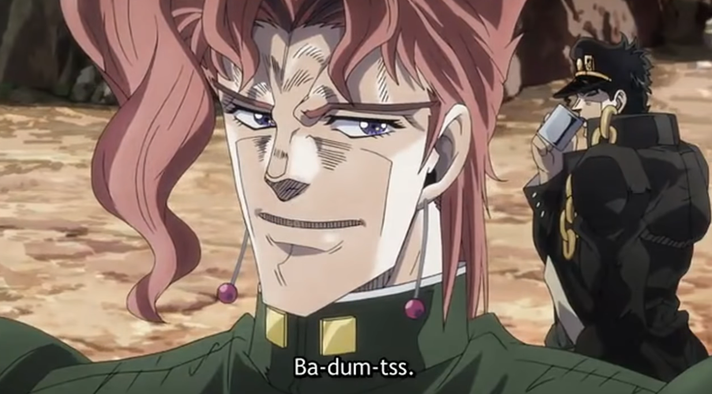
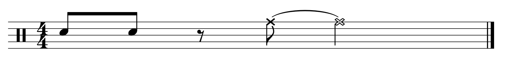
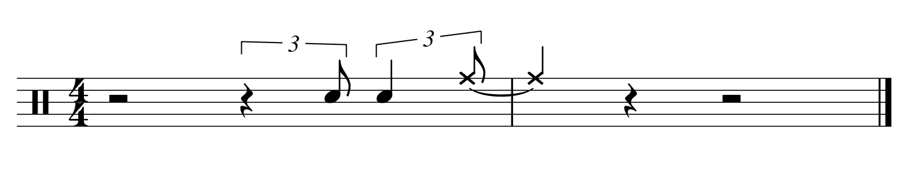
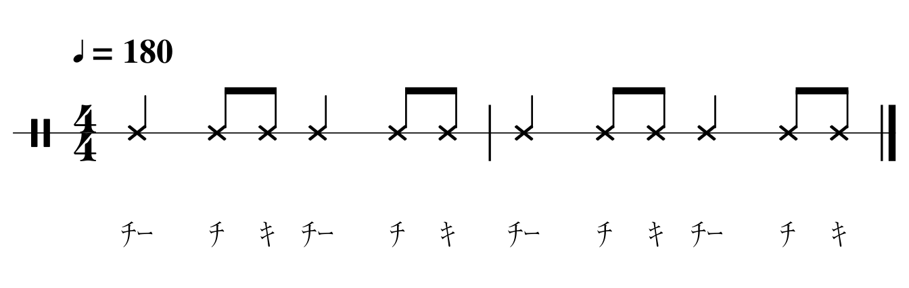
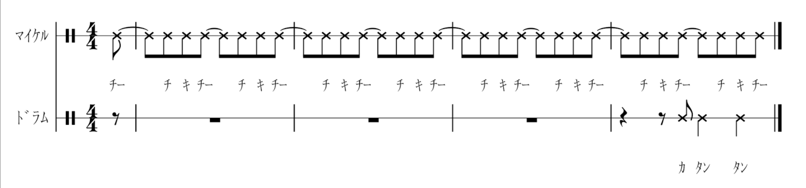

## 縦乗りとは

縦乗りとは何でしょうか。それは全く見えない存在です。しかし縦乗りは常にそこに存在しています。それは今この文章を読んでいる今この瞬間も存在しています。縦乗りは見えない存在ですが、今も正に貴方は縦乗りを見ています。縦乗りは常にそこに存在する空気のような存在です。そして空気がなければ生きていくことが出来ないように、縦乗りがなくなると人は生きていくことができません。人は、生まれてから縦乗りと出会い、そのまま縦乗りの存在に気付かず、縦乗りの存在に気付かぬまま死んでいきます。

しかし縦乗りは常に私達の行動を規定しています。私達は常に縦乗りに束縛されているのです。

縦乗りに気付くかどうかは貴方次第です。そのまま縦乗りの存在に気付かずに生涯を全うするか、あるいは縦乗りに気付いて火のついた様な激しい真実の世界で生きていくか。それは貴方の選択次第です。

それは映画マトリックスに登場する赤いカプセルと青いカプセルの様です。もちろん、このまま縦乗りに気付かないで生きていくことも可能です。もしもここで、縦乗りに気付くことを選んだらどうなるでしょうか。 …縦乗りに気付くことにより大きな自由が得られると同時に、大きなリスクのある世界で生きていく事になります。

ここで縦乗りだと出来なくなることを御説明致しましょう。

* 英語のリスニング
* 英会話
* その他、日本語以外の会話能力全て
* ITの世界で世界の壁を打ち破る
* クラシック演奏活動で世界の壁を打ち破る
* ジャズの演奏活動で世界の壁を打ち破る
* 格闘技で世界の壁を打ち破る
* レースで世界の壁を打ち破る
* サッカーなどの球技全般のスポーツの世界で世界の壁を打ち破る
* 「世界」ではなく「東京」の壁を打ち破ることも含まれるかも知れません。

大きな夢のある世界で生きて行きたい… もしも貴方がそうお考えでしたら、縦乗りに気付くことは大きなチャンスとなるでしょう。

貴方は、世界の壁を打ち破り大きな人間になりたくありませんか？  ───  もちろんそれは強制ではありません。

世界の壁を打ち破る事に興味はないけども、縦乗りが何なのかちょっと興味があるな… そういう方でも結構です。

この縦乗りに気付き、縦乗りから自立し、縦乗りがなくても生きていく能力を身につける、その為の理論と実践的練習方法があります。

その方法をここで御紹介したいと思います。順を追って御説明致します。

## 縦乗りが与える影響

**縦乗り**とは、日本語を母語とする人々に特有の、リズム感覚の微妙で深刻なズレを表す概念です。縦乗りは、日本語を母語とする人自身には感じとることが出来ません。しかしこのズレは、音楽、言語、身体感覚などのあらゆる場面で、色々な問題を引き起こしています。それは常に世界中の人々に「何かがおかしい」と感じさせていますが、その違和感はとても言葉で表すことが難しく、世界中の人々を常にモヤモヤさせつづけています。

縦乗りは一見すると些細な問題に思えるかも知れません。しかし日本語を母語とする人々が全く意識していないにも関わらず、日本人の身体動作、時間認識、音楽演奏、英語発音、さらにはコミュニケーション全体に深い影響を与えています。

もともと「縦乗り」は日本でのジャズ用語でした。スイングしないリズムを表現する用語で、文字通り「拍を縦に踏む」ようなリズムの演奏の仕方を指します。楽器を演奏する時などに、極端にビートを正確に区切り、表拍に重心を置き、タイミングを機械的に揃える傾向を表す概念です。一見正確で真面目な演奏方法と思えるかも知れませんがジャズを始め、ファンク、ソウルのようなジャンルの音楽に独特な「うねり」や「ノリ」が生まれにくくなります。このうねりの感覚の欠如が「縦乗り」です。

一方、縦乗りでない人をここでは**横乗り**と呼びたいと思います。

この縦乗りは、実は音楽以外のあらゆる面で様々な影響を与えています。

* 英語やその他の外国語を聴き取ることができない。
* 英語やその他の外国語を相手に伝わる形で発音することができない。
	* → ラップを歌った時にグルーヴしないという現象の原因になる。
* 音楽の即興演奏を行う時に、共演者の演奏内容を予想することが上手くできない。
	* → グルーヴしないという現象の原因になる。
* 即興ダンスを行う時に、共演者の動作を予想することが上手くできない。
	* → グルーヴしないという現象の原因になる。
* 格闘技などで敵の動作予想を直感的に予想する事が上手くできない。
* サッカーやバスケットボールなどのスポーツで敵や見方ボールなどの動作予想を直感的に予想する事が上手くできない。
* 海外で街を歩く時に人とぶつかりやすくなる。
	* → 海外で犯罪に巻き込まれやすくなる。

本当にそんなことが起こっているでしょうか。具体例を交えて御説明致します。

## 縦乗りという盲点

### 弱起という盲点

英語で良く使われる慣用表現で「バダムツー」というオノマトペがあります。次のような音です。

<blockquote class="twitter-tweet" data-media-max-width="560">
バダムツー（英語での「ちゃんちゃん」のような効果音） Credit : <a href="https://t.co/1pMfDuY1S3">https://t.co/1pMfDuY1S3</a> <a href="https://t.co/qdcGm8P81M">pic.twitter.com/qdcGm8P81M</a>
&mdash; 岡敦/Ats🇯🇵 (@ats4u) <a href="https://twitter.com/ats4u/status/1928811162042507281?ref_src=twsrc%5Etfw">May 31, 2025</a></blockquote> 

バダムツーはとてもポピュラーでネット上を探すと沢山の例を見つけることが出来ます。

<blockquote class="twitter-tweet" data-media-max-width="560">
【 Ba Dum Tss / バダムツー 】 ─── 日本人はこのリズムを必ず聴き間違える。このリズムを何故日本人は、必ず聴き間違えるのか。そこに日本人の縦乗りの最も根本的な原理を観察することができる。<a href="https://twitter.com/hashtag/%E3%82%AA%E3%83%95%E3%83%93%E3%83%BC%E3%83%88%E3%81%A7%E6%80%9D%E8%80%83%E3%81%99%E3%82%8B%E8%AA%9E%E5%AD%A6?src=hash&amp;ref_src=twsrc%5Etfw">#オフビートで思考する語学</a> <a href="https://t.co/IWibkjxhj3">pic.twitter.com/IWibkjxhj3</a>
&mdash; 岡敦/Ats🇯🇵 (@ats4u) <a href="https://twitter.com/ats4u/status/1918313900753514678?ref_src=twsrc%5Etfw">May 2, 2025</a></blockquote> 

このリズムを、何かの面白い事（おち）が起こった直後に演奏します。

<blockquote class="twitter-tweet" data-media-max-width="560">
バダムツーの実際に実践で使われている例：Credit : <a href="https://t.co/9YyvfCjSX1">https://t.co/9YyvfCjSX1</a> <a href="https://t.co/NBE4a3FB7d">pic.twitter.com/NBE4a3FB7d</a>
&mdash; 岡敦/Ats🇯🇵 (@ats4u) <a href="https://twitter.com/ats4u/status/1928826772281233678?ref_src=twsrc%5Etfw">May 31, 2025</a></blockquote> 

これは日本語ではしばしば「ちゃんちゃん」と訳されます。

{width=560px }

これは日本語のちゃんちゃんの様な位置にあり、コントの終わりなどで効果音として使われます。

<blockquote class="twitter-tweet" data-media-max-width="560">
日本の「ちゃんちゃん」は英語で ba dum tss と翻訳されている。ジョジョの不思議な冒険「マニッシュ・ボーイ」Credit : <a href="https://t.co/hRYKOraxdq">https://t.co/hRYKOraxdq</a> <a href="https://t.co/Oym4ZIsLUD">pic.twitter.com/Oym4ZIsLUD</a>
&mdash; 岡敦/Ats🇯🇵 (@ats4u) <a href="https://twitter.com/ats4u/status/1928814004308185233?ref_src=twsrc%5Etfw">May 31, 2025</a></blockquote> 

もし貴方が音楽の訓練を受けている方で、譜面を読み書きすることができる方でしたら、次の様に聴き取ったかも知れません。

しかしこれは本来次の様に記譜すべきなのです。

ここに日本語を母国語とする人と、そうでない人のリズムの認識に、大きな違いが見つかります。

次の例を見てみてください。

<blockquote class="twitter-tweet" data-media-max-width="560">
【モーラ拍リズムの言語（日本語）を母語として話す人が聴き取れないリズム】 16分音符1つが弱起として入っている基本リフパターン ─── マイケル・ジャクソンのヒューマン・ネイチャー Live at Wembley 1988 Credit : <a href="https://t.co/eQ1e6WjElH">https://t.co/eQ1e6WjElH</a> <a href="https://t.co/mBAaWxTeSj">pic.twitter.com/mBAaWxTeSj</a>
&mdash; 岡敦/Ats🇯🇵 (@ats4u) <a href="https://twitter.com/ats4u/status/1928820285270024211?ref_src=twsrc%5Etfw">May 31, 2025</a></blockquote>

この曲は、マイケル・ジャクソンのヒット曲『[ヒューマン・ネイチャー](https://www.youtube.com/watch?v=ElN_4vUvTPs)』です。この曲の冒頭でマイケル・ジャクソンが「チーチキ・チーチキ」と歌っていますが、この記事を読んで下さっている皆様は、このリズムをどの様に聴き取りましたでしょうか。

この様に解釈されたのではないでしょうか。しかし曲が始まると間もなくこの解釈が間違っていることが明らかになります ─── 実は次のようになっています。

このように８分音符１つ分ずれた形でリズムが始まっています。

**ここからわかることは、日本語を母国語とする人はある音を聞いた瞬間、当然のようにそれを８分音符の表拍として認識しているところを、外人は当然の様にそれを８分音符の裏拍として認識しているということです。**

これは些細なことと見えるかも知れません。しかしここに大きな盲点が存在します。

この盲点こそが、日本語を母国語とする人が英語が聴き取れなくなる理由なのです。次の動画を見てみてください。これは映画ハイスクール・ミュージカル（2006年）の主題歌です。 この動画のなかで日本語母国語話者が聴き落とす地点をアニメーションで表現しました。

<blockquote class="twitter-tweet" data-media-max-width="560">
【日本人のリズムの盲点】映画ハイスクール・ミュージカルの音楽にはオフビートから始まるリズムが現れます。  日本人には1拍目表拍から文章を解釈しその前にある音を全て無視するという性質がある為、そこに音があることに気付きません。   その地点を見える化しました。<a href="https://twitter.com/hashtag/%E3%82%AA%E3%83%95%E3%83%93%E3%83%BC%E3%83%88%E3%81%A7%E6%80%9D%E8%80%83%E3%81%99%E3%82%8B%E8%AA%9E%E5%AD%A6?src=hash&amp;ref_src=twsrc%5Etfw">#オフビートで思考する語学</a> <a href="https://t.co/qpvR56b6tG">pic.twitter.com/qpvR56b6tG</a>
&mdash; 岡敦/Ats🇯🇵 (@ats4u) <a href="https://twitter.com/ats4u/status/1661582852574806021?ref_src=twsrc%5Etfw">May 25, 2023</a></blockquote>

この歌詞は次の様になっています。

	We're all in this together  
	Once we know that we are, we're all stars  
	And we see that

この様に、小節の開始地点に先駆けて開始地点前の位置から勢いをつけてメロディーが始まることを、音楽の楽典の用語で弱起と呼びます。

この最初の we're が **弱起** で発音されていることに注目してください。この弱起こそが日本語母国語話者の盲点です。

この曲では最初の部分だけが弱起になっている非常に短い弱起なので、全ての意味が理解できないことはないかも知れません。しかし英語の詩では、**歌詞の全て弱起になっている**ことは稀なことではありません。そうなると、全ての音が聴き取れないという現象が実際に起こるのです。

<blockquote class="twitter-tweet" data-media-max-width="560">
その後、リハンナが2007年に Don’t Stop the Music でマイケルジャクソンのママセイママサーママクサを素材にしたリフを使ったことで、ママセイママサーママクサは更に広く知られる様になりました。  Credit : <a href="https://t.co/4XdSx8kHp0">https://t.co/4XdSx8kHp0</a> <a href="https://t.co/BGQnWLvpzp">pic.twitter.com/BGQnWLvpzp</a>
&mdash; 岡敦/Ats🇯🇵 (@ats4u) <a href="https://twitter.com/ats4u/status/1646892656285618176?ref_src=twsrc%5Etfw">April 14, 2023</a></blockquote> 

このサビ部分の歌詞は**全てが弱起で構成**されています。

	I wanna take you away
	Let's escape into the music, DJ, let it play
	I just can't refuse it, like the way you do this, keep on rockin' to it  
	Please don't stop the, please don't stop the music

この歌詞を、小節単位で行区切して、文章の切れ目を色で表示しました。

<pre style="border-radius:15px; border: 3px solid silver; padding:15px; font-size:1.6em;color:white;font-weight:bolder;line-height:1.5em;background-color:black; white-space: pre;">
I wanna take you 
away Let's escape into the 
music  DJ, let it
play  I just can't  re- 
-fuse it,  like the way you 
do this, keep on rockin' 
to it Please don't stop the, please don't stop the 
music 
</pre>

歌詞は完全に中学英語の範囲内です。しかしこの様に文章の切れ目の位置が弱起によって変わってしまうことにより文章全体が理解できなくなるという現象が起こります。

これこそが日本語母国語話者が、英語が理解できなくなる理由の正体です。

どんなに R の発音を練習しても、どんなに TH の発音を練習しても、リズム解釈方法が異なることにより、全てが理解できなくなってしまうのです。 リズム解釈の違いがある限り、日本人の全ての努力は水泡に帰すのです。

そしてこの弱起によって文章の切れ目位置が変わるということは、アフリカ系の諸言語の影響を強く受けている米国英語では特に顕著に起こります。

### 言語によって異なるリズム解釈

次の曲は２０１４年頃にタイで流行していた曲です。

  <iframe width="560" height="315" src="https://www.youtube.com/embed/w1y19rSAlGk?si=SmAUtZb1-qdjzGHT&amp;start=57" title="YouTube video player" frameborder="0" allow="accelerometer; autoplay; clipboard-write; encrypted-media; gyroscope; picture-in-picture; web-share" allowfullscreen></iframe>

2014年当時のタイのミュージックシーンの感性にフィットし爆発的にヒットしましたが、タイのミュージシャンという訳ではありません。これは [Mc Jair Da Rocha](https://www.youtube.com/channel/UC30QowTrCEeqr4L4R5zH8cA) というサンパウロのミュージシャンによる『A Minha Amiga Fran (Franという名の友達)』という名の曲です。彼は世界的に著名なミュージシャンというわけではありませんが、どういう経緯によってかタイでヒットしました。

この曲の歌詞を貴方は、どういう風に聞き取りましたでしょうか。この曲はサビの部分で「ウォカ・ウォカ」と連呼しておりとてもキャッチーですが、私達はこの歌詞を当然の様に「ウォカ・ウォカ」と解釈していた筈です。 しかし実は、この曲は、タイでは กาโว กาโว (kawo kawo ) と呼ばれているのです。 [カウォ・カウォというキーワード](https://www.google.com/search?q=%E0%B8%81%E0%B8%B2%E0%B9%82%E0%B8%A7+%E0%B8%81%E0%B8%B2%E0%B9%82%E0%B8%A7)  で検索すると沢山のタイ版リミックスが見つかります。

日本人が当然の様にウォカウォカと聴き取る同じ音声をタイ人は当然の様にカウォカウォと解釈している ─── この現象は、発音とリズムの解釈に大きな示唆を与えてくれます。 ここでタイ解釈では「カ」が先にくるカウォは弱起（小節頭より前から始まるメロディ）が前提となって解釈されていると見ることができます。そして日本解釈では「ウォ」が先にくる強起（小節頭より後ろから始まるメロディ）が前提となって解釈されていると見ることができます。

つまり、**言語の発音上のリズム解釈は、言語によって大きく異なる**ということが、少なくともここから観察出来ます。

民族音楽は、民族の言語と深く結びついています。日本の民族音楽（音頭や演歌）には弱起（アナクルーシス／アウフタクト）がありませんが、タイの民族音楽には弱起があります。この言語による**リズムの解釈の違いの存在**にまず気付くことが大切といえそうです。

なお、この曲の中盤のサビ部分の歌詞はポルトガル語で louca ( 英語のcrazy )と連呼している為、タイ解釈（カウォ）と日本語解釈（ウォカ）のどちらがポルトガル語解釈と一致しているか考えると、日本語の解釈の方が正しいといえます。

しかしタイ人の人はほとんどの場合、前提となる知識が全くない状態でも英語圏・ラテン語圏の人々とコミュニケーションを取ることが出来ることに対して、日本人は長い期間前提知識を学んだ状態でも、英語圏・ラテン語圏の人々とコミュニケーションを取ることが出来ないという点に注意が必要です。

彼らタイ人は全く知らない未知の言語でも、聴いた単語をそのままオウム返しに発音することが出来ます。しかし日本人は多くの発音を聞き落としてしまうため、オウム返しに発音することができません ─── ここに日本人が英語が苦手になる理由の本質が隠れています。

タイ人は「カウォでなくウォカだよ！」と訂正されるとすぐに発音解釈を切り換えることが出来ます ─── もし日本人が同じ様にして「これはウォカではなくカウォだよ！」と訂正された場合、すぐに解釈を「カウォ」に切り換えることが出来るでしょうか。答えはNOです。ここに日本語の不思議な性質を観察することが出来ます。

## 縦乗りとモーラ拍リズム

つまり**縦乗り**とは、日本語を母国語とする人だけが持っているある種の**リズム感覚の欠落**といえます。縦乗りは、単なる個人の資質や音楽の好みの問題ではありません。実は縦乗りは、日本語の発音構造が起因して起こる**構造的な現象**です。

日本語のリズム認識のことを学術的に**モーラ拍リズム**と呼びます。モーラ拍リズムとは日本語を母国語とする人が当たり前のように行っている「あーいーうーえーおー」と発音を一定の長さに区切って認識する発音認識方法のことを指しま
す。この一定の長さに区切った発音要素のことをモーラと呼びます。モーラ ─── これは日本語を話す人にとっては当たり前なことですが、実はこのモーラ拍リズムを持った言語は、世界的に探してみても日本語しかないと言われています。

世界中の大半の言語は**ストレス拍リズム**または**シラブル拍リズム**と呼ばれるリズム認識を持っています。 例えば英語・ロシア語・ドイツ語・アラビア語は**ストレス拍リズム**、スペイン語・フランス語・イタリア語・中国語・韓国語は、**シラブル拍リズム** に分類されています。 タイ語・ラオ語は色々議論があるところですが、ストレス拍リズムに分類されることもあるそうです。

ここでいう、**日本人に欠落しているある種のリズム感覚**とは特にこの**ストレス拍リズム** のことです。ここでいう横乗りとは、特に英語などのストレス拍リズムに基づいた言語を母国語として話す人々が自然に持っている**リズム感覚**です。

ストレス拍リズムとは、一定時間ごとにストレス拍＝強調されたシラブルが現れ、ストレスによって強調されないシラブルはストレス拍の間に短く等分に発音されることをいいます。[参照](https://digitalcommons.wayne.edu/cgi/viewcontent.cgi?article=1025&context=honorstheses)  例えば、fourteen, fifteen, sixteen と発音したとします。 この時 teen は必ず同じ間隔の時間をもって強調されて発音します。 しかし four | fif  | six はそれぞれ  fo fif siks と異なる数の音素を持っていても、必ず同じ長さの範囲内で時間分配されて発音されます。 これがストレス拍リズムです。

問題は、このリズム感覚の欠落が日本人にだけ特有に見られる現象だということです。 ストレス拍リズムを持つ言語を話す人々（日本人以外の地球上のほぼ全ての人々）から見ると、明らかにそこにあるべき何かがないことがはっきり明瞭に観察されます。しかしもともとその**ストレス拍リズム**という概念を持たない日本人は、そこに何かがある筈だったという認識自体が共有出来ないのです。このリズム感上の感覚差は大変に大きく、この感覚差が原因で、日本人とそれ以外の人々のコミュニケーションを決定的に困難にしています。

そしてこの発音構造の違いが、日本の教育・敗戦・戦後の歴史・高度経済発展・日本独特な心理「甘え」などの歴史的背景・心理学的背景と深く絡み合って多様な問題を生み出しています。

## 横乗りの人は縦乗りにすぐに気付く

この**リズム感覚**を持たない日本語を母国語とする人が演奏や作曲を行うと、その作品に**独特なリズム感覚の欠落**が残ります。この欠落は、そのリズム感覚を持つ人から見た時、とてもはっきりとわかる非常に明瞭なものです。この欠落は日本語以外の言語を母国語とする人々に対して常に一定の違和感を与えます。 

踊りを踊っても、それはすぐに日本人の動作だとわかる痕跡が残ります。例えそれが VTuber の映像で外見からその人が日本人であることがわからなくても、その動きだけからその人が日本人だとわかる特徴が見られます。それが例え振り付けで完全に日本人だということが部外者から見えない状態でも、それは日本人の振り付けだと即座にわかる特徴が残ります。

歩いても、走っても、歌っても、踊っても、ギターを弾いても、ドラムを叩いても、ピアノを弾いても、クラシックを演奏しても、ジャズを演奏しても、何をやっても全てに、日本人の認識欠落の痕跡が残ります。

問題は、このリズム感覚を持たない人が、そもそも彼が持っている**リズム感覚**の欠落自体を認識できないことです。

## 縦乗りの人は縦乗りに気付かない

問題は、このリズム感覚を持たない人は、そもそも彼が持っている**リズム感覚**が欠落していること自体を認識できないことです。つまり**あるリズム感覚をもつものと、あるリズム感覚をもたないものとの間に、違いがあること自体を認識できない**のです。リズム感覚を持たない人たちは、感覚を持たないがために、無意識のうちにその感覚を持たないものだけを選んでしまうのです。そしてこの偏りを、そのリズム感覚を持つ人は明白に認識しています。しかしリズム感覚を持たない人は、その偏り自体を認識出来ません。

日本語を母国語とする人だけがもつ独特なリズム感覚の盲点  ─── それが**縦乗り**です。

## 縦乗りははっきりと定量化出来る

縦乗りの人が作った曲を採譜するとはっきりとそれと指摘できる特徴が見られます。例えば、縦乗りの人が作った曲には弱起がない為、必ず文書作成ソフトで文を左寄せにしたように音符が左側に偏って配置されます。一方横乗り（縦乗りではない人）の作った曲を採譜するとしばしば、文書作成ソフトで文を右寄せにしたように音符が右側に偏って配置されます。この様に縦乗りは、決して感覚的なものではなく、定量化してはっきりと目に見える形で観察することが出来ます。

## 縦乗りの人には見えないことがある

縦乗りの人は、認識出来ないリズム型が多数あります。問題は縦乗りの人がその認識できないリズムの存在自体を認識出来ないことです。そのようななか具体的に縦乗りの人が高い再現性をもって聴き間違えるリズムパターンがあります。リズムペディアでは、そのリズムパターンにもついても言及します。

## 縦乗りの人には出来ないことがある

縦乗りの人は、時間の認識の原理上「2人で交互に手を叩くことが出来ない」という特徴があります。 もしかするとメトロノームに合わせて交互に手を叩くことは出来るかも知れません。しかし不正確な人間を相手に交互に手を叩くことが出来ません。

しかし、相手が人間の場合、人間のリズムには微妙な揺らぎがあることから、その揺らぎに対して柔軟に対応する必要が発生します。つまり交互にリズムを合わせ続けるには「相手のゆらぎを感じ取りながら、自分のタイミングを調整する」という、より複雑な時間感覚が求められます。 ─── この人間同士で交互手叩きを行う場面で、時間認識の違いをはっきりと観察できる現象が観察出来るのです。

縦乗りの人は、時間認識の原理上、一定の間隔で鳴っているパルスと距離を取って同時ではない状態を維持することがとても難しく、結果として、人間同士での即時的なリズムのやりとり──すなわち交互に手を叩くような行為──が出来ないという現象となって観察されます。

一方縦乗りの人は、交互に手を叩くことは出来ませんが、不規則になっている手拍子に合わせて同時に叩くことなら即座に行う事ができます。これはむしろ、縦乗りの人に特徴的な能力で縦乗りの人以外には出来ない行為です。

これは些細なこと…と思われるかも知れません。しかし、ロック・ジャズ・クラシック・ファンク問わず、2人の奏者が交互に音を出すリズムが繰り返し現れることには注意が必要です。西洋音楽の最も基礎にバスドラムとスネアドラムを交互に演奏するリズムが現れます。特に現代あるアメリカ起源のポピュラー音楽は必ずこのリズムが登場します。

## 縦乗りが起こす問題

### 縦乗りだと横乗り音楽が聴き取れない

縦乗りの人が演奏する上で最も顕著になる問題は、弱起が認識出来ないことです。これが横乗りの人にとって、縦乗りの人との演奏を決定的に難しくします。

縦乗りの人は弱起を認識できません。自分が演奏出来ない事はもちろんですが、相手が弱起を演奏した時に聴き間違えて演奏位置がずれてしまうという現象が起こります。これは、縦乗りの人が弱起を耳にすると無条件にその位置を1小節目1拍目と認識してしまうことによります。 このことを [**最初に聞いた音が1拍目表に聞こえる症候群**](https://oka-ats.blogspot.com/2021/01/oka01-ubjkgrbexmeuwzjj.html) と呼びます。最初に聴いた音が一拍目に聞こえる症候群の人は、本人が弱起を演奏できないだけでなく、共演者が弱起を演奏を行う際にも自分自身の演奏位置を正常に維持することができず、合奏が崩壊してしまうという現象が起こります。

ジャズでは「ピックアップ」と言って伴奏が止まった場所でソロパートの長い弱起を演奏する習慣があります。縦乗りの人はこれを演奏する事が出来ません。 特に譜面であらかじめ何を演奏するか決まっていない即興演奏を行う時では、これが大きな問題となります。

その他、ジャズを始めとするアメリカのポピュラー音楽で多用される次の様なリズム表現手法は全て、 縦乗りの人の認識上で [**最初に聞いた音が1拍目表に聞こえる症候群**](https://oka-ats.blogspot.com/2021/01/oka01-ubjkgrbexmeuwzjj.html) が発動してしまうため、横乗りの人とリズムの認識を共通にすることが出来ません。

* 裏拍先行
* ラッシング
* レイドバック

### 縦乗りだと日本語以外の外国語は全て聴き取れない

この [**最初に聞いた音が1拍目に聞こえる症候群**](https://oka-ats.blogspot.com/2021/01/oka01-ubjkgrbexmeuwzjj.html) は日本人が英語を聴き取る事が出来なくなる原因と共通です。縦乗りの人は、最初に聴いた強拍を何の疑いもなく文頭の音と仮定して文章の解釈を開始する為、日常会話上で音楽の弱起のように軽く発音されることが多い主節・冠詞・接続詞などを全て無警戒に聞き逃してしまうという現象が起こります。

特に、英語の南部方言やニューヨーク方言など早口で話す傾向が強い方言では、文章の大半が弱起の様に軽く発音し、文末だけややはっきり発音する傾向があります。この様な発音になると、日本人は発音の大半を聞き漏らしてしまうため、全く何を言っているか判別がつかなくなってしまいます。

これは英語だけでなく、日本人が日本語以外の言語を学習する時に最初に直面する問題となります。これが最初の問題であり、最大の問題であり、克服が極めて難しい最難の問題となります。日本人はこうして語学の入口で躓いてしまう為、語学がとても苦手になる傾向があります。

### 縦乗りは英語(外国語)習得する上での最初で最大のハードル

つまり、縦乗りは日本人にとって英語(等の外国語)を習得する上で最も大きな障壁です。英語を聞き取ったり話したりする際に、必要となる発話や音声要素の順番が、日本語のリズムをベースとする人から見ると真逆の順番になっているからです。

日本人が英語を聞き取ろうとする時、英語話者はすでに文章の重要な要素を言い終えてしまっており、逆に日本人が何かを言おうとした頃には、英語話者の感覚では全てが過ぎ去った後になってしまう、というようなすれ違いが起きます。 多くの日本人が「英語の発音が聞き取れない」と感じるのは、実は**音の質**そのものではなく、英語特有の**発音のリズムや順番**を捉えることができないからなのです。**英語特有の発音のリズムや順番**が認識出来なければ、発音自体を聞き分ける土台に立つことが出来ません。

### 縦乗りは日本人の礼儀の精神に反する
ジャズ・R&B・ファンク・ラップ・ロック・ヘビメタ等々の音楽は、しばしば英語では、日本の俳句と全く同じ文学的要素をもっています。日本語の発音を色濃く残したまま英文学に足を踏み入れることは、日本人が気付かぬ内に他者に対する大きな失礼となって相手に伝わっています。

## 縦乗りには地域差がある
日本人の縦乗りには地域差が見られます。歴史的に見ると縦乗りは中国文化のリズムが元になっています。渡来人によって在来人の言語をまとめた一番最初の都市・京都に近付くほど縦乗りの人が増えていきます。そして京都から遠ざかるほど、縦乗りではない人は増えていきます。

これは現段階では飽くまでも仮説ですが、金田一春彦氏による日本語の方言研究による説と一致しています。

* [方言アクセントの歴史](https://ja.wikipedia.org/wiki/%E6%97%A5%E6%9C%AC%E8%AA%9E%E3%81%AE%E6%96%B9%E8%A8%80#方言アクセントの歴史)  ───  *各地の方言アクセントに規則的な対応関係が見られることは、これらが同一のアクセント体系から分岐して成立したことを物語る。アクセント分布は、近畿地方付近に京阪式が横たわり、その東西に東京式が広がるという見かけ上の周圏分布になっているが、日本語のアクセント史については方言周圏論とは逆で、京阪式から東京式が生まれたとする説が有力である。京都アクセントの記録は平安時代から残っており、これら京都アクセントの記録や現代方言同士の比較から、[金田一春彦](https://ja.wikipedia.org/wiki/%E9%87%91%E7%94%B0%E4%B8%80%E6%98%A5%E5%BD%A6 "金田一春彦")や[奥村三雄](https://ja.wikipedia.org/wiki/%E5%A5%A5%E6%9D%91%E4%B8%89%E9%9B%84 "奥村三雄")は、平安期の京都アクセントに近いものが各地で変化して、今日のようなアクセントの方言差を生んだと推定している。平安時代後期の『[類聚名義抄](https://ja.wikipedia.org/wiki/%E9%A1%9E%E8%81%9A%E5%90%8D%E7%BE%A9%E6%8A%84 "類聚名義抄")』に記された京都アクセントは、二拍名詞に5種類のアクセントの区別があった。この5つの語群（第1類〜第5類）のうち、第2類と第3類が統合したのが現在の京阪式アクセントであり、さらに第4類と第5類が統合したのが東京式アクセントである。いっぽう[山口幸洋](https://ja.wikipedia.org/wiki/%E5%B1%B1%E5%8F%A3%E5%B9%B8%E6%B4%8B "山口幸洋")は中央の京阪式アクセントと地方の[無アクセント](https://ja.wikipedia.org/wiki/%E7%84%A1%E3%82%A2%E3%82%AF%E3%82%BB%E3%83%B3%E3%83%88 "無アクセント")の接触によって、東京式アクセントが生まれたとする説を提唱している[[52]](https://ja.wikipedia.org/wiki/%E6%97%A5%E6%9C%AC%E8%AA%9E%E3%81%AE%E6%96%B9%E8%A8%80#cite_note-53)。*

ここから縦乗りの原因として一つの仮説が生まれます。
* 遺伝的要因
* 後天的環境要因
    * 地元の民謡
    * 地元の方言
    * 地元の多様性
        * 横乗りと出会う環境
        * 縦乗りと出会う環境

## 縦乗りの主な原因
### 日本語のモーラ拍リズムの構造
縦乗りの原因は日本語の発音構造にあります。 縦乗りの直接的な原因となる発音要素は、大きく分けて５つあります。

* 子音と母音を区別しない
* 末子音がない
* 多重子音がない
* 子音が短い
* 母音しか意識しておらず子音が意識できない

言語学ではこれらの特徴を総合して**モーラ拍リズム言語**と呼びます。

一方、横乗りつまりモーラ拍リズム言語ではない**ストレス拍リズム**の言語には

* 子音と母音をはっきり区別している
* 子音が長い（子音も母音と同じ用に長く発音出来る）
* 末子音がある
* 多重子音がある
* リエゾンがある

ほとんどの場合この様な特徴があります。

モーラ拍リズムはほぼ日本語だけに見られる特徴である為、モーラ拍リズムが母国語となることで、モーラ拍リズム以外の言語＝世界中の大半の言語が理解できなくなるという日本語話者独特な盲点を持つことになります。

### リズム音痴コンプレックス

リズム感の欠落は、しばしば指摘が困難なだけでなく、話題として出すこと自体が不適切とみなされる傾向があります。これは**リズム感の欠落が人々が根本的にもっている様々な劣等感と結びついている**事によります。

* 欧米コンプレックス
* 敗戦コンプレックス
* 肉体的コンプレックス
* 精神的コンプレックス
* 英語コンプレックス

リズム感に関する問題点を話題として出すことにより、これらの劣等感が刺激を受け、本来のリズム論とは全く関係ない人格問題などに話題が発展しやすい傾向があります。このためリズム感に関する話題は、社会生活上でしばしばタブー視される傾向があります。

### リズムに対する社会的タブー

これらのリズム感覚の欠落は、これらのコンプレックスと結びつくことにより、様々な防衛機制を生み出します。 これらの演奏者の防衛機制は、社会学的に見た時に、様々な **風当たり (unspoken resistance)**  となって観察されます。横乗りリズムで演奏するだけですら風当たりが生じ、あまり風当たりを無視しすぎると、演奏内容だけで人間関係トラブルに発展することも稀なことではありません。これは社会学的に **同調圧力（どうちょうあつりょく, pressure to conform）** と呼ばれます。

### 日本差別と取られる恐れ

日本人が西洋を模倣した**縦乗り西洋音楽**には賛否両論あります。しかし賛成意見はすぐに見つかっても、否定する意見は滅多に見つけることが出来ません。見つからないからといって、否定する意見が存在しない訳ではありません。 むしろ否定意見は、潜在的に賛成意見よりも多く存在します。

特に欧米では、人種差別に対する感受性が高く、わずかな批判であっても差別とみなされ糾弾されることがあります。一方、日本では人種差別に対する感受性が比較的低いとされており、そのギャップが日欧間の認識のずれを生み出しています。

よって、海外の人々は日本人の縦乗りジャズに対して違和感を感じていても、それを公然と発言することはほとんどありません。

この為、日本人は自分自身の縦乗りに気付く機会がとても少なくなっているといえます。

## 縦乗りを克服するにはどうすればよいか
縦乗りの克服は、３つのステップに分かれます。

### リズム・コンプレックスを意識する
まず最初に行うべきは、自身の中に潜んでいる**リズム・コンプレックス**に気付くことです。多くの人は、リズム感が乏しいことを単なる『不得意』や『身体能力の差』として捉えがちですが、実際にはそれらは **言語的・文化的・歴史的な要因**と深く結びついています。

リズムに対する感覚の欠落には、とてもはっきりした原因があります。それらは身体能力や精神性とは全く無関係なものです。これらの感覚欠落は、機械的なトレーニングによって修正することが可能なことです。リズム感覚の欠落が身体能力の欠陥ではないという事実に気付くことが大切です。

『自分はリズム感がない』と感じている原因は、実のところ単に**縦乗りと横乗りのあいだに横たわるリズムの違いに関する知識の欠如**にすぎません。そしてその知識の欠如は、多くの場合、**教育システムの構造的な欠陥** によって生じています。

日本の学校教育では、日本語の発話リズムと西洋言語の発話リズムの違いを無視したまま、**「拍の頭をそろえる」ことに重点を置いた訓練**が行われてきました。その結果、リズムの感じ方における文化的違いが意識されることなく、間違った理論にのっとって長年にわたって経験を積んでしまう結果になっています。リズムの違いに気付き乗り越えるための理論的な教育もまた圧倒的に不足しています。

こうした環境の中で育った人々は、無意識のうちに「リズムに乗る」という行為に対して**劣等感や無力感**を抱くようになり、本来であれば比較的容易に身につけられるはずだった**グルーヴの感覚**を、どこかで「自分には無理だ」と**諦める心理的ブロック**を形成してしまうのです。

<!--
『自分はリズム感がない』と感じている原因は、単に **縦乗りと横乗りの間に横たわるリズム差に対する知識** の欠落にあります。それは単なる **教育システム**上の欠陥が原因となって発生する問題です。学校教育では、日本語の発話リズムと西洋の発話リズムの違いを度外視した「拍頭」を追いかける訓練に重点が置かれており、発話リズムの違いに意識を向ける為の理論教育と訓練が圧倒的に不足しています。その結果、無意識のうちに「リズムに乗る」という行為に対して劣等感を植え付けられてしまい、本来であれば容易に身につけられる筈だったグルーヴを練習することに対する諦めにもにた心理的なブロックが形成されてしまいます。
-->

このステップは **『内面的なリズム認知に対するリフレーミング（再構築)』** といえます。 自分自身が『何故リズムに乗れないのか』という原因を自分自身の身体上の欠陥ではなく、単なる知識／練習で解決できる単純な問題だと気付くことが、まずとても大切なのです。

### モーラ拍リズムとストレス拍リズムの違いを良く知る
縦乗り理論を良く学び、モーラ拍リズムとストレス拍リズムの違いに慣れ親しむ事が縦乗り克服の土台となります。

### オフビートカウント理論を習得する
オフビートカウント理論は、ストレス拍リズムを理論的に分析した結果生まれたリズムを分析する為の体系だった基礎理論になっています。これを良く習得する事が次のステップです。

### オフビートカウント練習法を実践する
オフビートカウント理論は同時に、ドリル練習として実践することでストレス拍リズムへの体感的な理解を深める大きな手助けとすることができます。

## まとめ

縦乗りとは、日本語を母語とする日本人だけが陥りやすいリズム感覚の『欠落』を指す概念です。但し縦乗りは必ずしも悪ではなく、外国人からは日本独自のエキゾチックな魅力として捉えられる場合も多々あります。 一方で、クラシックやジャズ、R&Bなど、ストレス時間リズムを基盤にした音楽を『本格的』に模倣しようとした時に限っては、日本人が気付かないうちに縦乗りが原因で強い違和感を与えてしまうことも事実です。

この違和感を例えるならば、外国人が日本語を使って俳句を詠もうとしたときに生じるリズムのずれに近いといえます。日本語にはモーラ時間リズムという特別な性質があり、英語などのストレス時間リズムをもつ言語とは根本的にリズム構造が異なるからです。

この日本人にとっては当たり前に感じられるこの言語感覚ですが、英語話者には**リズム感の欠落**として認識される場合があります。この感覚の違いが、音楽表現にも大きな影響を与え、英語の習得面でもハードルとなってしまうことを見てきました。

しかし、こうしたギャップを少しでも埋めるための方法として、オフビートカウント練習が考案されました。もしも『本格的』な英語リズムを身につけたい、あるいはジャズやクラシック、R&Bをより本格的に演奏したいと願うのであれば、縦乗りと横乗りの違いを理解し、適切な練習を通じてその差を意識的に補う必要があるでしょう。

